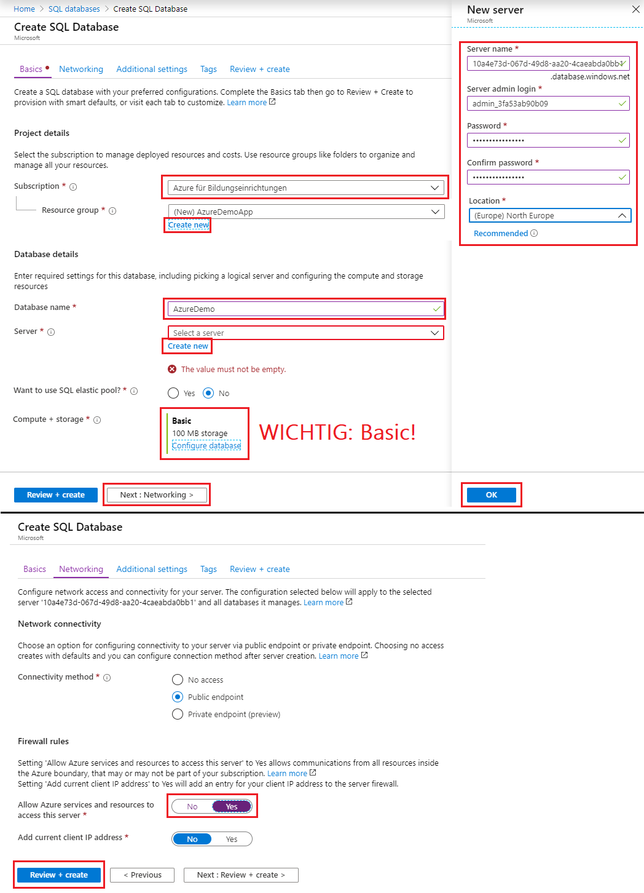
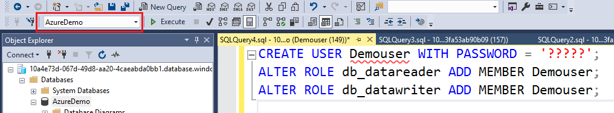

# Einrichtung einer SQL Server Datenbank

## Vorbereitung

Lade das [SQL Server Management Studio (SSMS)](https://docs.microsoft.com/en-us/sql/ssms/download-sql-server-management-studio-ssms)
für den Zugriff auf den SQL Server in Azure herunter.

## Anlegen der SQL Server Datenbank in Azure

Suche im Portal nach den Service *SQL Databases*. Im nachfolgenden Dialog kann mit *Add* eine
neue Datenbank angelegt werden.


Beim Anlegen muss die richtige Subscription gewählt werden (*Azure für Bildungseinrichtungen* ohne Starter).
Als Resource gruop wählen wir *AzureDemoApp*. Zu dieser Gruppe werden wir dann auch das App Service
hinzufügen.

> **Achtung**: Wähle bei *Compute + storage* den billigsten Plan (Basic). Beim voreingestellten Plan
> würde das Guthaben nach wenigen Tagen aufgebraucht sein!



## Verbinden mit dem SQL Server Management Studio

Mit den bei *Create new server* eingegebenen Daten kannst du dich nun aus dem SQL Server Management
Studio (SSMS) verbinden.

- Servername: ???????.database.windows.net
- Authentication: SQL Server Authentication
- Login:    ?????
- Passwort: ?????

Beim ersten Verbinden fragt das Management Studio, ob die lokale IP Adresse zur Firewall hinzugefügt
werden soll. Dies muss natürlich gemacht werden, denn sonst ist keine Verbindung möglich.

### Erstellen einer Testtabelle

Um sicher zu stellen, ob alles funktioniert, legen wir eine Tabelle *Person* mit 3 Einträgen an:

```sql
CREATE TABLE Person (
    ID        INT PRIMARY KEY IDENTITY(1,1),
    Lastname  VARCHAR(200) NOT NULL,
    Firstname VARCHAR(200) NOT NULL
);

INSERT INTO Person (Lastname, Firstname) VALUES ('Lastname1', 'Firstname1');
INSERT INTO Person (Lastname, Firstname) VALUES ('Lastname2', 'Firstname2');
INSERT INTO Person (Lastname, Firstname) VALUES ('Lastname3', 'Firstname3');
```

### Anlegen eines weiteren Users für die Datenbank AzureDemo

In unserem Programm verwenden wir natürlich nicht den Admin, um sich zur Datenbank zu verbinden.
Deswegen legen wir einen weiteren Benutzer an, der in der Datenbank lediglich lesen und schreiben,
jedoch keine Änderungen am Schema vornehmen kann.

Dafür selektieren wir die Datenbank *master* bzw. *AzureDemo* im SQL Server Management Studio und führen die
folgenden Befehle aus. Das Passwort muss Groß- und Kleinbuchstaben sowie Ziffern oder Sonderzeichen
enthalten.



In der Datenbank *master* wird folgender Befehl ausgeführt:

```sql
CREATE USER Demouser WITH PASSWORD = '?????';   -- Statt Demouser kommt der Username
```

In der Datenbank *AzureDemo* werden folgende Befehle ausgeführt:

```sql
CREATE USER Demouser WITH PASSWORD = '?????';   -- Statt Demouser kommt der Username
ALTER ROLE db_datareader ADD MEMBER Demouser;   -- Statt Demouser kommt der Username
ALTER ROLE db_datawriter ADD MEMBER Demouser;   -- Statt Demouser kommt der Username
```
