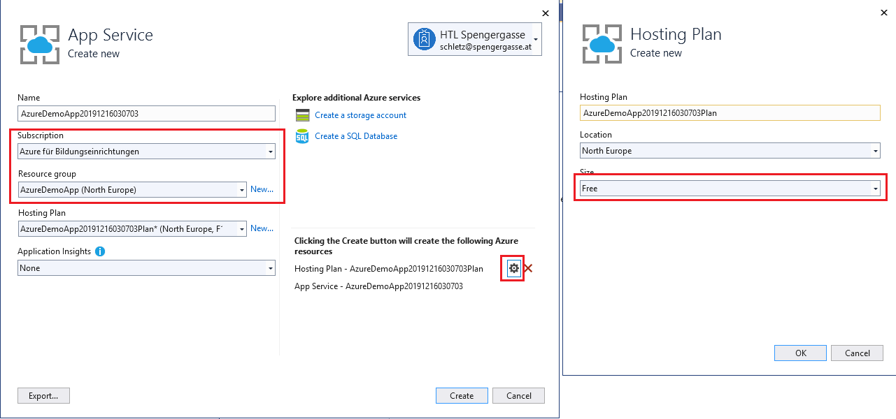

# Erstellen einer ASP.NET WebAPI als App Service

In diesem Kapitel erstellen wir eine ASP.NET Core WebAPI, um unsere SQL Server Datenbank über eine 
REST Schnittstelle ansprechen zu können.

## Erstellen einer leeren WebAPI von der Konsole aus

Neue WebAPI Projekte können auch von der Konsole aus erstellt werden, indem ein neuer Ordner (z. B. *AzureDemo*)
erstellt wird. In diesem Ordner werden dann folgende Befehle ausgeführt. Der Connection String muss
allerdings noch an die eigenen Einstellungen angepasst werden.

```text
dotnet new webapi
dotnet tool update --global dotnet-ef
dotnet add package Microsoft.EntityFrameworkCore.Tools
dotnet add package Microsoft.EntityFrameworkCore.SqlServer
dotnet ef dbcontext scaffold "Server=aaaaa.database.windows.net;Database=bbbbb;User id=ccccc;Password=ddddd" Microsoft.EntityFrameworkCore.SqlServer --output-dir Model --use-database-names --force --data-annotations
```

Beim Verbindungsstring von scaffold sind folgende Dinge anzupassen:

- *aaaaa.database.windows.net*: Durch den Servernamen des SQL Servers auf Azure zu ersetzen
- *Database=bbbbb*: Durch den Datenbanknamen auf Azure zu ersetzen
- *User id=ccccc*:  Benutzername unseres App Users, der im vorigen Kapitel erstellt wurde.
- *Password=ddddd*: Passwort des App Users, der im vorigen Kapitel erstellt wurde.

### Erstellen einer WebAPI mit SQLite

Es ist auch möglich, eine SQLite Datenbank mit dem Projekt nach Azure zu übertragen. Der Vorteil dabei
ist, dass hier keine Kosten für die Datenbank anfallen.

```text
dotnet new webapi
dotnet tool update --global dotnet-ef
dotnet add package Microsoft.EntityFrameworkCore.Tools
dotnet add package Microsoft.EntityFrameworkCore.Sqlite
dotnet ef dbcontext scaffold "DataSource=aaaa.db" Microsoft.EntityFrameworkCore.Sqlite --output-dir Model --use-database-names --force --data-annotations
```

Beim Verbindungsstring von scaffold sind folgende Dinge anzupassen:

- *DataSource=aaaa.db:* Durch den Datenbanknamen der SQLite Datei zu ersetzen.

> **Achtung:** Die Datenbank muss in beim Kompilieren ins Ausgabeverzeichnis kopiert werden, da sie
> sonst nicht übertragen wird. Dafür klickt man in Visual Studio auf die Datei im Solution Explorer
> und wählt statt *Do not copy* die Option *Copy always*. Dies kann auch händisch in der *.csproj*
> Datei eingetragen werden:

```xml
<ItemGroup>
  <None Update="xxx.db">
    <CopyToOutputDirectory>Always</CopyToOutputDirectory>
  </None>
</ItemGroup>
```

## Hinzufügen eines Controllers

### ConfigureServices

Der DbContext wird mit *AddDbContext()* hinzugefügt. Über Dependency Injection wird dann eine Instanz
des Contextes im Konstruktor des Controllers von ASP.NET Core übergeben.

```c#
public void ConfigureServices(IServiceCollection services)
{
    services.AddControllers();
    services.AddDbContext<AzureDemoDatabaseContext>();  // Entsprechendes using eintragen!
}
```

### Erstellen der Datei Person.cs in Controller

```c#
[Route("api/[controller]")]
[ApiController]
public class PersonController : ControllerBase
{
    private readonly AzureDemoDatabaseContext _context;
    public PersonController(AzureDemoDatabaseContext context)
    {
        _context = context;
    }

    [HttpGet]
    public ActionResult<Person> Get()
    {
        return Ok(_context.Person.AsEnumerable());
    }
}
```

## Publishing mit Visual Studio

### launchSettings.json

Die Datei *launchSettings.json* im Ordner Properties kann auf den folgenden Inhalt geändert werden.
Dadurch hört der Server auf den Standardports für HTTP und HTTPS.

```js
{
  "$schema": "http://json.schemastore.org/launchsettings.json",
  "profiles": {
    "AzureDemoApp": {
      "commandName": "Project",
      "applicationUrl": "https://0.0.0.0:443;http://0.0.0.0:80",
      "environmentVariables": {
        "ASPNETCORE_ENVIRONMENT": "Development"
      }
    }
  }
}

```

### Publishing

Mit der rechten Maustaste kann in Visual Studio beim Projekt der Punkt *Publish* gewählt werden.
Auch hier ist darauf zu achten, dass das niedrigste Paket gewählt wird.



## Aktivieren des Development Profiles

Falls Fehler auftreten, werden keine Beschreibungen dazu in Azure angezeigt. Das liegt daran, dass diese
nur im Profil *Development* sichtbar sind. Um das zu aktivieren, klicke in https://portal.azure.com
unter *App Services* auf deine App. Unter den Einstellungen kann nun die Umgebungsvariable
*ASPNETCORE_ENVIRONMENT* auf *Development* gesetzt werden.


## Aktivieren von MySQL in App

In Azure kann - ebenfalls unter *Settings* des App Serivce - der Punkt *MySQL in App* aktiviert
werden. Dabei wird ein Connectionstring angeboten, der in der Datei *Startup.cs* der ASP.NET
Core Applikation verwendet werden kann:

```c#
string connectionString = Environment.GetEnvironmentVariable("MYSQLCONNSTR_localdb")
    ?.Replace("Data Source", "Server")
    ?.Replace("User Id", "User") ?? "";             // Schöner: String aus appsettings.json statt ""
services.AddDbContext<ApplicationDbContext>(options =>  
    options.UseMySql(connectionString)
);
```

In Windows kann diese Variable *MYSQLCONNSTR_localdb* zum Testen angelegt werden (*Start* -
*Environment Variables*). Diese muss einen Connectionstring liefern, wie ihn auch Azure liefern würde.
Die einzelnen Werte können natürlich an das lokale System angepasst werden.

```text
Database=localdb;Data Source=127.0.0.1:50513;User Id=azure;Password=xxxxxx
```

Natürlich sind auch andere Varianten dieses Codes möglich. So kann z. B. wenn *GetEnvironmentVariable()*
null liefert, nicht der Leerstring sondern der String aus der Datei *appsettings.json* geladen werden.
