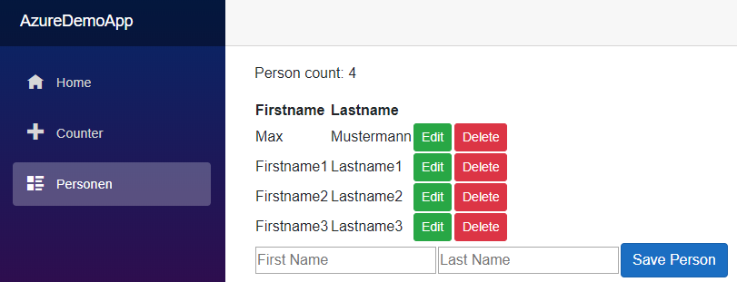

# Erstellen einer CRUD Applikation in Blazor für die Personentabelle



## Erstellen der Applikation

Dieses Beispiel benötigt .NET Core 3.1. Prüfe vorher in der Eingabeaufforderung, ob diese Version
auch installiert ist:

```text
...>dotnet --version
3.1.100
```

Falls nicht, führe ein Visual Studio Update aus. Die Version 16.4 aktualisiert auf .NET Core 3.1.
Wenn du kein Visual Studio verwendest (und nur dann), lade die neueste Version der .NET Core SDK
von https://dotnet.microsoft.com/download.

Wir erstellen wieder wie bei der WebAPI einen neuer Ordner (z. B. *AzureDemoApp*). In diesem Ordner
werden dann folgende Befehle ausgeführt. Der Connection String muss allerdings noch an die eigenen 
Einstellungen angepasst werden.

```text
dotnet new blazorserver
dotnet tool update --global dotnet-ef
dotnet add package Microsoft.EntityFrameworkCore.Tools
dotnet add package Microsoft.EntityFrameworkCore.SqlServer
dotnet ef dbcontext scaffold "Server=tcp:AAAA,1433;Initial Catalog=bbbb;Persist Security Info=False;User ID=cccc;Password=dddd;MultipleActiveResultSets=False;Encrypt=True;TrustServerCertificate=False;Connection Timeout=30;" Microsoft.EntityFrameworkCore.SqlServer --output-dir Model --use-database-names --force --data-annotations
```

Beim Verbindungsstring von scaffold sind folgende Dinge anzupassen:

- *Server=tcp:AAAA,1433*: Durch den Servernamen des SQL Servers zu ersetzen
- *Initial Catalog=bbbb*: Durch den Datenbanknamen  zu ersetzen
- *User ID=cccc*:  Benutzername des Datenbankusers.
- *Password=dddd*: Passwort des Datenbankusers.

## Anpassen der launchsettings.json

In *Properties/launchSettings.json* wird die generierte Datei gegen folgende Version ausgetauscht.
Diese stellt sicher, dass der Server auf den Standardports hört und an jedes Netzwerkinterface
gebunden ist.

```javascript
{
  "profiles": {
    "AzureDemoApp": {
      "commandName": "Project",
      "launchBrowser": true,
      "applicationUrl": "https://0.0.0.0:443;http://0.0.0.0:80",
      "environmentVariables": {
        "ASPNETCORE_ENVIRONMENT": "Development"
      }
    }
  }
}
```

## Adaptierung des Datenbankcontextes

In *Model/Person.cs* fügen wir beim Property ID noch die Annotation
*[DatabaseGenerated(DatabaseGeneratedOption.Identity)]* hinzu. Da ID ein Autowert ist (er wurde
in CREATE TABLE mit IDENTITY definiert), wird er in der Datenbank generiert. EF Core muss daher
diesen Wert zurücklesen.

```c#
public partial class Person
{
    [Key]
    // SQL Server ist zwar tolerant (er generiert auch ohne dieses Property einen Autowert),
    // aber wir geben bekannt, dass der Wert von der DB generiert wird.
    [DatabaseGenerated(DatabaseGeneratedOption.Identity)]
    public int ID { get; set; }

    // ...
}
```

In *Startup.cs* bearbeiten wir 2 Methoden. Zuerst wird in *ConfigureServices()* der Context mittels
*services.AddDbContext<AzureDemoContext>();* registriert. Natürlich muss das entsprechende *using*
für den Namespace Model eingebunden werden. Danach erweitern wir die Methode *Configure()* so,
dass wir mit *endpoints.MapControllers();* auch angelegte Controller auslesen. So können z. B.
Apps die Daten als JSON abrufen.

```c#
public void ConfigureServices(IServiceCollection services)
{
    // ...

    // Fügt den DbContext als Service hinzu, damit wir ihn über @inject bekommen.
    services.AddDbContext<AzureDemoContext>();
}
```

```c#
public void Configure(IApplicationBuilder app, IWebHostEnvironment env)
{
    // ...
    app.UseEndpoints(endpoints =>
    {
        // Dadurch werden auch API Controller im Verzeichnis 
        // Controller oder Controllers gelesen. Somit können wir auch für Apps die URL
        // .../api/person zum Abrufen der Personen als JSON zur Verfügung stellen.
        endpoints.MapControllers();
        endpoints.MapBlazorHub();
        endpoints.MapFallbackToPage("/_Host");
    });
}
```

## Erstellen der Page

Nun erstellen wir im Ordner *Pages* die Datei Persons.razor. Sie beinhaltet die Logik für unsere Seite,
wo die gespeicherten Personen angesehen werden können.

```c#
@page "/persons"
@using Microsoft.EntityFrameworkCore
@using AzureDemoApp.Model
@inject AzureDemoContext Context
<!-- Grauen Hintergrund in Visual Studio deaktivieren:
    Tools -> Options ->Environment -> Fonts and Colors -> HTML Razor Code Background -->

<p>Person count: @count</p>
@if (count > 0)
{
    <table>
        <tr><th>Firstname</th><th>Lastname</th></tr>
        @foreach (Person p in persons)
        {
    <tr>
        <td>@p.Firstname</td>
        <td>@p.Lastname</td>
        <!-- Wichtig: Deaktivert den Button während des DB Zugriffes. Sonst entsteht eine
             DbUpdateConcurrencyException, da versucht wird, den Datensatz 2x zu löschen. -->
        <td><button class="btn btn-success btn-sm" disabled="@isBusy" @onclick="@(() => currentPerson = p)">Edit</button></td>
        <td><button class="btn btn-danger btn-sm" disabled="@isBusy" @onclick="@(() => WritePersonToDb(Action.Delete, p))">Delete</button></td>
    </tr>
        }
    </table>
}

<EditForm Model="@currentPerson" OnValidSubmit="@(() => WritePersonToDb(Action.AddOrEdit, currentPerson))">
    <table>
        <tr>
            <td><InputText placeholder="First Name" @bind-Value="@currentPerson.Firstname" /></td>
            <td><InputText placeholder="Last Name" @bind-Value="@currentPerson.Lastname" /></td>
            <td><button type="submit" class="btn btn-primary" disabled="@isBusy">Save Person</button></td>
            <td>&nbsp;</td>
        </tr>
        <tr>
            <td colspan="4">
                <DataAnnotationsValidator />
                <ValidationSummary />
            </td>
        </tr>
    </table>
</EditForm>


@code {
// Vorsicht beim Zugriff auf den Context in der Page. Das Rendering wird in mehreren Threads
// ausgeführt. Arbeiten wir in foreach direkt mit Context.Person bzw. geben es als Property
// AsEnumerable zurück, kommt es bei await Context.SaveChangesAsync() zum Fehler
// InvalidOperationException: A second operation started on this context before a previous operation completed.
// This is usually caused by different threads using the same instance of DbContext. For more information on
// how to avoid threading issues with DbContext, see https://go.microsoft.com/fwlink/?linkid=2097913.

#nullable enable
    private enum Action { AddOrEdit, Delete };
    private IEnumerable<Person> persons = Enumerable.Empty<Person>();    // Die Tabelle lokal speichern.
    private Person currentPerson { get; set; } = new Person();           // Für das EditForm.
    private int count => persons.Count();   // Immer auf die lokale Tabelle greifen, nicht auf den Context!
    private bool isBusy = false;

    protected override void OnInitialized()
    {
        persons = Context.Person.ToList();
    }

    private async Task WritePersonToDb(Action action, Person p)
    {
        // Buttons deaktivieren, damit der gleiche Datensatz nicht mehrmals gelöscht wird.
        isBusy = true;
        if (action == Action.Delete)
        {
            Context.Entry(p).State = EntityState.Deleted;
        }
        else
        {
            if (Context.Entry(p).State == EntityState.Detached)
            {
                Context.Entry(p).State = EntityState.Added;
            }
            else
            {
                Context.Entry(p).State = EntityState.Modified;
            }
        }
        currentPerson = new Person();
        try
        {
            await Context.SaveChangesAsync();
        }
        catch (DbUpdateConcurrencyException)
        {
            // Hier die Fehlerbehandlung einfügen, wenn der Datensatz von einem anderen User
            // schon gelöscht wurde, er aber aktualisiert werden soll.
        }
        catch (DbUpdateException)
        {
            // Hier die Fehlerbehandlung für Datenbankfehler einfügen.
        }
        // Die Tabelle lokal speichern, damit der Renderer nicht auf den Context greift.
        persons = Context.Person.ToList();
        isBusy = false;


    }
}
```

Zum Schluss ersetzten wir noch in *Shared/NavMenu.razor* den letzten Navigationspunkt (*Fetch data*)
durch unsere Persons Seite:

```html
<!-- ... -->

<li class="nav-item px-3">
    <NavLink class="nav-link" href="persons">
        <span class="oi oi-list-rich" aria-hidden="true"></span> Personen
    </NavLink>
</li>

<!-- ... -->
```

## Erstellen eines Services: CounterService

Nun wollen wir, dass im Menüpunkt Counter der Zählerstand auch in der Navigation angezeigt wird.
Dafür müssen wir eine Klasse erstellen, auf dessen Instanz alle Pages des Users zugreifen können:
Das *ScopedService*.

Dafür erstellen wir einen Ordner Services, und darin eine neue Datei *CounterService.cs*. Die Klasse
sieht so aus:

```c#
public class CounterService
{
    public event Action OnCounterIncrement;
    public int Current { get; private set; } = 0;
    public void Increment()
    {
        Current++;
        OnCounterIncrement?.Invoke();
    }
}
```

Das Wichtige an dieser Klasse ist das Event: Es wird geworfen, wenn der Zählerstand mit *Increment()*
erhöht wird. Dafür muss die Component Counter allerdings dieses Service verwenden. Dazu editieren wir
*Pages/Counter.razor* und adaptieren den Code:

```c#
@code {
    private int currentCount => MyCounter.Current;          // Ist jetzt ein Property.

    private void IncrementCount()
    {
        MyCounter.Increment();   // Aufruf der Methode, damit das Event geworfen wird.
    }
}
```

In *Startup.cs* wird nun das Service in *ConfigureServices()* registriert:

```c#
public void ConfigureServices(IServiceCollection services)
{
    // ...
    services.AddScoped<CounterService>();
}
```

### Aktualisieren der Navigation mit *StateHasChanged()*

Un nun wird auch *Shared/NavMenu.razor* angepasst, da wir auf den Event reagieren müssen. Dafür wird
mit *@using* und *@inject* das *CounterService* eingebunden. Danach wird im Navigationslink des Counters
das Property *Current* des *CounterService* ausgegeben. Damit das Event abonniert wird, erstellen wir
eine Methode *OnInitialized()*. Da das Event vom Typ *Action* ist, können wir direkt die Methode
*StateHasChanged()* daran binden. Diese Methode gibt an, dass der Inhalt neu gerendert werden muss.
Ansonsten kann natürlich eine beliebige *void* Funktion bzw. Lambda Expression ohne Parameter auf 
das Event reagieren.

```html
@using AzureDemoApp.Services
@inject CounterService MyCounter

<!-- Andere Navigation -->
<NavLink class="nav-link" href="counter">
    <span class="oi oi-plus" aria-hidden="true"></span> Counter (@MyCounter.Current)
</NavLink>
<!-- Andere Navigation -->

@code {
    // ...
    protected override void OnInitialized()
    {
        MyCounter.OnCounterIncrement += StateHasChanged;
    }
    public void Dispose()
    {
        MyCounter.OnCounterIncrement -= StateHasChanged;
    }
}
```

## Weitere Informationen

- Create and use ASP.NET Core Razor components: https://docs.microsoft.com/en-us/aspnet/core/blazor/components?view=aspnetcore-3.0
