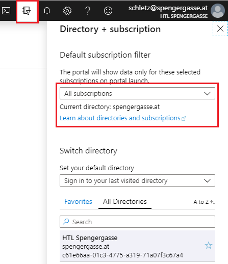

# Microsoft Azure

## Erklärungen

- Einrichten einer SQL Server Datenbank: [01_Database.md](01_Database.md)
- REST API als App Service (mit ASP.NET Core WebAPI): [02_AppServiceWebAPI.md](02_AppServiceWebAPI.md)
- CRUD Applikation als App Service mit ASP.NET Core und Blazor: [03_BlazorCrud.md](03_BlazorCrud.md)

## Wichtige Links

| Seite        | Beschreibung | URL  |
| ------------ | ------------ | ---- |
| School Info Center        | Zur Freischaltung des Accounts für Office365.  | https://sic.spengergasse.at (aus dem Schulnetz)                                |
| Azure Portal              | Die Zentrale für das Einrichten von Diensten.  | https://portal.azure.com                                                       |
| Azure Education Hub       | Beantragung des Startguthabens.                | https://portal.azure.com/#blade/Microsoft_Azure_Education/EducationMenuBlade   |
| Azure Sponsorship         | Zur Anzeige des verfügbaren Guthabens.         | https://www.microsoftazuresponsorships.com/Balance                             |
| Online GUID Generator     | Zum Generieren von Servernamen, ...           | https://www.guidgenerator.com/online-guid-generator.aspx                       |
| Secure Password Generator | Zum Generieren von Passwörtern für Applikationen. | https://passwordsgenerator.net                                              |

## Wichtige Services

| Service  | Beschreibung  |
| -------  | ------------- |
| SQL Databases | SQL Server Datenbank |
| App Services | ASP.NET Core Webanwendungen (WebAPI oder Blazor) |

## Erstmalige Einrichtung des Schulaccounts

### Zustimmungserklärung

Gehe auf https://sic.spengergasse.at und hake bei *Zustimmungserklärungen* den Punkt *Office365* an.
Dadurch darf die Schule die Accountdaten an Microsoft zur Authentifizierung freischalten.

### Einrichten des Accounts auf Azure

Gehe nach der Freischaltung auf https://portal.azure.com und melde dich mit deinem Schulaccount an.
Nach dem Login muss noch das Startguthaben beantragt werden. Dafür suche nach dem Service *Education*
im Suchfeld ganz oben im Portal. Hier erscheint ein Button, über den ein kostenloses Guthaben von
100 USD beantragt werden kann. Für die Registrierung ist nur eine Telefonnummer zum Empfangen der
Bestätigungs-SMS nötig.

Das Guthaben verfällt nach 1 Jahr, es kann nächstes Jahr aber erneut beantragt werden. Eine Mitnahme
von Guthaben ist nicht möglich. Details sind auf [Azure for Students – FAQs](https://azure.microsoft.com/de-de/free/free-account-students-faq/)
abrufbar.

> **Wichtig:** Achte bei der Konfiguration immer auf den Preis des Services und wähle zu Beginn die
> niedrigste Option. Sonst kann das Guthaben schnell aufgebraucht werden, da z. B. eine Datenbank
> auch Kosten verbraucht, wenn sie lediglich läuft.
>
> Beende die Services immer, wenn sie nicht benötigt werden. Alleine das Laufen
> eines Services kann Kosten verursachen. Manche Services können nicht gestoppt werden (z. B.
> Datenbanken). Diese sollten daher mit der niedrigsten Leistung angelegt werden.

Nach der Gutschrift muss im Filter auch die Subscription *Azure für Bildungseinrichtungen* (ohne
Starter) aktiviert werden. Sonst sind manche Services nicht verfügbar, es kommt dann die Meldung
dass ein Upgrade durchgeführt werden muss. Am Besten wähle hier *Select all*. Falls keine Subscriptions
zur Auswahl stehen ist auch alles in Ordnung, dann wurde die Starter Subscription nie angelegt.

