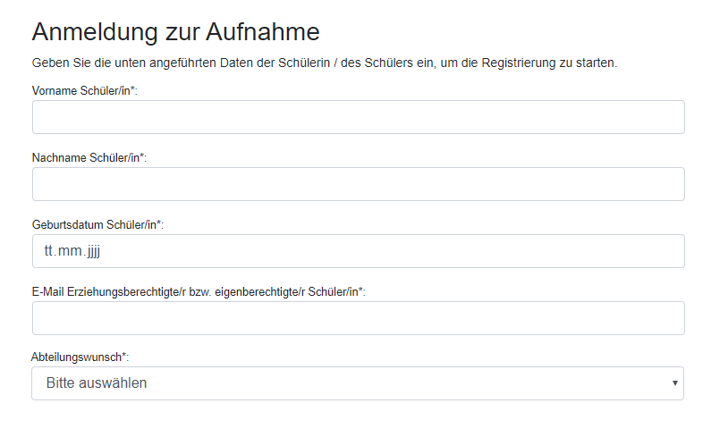
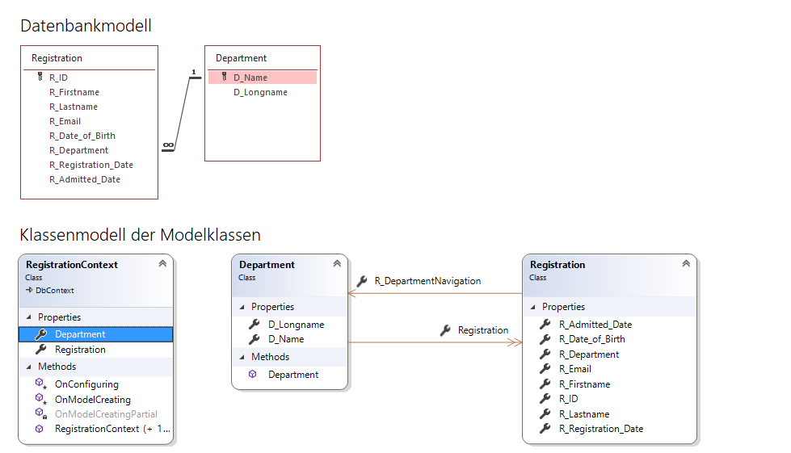
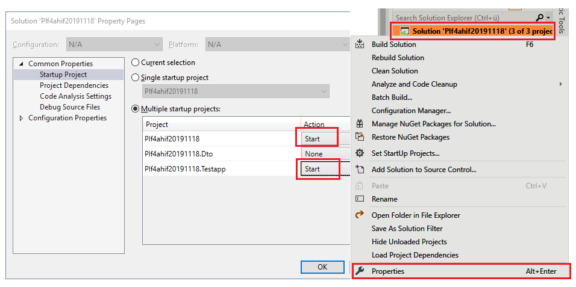

# 1. Prüfung in POS
Klasse: 4BHIF, Datum: 25. November 2019, Prüfer: SZ


## Intro
Für das neue Anmeldesystem der HTL Spengergasse soll eine REST API auf Basis von Microsoft
ASP.NET Core 3 geschrieben werden.



Für die Anmeldung sind folgende Funktionen abzudecken:
- Ein neuer Schüler meldet sich mit Vor- und Zuname, Emailadresse und dem Abteilungswunsch an. Diese
  Daten werden mit dem Zeitpunkt der Anmeldung in der Datenbank gespeichert.
- Wenn die Schule den Schüler aufnimmt (also den Schulplatz zusichert), wird dies durch das Setzen 
  des Feldes *R_Admitted_Date* auf das Datum der Zusicherung gespeichert. Davor ist dieses Feld *null*.

Die Datenbank und die Modelklassen sind schon fertig definiert und sehen so aus:

  

## Hinweise zur Implementierung
### Ausführen des Servers und des Testprogrammes
In der Visual Studio Solution ist ein Serverprojekt (*Plf4bhif20191125*) und ein Integrationstest
(*Plf4bhif20191125.Testapp*) angelegt. Damit der Test funktioniert, muss das Server- und das Testprojekt
zugleich gestartet werden. In Visual Studio erreicht man dies durch Rechtsklick auf die Solution und
dem Einstellen der Startprojekte in den Eigenschaften:



### DTO Klassen
Die DTO Klassen, die vom Controller zurückgeliefert werden, sind bereits in einer Klassenbibliothek
(*Plf4bhif20191125.Dto*) enthalten. Sie können mit einem typisierten *ActionResult* im Controller
zurückgegeben werden:
```c#
public ActionResult<RegistrationDto> GetTestdata()
{
    return Ok(from r in _db.Registration
                select new RegistrationDto
                {
                    Firstname = r.R_Firstname,
                    Lastname = r.R_Lastname
                });
}
```
Der Integrationstest versucht, die Serverantwort ebenfalls in diese DTO Klassen zu serialisieren.

### Modelklassen
Die Modelklassen sind bereits fertig im Ordner *Model* generiert und greifen auf die SQLite Datei
*Registration.db* im Hauptordner zu. Es gibt auch eine Accessvariante (*Registration.mdb*), falls 
jemand den Inhalt der Datenbank lesen möchte.

### Zeitwerte
Mit *DateTime.Now* kann das aktuelle Systemdatum in die Datenbank eingetragen werden.

### Controller
Aller Code ist in der Datei *RegistrationController.cs* zu schreiben. Ein Ändern anderer Programmteile
in der Solution ist nicht notwendig.

### Abgabe:
Kopiere deine Solution samt aller Projekte in den Ordner 
`\\enterprise\ausbildung\unterricht\abgaben\4BHIF\POS_PLF20191125\(Accountname)`.

Wichtige Hinweise zur Abgabe:
- Führe vor der Abgabe bei geschlossenem Visual Studio die Datei *cleanSolution.cmd* aus. Diese 
  löscht alle kompilierten Dateien sowie die NuGet Pakete. Sonst dauert das Kopieren wegen der vielen
  kleinen Dateien recht lange.
- Im Ordner mit dem Accountnamen soll *kein Unterordner* oder ein ZIP Archiv erstellt werden. Die *.sln*
  Datei muss sich direkt in diesem Ordner befinden.

## Zu implementierende Routen
Bei allen Routen werden die Daten im Request Body als Typ *application/json* übertragen.

### GET /api/registration/(abteilung)
Ruft ein JSON Array mit allen registrierten Schülern mit dem entsprechenden Abteilungsnamen ab. Die
Groß- und Kleinschreibung ist zu ignorieren, d. h. *hif* soll auch alle Bewerber der Abteilung *HIF*
liefern. Das Ergebnis ist als Collection von Instanzen der Klasse *RegistrationDto* vom Controller zurückzugeben.

- Request Data: (keine)
- Response Header: HTTP 200
- Response Data: `[{"id":122,"firstname":"Firstname1","lastname":"Lastname1","email":"lastname1@mydomain.at","date_of_Birth":"2005-11-21T00:00:00","department":"HIF","registration_Date":"2019-11-01T15:00:00","admitted_Date":"2020-03-20T00:00:00"}, ...]`

### GET /api/admitted/(abteilung)
Ruft ein JSON Array mit allen Schülern der entsprechenden Abteilung ab, die einen Schulplatz zugesichert
bekommen haben (das Feld *R_Admitted_Date* ist also nicht *null*).

- Request Data: (keine)
- Response Header: HTTP 200
- Response Data: `[{"id":122,"firstname":"Firstname1","lastname":"Lastname1","email":"lastname1@mydomain.at","date_of_Birth":"2005-11-21T00:00:00","department":"HIF","registration_Date":"2019-11-01T15:00:00","admitted_Date":"2020-03-20T00:00:00"}, ...]`

### POST /api/registration 
Fügt einen neuen Bewerber hinzu. Das Feld *R_Registration_Date* wird dabei auf die aktuelle Systemzeit
(*DateTime.Now*) gesetzt.

- Request Data: `{"firstname":"Firstname1","lastname":"Lastname1","email":"lastname1@mydomain.at","date_of_Birth":"2005-11-21T00:00:00","department":"HIF"}`
- Response Header: HTTP 200 wenn der Bewerber eingefügt werden konnte oder HTTP 400 (Bad Request) wenn
  die Daten den Constraints der Datenbank widersprechen (ungültige Abteilung, leeres Namensfeld, ...).
- Response Data: `{"id":122,"firstname":"Firstname1","lastname":"Lastname1","email":"lastname1@mydomain.at","date_of_Birth":"2005-11-21T00:00:00","department":"HIF","registration_Date":"2019-11-01T15:00:00","admitted_Date":null}`


### PUT /api/registration/admit/{id} 
Sichert einem Bewerber mit der übergebenen ID den Schulplatz zu, indem das Feld *R_Admitted_Date* auf
die aktuelle Systemzeit (*DateTime.Now*) gesetzt wird.

- Request Data: (keine)
- Response Header: HTTP 200 die Daten geändert werden konnten, HTTP 400 (Bad Request), wenn die
                   ID nicht gefunden wurde.
- Response Data: siehe *POST /api/registration*

### PUT /api/registration/{id} 
Ändert die Anmeldedaten eines Bewerbers. Dies soll jedoch eingeschränkt werden:
1. Hat der Bewerber schon einen zugesicherten Schulplatz (*R_Admitted_Date* ist nicht *null*), so darf
  die Abteilung (*R_Department*) nicht mehr verändert werden.
1. Das Datum der Anmeldung (*R_Registration_Date*) darf nie verändert werden.

- Request Data: siehe *POST /api/registration*
- Response Header: HTTP 200 die Daten geändert werden konnten, HTTP 400 (Bad Request), wenn die
                   ID nicht gefunden wurde oder die oben erwähnten Regeln verletzt wurden.
- Response Data: siehe *POST /api/registration*


### DELETE /api/registration/{id} 
Löscht den Bewerber mit der übergebenen Registration-ID. Ein Löschen ist jedoch nicht mehr möglich,
wenn der Bewerber schon aufgenommen wurde.

- Request Data: (keine)
- Response Header: HTTP 200 wenn die Daten gelöscht wurden oder HTTP 400 (Bad Request), wenn 
                   die ID nicht gefunden wurde.
- Response Data: (keine)

Im Zweifelsfall gilt das Verhalten des Unittests.