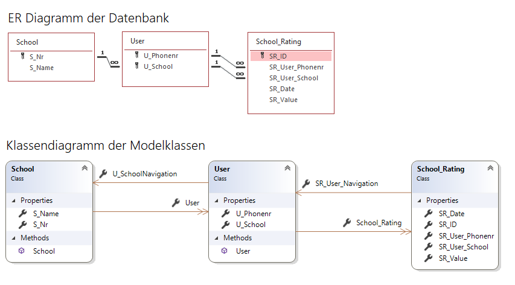
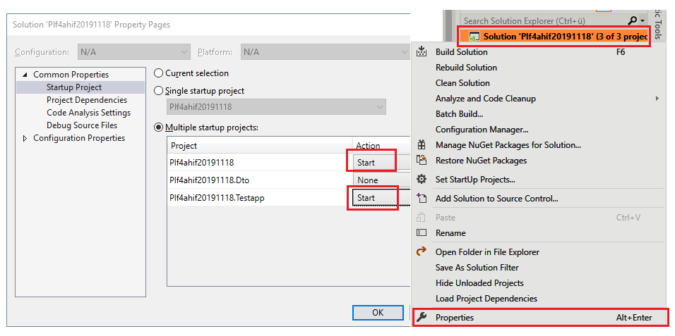

# 1. Prüfung in POS
Klasse: 4AHIF, Datum: 18. November 2019, Prüfer: SZ


## Intro
Für die neu erschienene Bewertungsapp für Schulen und Lehrer soll eine REST API auf Basis von Microsoft
ASP.NET Core 3 geschrieben werden.



Zur Vereinfachung wurden folgende Annahmen getroffen:
- Ein Benutzer kann nur eine Gesamtbewertung für eine Schule geben, keine Bewertung für Detailbereiche
  oder einzelne Lehrer.
- Jeder Benutzer ist mit einer Telefonnummer und der Schule, die er besucht, registriert.
- Es ist keine Authentifizierung oder Autorisierung vorzusehen.

## Hinweise zur Implementierung
### Ausführen des Servers und des Testprogrammes
In der Visual Studio Solution ist ein Serverprojekt (*Plf4ahif20191118*) und ein Integrationstest
(*Plf4ahif20191118.Testapp*) angelegt. Damit der Test funktioniert, muss das Server- und das Testprojekt
zugleich gestartet werden. In Visual Studio erreicht man dies durch Rechtsklick auf die Solution und
dem Einstellen der Startprojekte in den Eigenschaften:



### DTO Klassen
Die DTO Klassen, die vom Controller zurückgeliefert werden, sind bereits in einer Klassenbibliothek
(*Plf4ahif20191118.Dto*) enthalten. Sie können mit einem typisierten *ActionResult* im Controller
zurückgegeben werden:
```c#
public ActionResult<SchoolDto> GetSchoolTest()
{
    return Ok(from s in _db.School
                select new SchoolDto
                {
                    Nr = s.S_Nr,
                    Name = s.S_Name
                });
}
```
Der Integrationstest versucht, die Serverantwort ebenfalls in diese DTO Klassen zu serialisieren.

### Modelklassen
Die Modelklassen sind bereits fertig im Ordner *Model* generiert und greifen auf die SQLite Datei
*Rating.db* im Hauptordner zu. Es gibt auch eine Accessvariante (*Rating.mdb*), falls jemand den 
Inhalt der Datenbank lesen möchte.

### Zeitwerte
Bei der Bewertung wird der aktuelle Tag vom Server als Zeitstempel eingetragen. Mit *DateTime.Now.Date*
bekommt man in C# den Zeitstempel des aktuellen Tages ohne Zeitkomponente (also mit 0:00).

### Controller
Aller Code ist in der Datei *SchoolratingController.cs* zu schreiben. Ein Ändern anderer Programmteile
in der Solution ist nicht notwendig.

### Abgabe:
Kopiere deine Solution samt aller Projekte in den Ordner 
`\\enterprise\ausbildung\unterricht\abgaben\4AHIF\POS_PLF20191117\(Accountname)`.

Wichtige Hinweise zur Abgabe:
- Führe vor der Abgabe bei geschlossenem Visual Studio die Datei *cleanSolution.cmd* aus. Diese 
  löscht alle kompilierten Dateien sowie die NuGet Pakete. Sonst dauert das Kopieren wegen der vielen
  kleinen Dateien recht lange.
- Im Ordner mit dem Accountnamen soll *kein Unterordner* oder ein ZIP Archiv erstellt werden. Die *.sln*
  Datei muss sich direkt in diesem Ordner befinden.

## Zu implementierende Routen
Bei allen Routen werden die Daten im Request Body als Typ *application/json* übertragen.

### GET /api/schoolrating
Ruft ein JSON Array mit dem durchschnittlichen Rating aller eingetragenen Schulen ab. Das Rating ist
mit *Math.Round(val, 1)* auf 1 Stelle genau zu liefern. Das Ergebnis ist als Collection von Instanzen 
der Klasse *SchoolDto* vom Controller zurückzugeben.

- Request Data: (keine)
- Response Header: HTTP 200
- Response Data: `[{ "Nr": 905417, "Name": "HTL Spengergasse", "AvgRating": 5 }]`

### POST /api/register 
Registriert einen Benutzer mit Telefonnummer und Schulkennzahl. Das Ergebnis ist als Instanz 
der Klasse *UserDto* vom Controller zurückzugeben.

- Request Data: `{ "PhoneNr": "09994","School": 9999 }`
- Response Header: HTTP 200 wenn der User eingefügt werden konnte oder HTTP 400 (Bad Request) 
  wenn der Benutzer an dieser Schule schon vorhanden ist.
- Response Data: `{ "PhoneNr": "09994","School": 9999 }`


### POST /api/schoolrating 
Fügt eine Bewertung eines Users für eine Schule in die Datenbank ein und gibt den eingefügten Datensatz
zurück. Das Ergebnis ist als Instanz der Klasse *RatingDto* vom Controller zurückzugeben.

- Request Data: `{ "PhoneNr": "09992","School": 9999,"Value": 1 }`
- Response Header: HTTP 200 wenn das Rating eingefügt werden konnte, HTTP 400 (Bad Request), wenn der User die Schule schon bewertet hatte.
- Response Data: `{ "Id": 1,"PhoneNr": "09992","School": 9999,"Date": "2019-11-11T00:00:00","Value": 1 }`

### PUT /api/schoolrating/(ratingId) 
Ändert eine Bewertung eines Users anhand der (generierten) ID des Ratings und gibt das neue Rating zurück. 
Ein Benutzer darf das Rating nur 1x am Tag ändern. Das Ergebnis ist als Instanz der Klasse 
*RatingDto* vom Controller zurückzugeben.

- Request Data: `{ "Value": 2}`
- Response Header: HTTP 200 wenn das Rating geändert werden konnte, HTTP 400 (Bad Request), wenn die Rating ID 
nicht gefunden wurde oder ein Rating des aktuellen Tages verändert werden würde.
- Response Data: `{ "Id":1, "PhoneNr": "09992","School": 9999,"Date": "2019-11-11T00:00:00","Value": 2 }`


### DELETE /api/schoolrating/(ratingId)
- Request Data: (keine)
- Response Header: HTTP 200
- Response Data: (keine)
