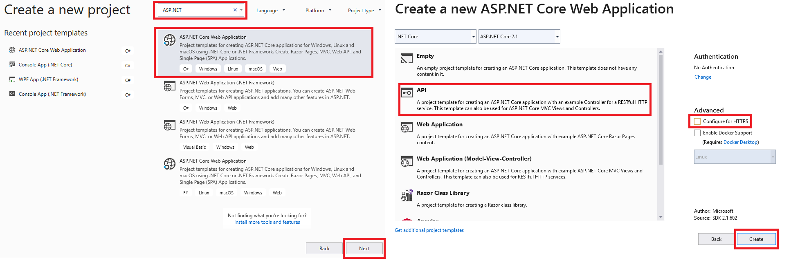

# GET Routen mit ASP.NET Core

Um ein einfaches Webservice mit ASP.NET Core zu erstellen, wird in Visual Studio 2019 mittels *Create a
new project* die Vorlage *ASP.NET Core Web Application* gewählt. Nach der Vergabe eines Namens wird
in den Projekteinstellungen der Punkt *API* gewählt. Die Checkbox bei *Configure for HTTPS* kann
abgehakt werden:



Nach dem Erstellen des Projektes können die Controller angelegt werden. Im Musterprojekt ist ein
Controller mit dem Namen *PupilController* angelegt. Der Name ist für das Routing wichtig, denn
der Request */api/pupil* wird automatisch an den Controller mit dem Namen *PupilController* 
weitergegeben.

Sollen weitere Controller angelegt werden, so kann dies in Visual Studio unter *Controllers* - 
*Add* - *Controller* erledigt werden:


**Unter Linux:**
``user@hostname:~$ dotnet new webapi``

## Der Pupil Controller und seine Funktionen
Wird ein leerer Controller angelegt, so werden 2 Annotations über die Klassendefinition 
geschrieben:
```c#
[Route("api/[controller]")]
[ApiController]
public class PupilController : ControllerBase
{
}
```

Die Annotation *[Route("api/[controller]")]* bewirkt, dass Requests mit der URL 
*/api/controllername* hier bearbeitet werden. Natürlich könnte man statt *[controller]*
auch den Namen des Controllers (also *Pupil*) schreiben, so ist es jedoch allgemeiner.

### GET Routen
Damit ein Controller auf GET Anfragen reagiert, wird eine Methode mit der Annotation 
*HttpGet* versehen. Der Methodenname kann dabei beliebig gewählt werden.
```c#
[HttpGet]
public IActionResult Get()
{
    return Ok(db.Schueler.Select(s => new { s.Vorname, s.Zuname }));
}
```

Die Methode *Ok* bewirkt, dass das Ergebnis der Abfrage als JSON mit dem Statuscode 200 
zurückgegeben wird.

Da nichts weiter angegeben wird, wird diese Methode bei */api/pupil* aufgerufen. Möchten wir nun 
einzelne Schüler abfragen, brauchen wir eine dynamischere Definition. Wenn bei */api/pupil/1001* der
Schüler mit der ID 1001 zurückgegeben werden soll, so können wir mit folgender Annotation den 
letzten Parameter in die Variable id schreiben:
```c#
[HttpGet("{id}")]
public IActionResult GetById(string id)
{
}
```

Beachte: Parameter sind immer Strings. Er kann zwar automatisch geparst
werden, indem die Methode einen Parameter vom Typ *int* bekommt, eine Fehlerbehandlung ist 
dann allerdings nicht möglich.

Möchten wir auf einen Query String der Form */api/pupil/byId?id=1001* reagieren, so ist das 
ebenfalls möglich:
```c#
[HttpGet("byId")]
public IActionResult GetWithQuerystring([FromQuery]string id)
{
}
```

Die Routen waren bis jetzt immer relativ, d. h. sie werden zur Route des Controllers "dazugegeben".
Möchten wir eine Route definieren, die auf */api/count* reagiert, so können wir durch einen 
Schrägstich am Anfang eine absolute Route definieren:
```c#
[HttpGet("/api/count")]
public IActionResult GetPupilCount()
{
}
```

## Konfugration des Webservers
Wird die ASP.NET Core Applikation aus Visual Studio gestartet, wird der Webserver Kestrel geladen und
das Programm ausgeführt. Dieser Server kann vom Programmierer konfiguriert werden. Die erste Konfiguration,
die wir benötigen, ist die CORS Einstellung. Unsere REST Api soll auch funktionieren, wenn die aufrufende
HTML Seite unter einer anderen Domäne gespeichert wird. Dafür wird der Header `Access-Control-Allow-Origin: *`
gesetzt. Wir erledigen das zuerst über eine Extension Methode des Interfaces *IServiceCollection*.
Der Name *CorsPolicy* ist frei zu vergeben. Er wird dann bei der Aktivierung der Konfiguration benutzt.
```c#
public static void ConfigureCors(this IServiceCollection services)
{
    services.AddCors(options =>
    {
        options.AddPolicy("CorsPolicy",
            builder => builder
            .AllowAnyOrigin()
            .AllowAnyMethod()
            .AllowAnyHeader()
        );
    });
}
```

Nun wird in der vorhandenen Methode *ConfigureServices()* in *Startup.cs* unsere Methode aufgerufen:
```c#
public void ConfigureServices(IServiceCollection services)
{
    services.ConfigureCors();                              // Einzufügender Code
    services.AddMvc().SetCompatibilityVersion(CompatibilityVersion.Version_2_1);
}
```

Zum Abschluss muss noch die angelegte Regel in der Methode *Configure()* der Datei *Startup.cs* aktiviert 
werden.
```c#
public void Configure(IApplicationBuilder app, IHostingEnvironment env)
{
    if (env.IsDevelopment())
    {
        app.UseDeveloperExceptionPage();
    }
    app.UseCors("CorsPolicy");                     // Einzufügender Code
    app.UseFileServer();                           // Einzufügender Code
    app.UseMvc();
}
```

## Übung
Schreibe basierend auf diesem Musterprojekt ein Webservice, welches folgende URLs implementiert.
Hinweis: Leerstellen werden in der URL mit *%20* übertragen. So kann als Abteilungsname z. B. 
*Biomedizin-%20und%20Gesundheitstechnik* in der URL übertagen werden.

| Method | URL                              | Result |
| ------ | -------------------------------- | -------- |
| GET    | /api/klassen                     | Alle Klassennamen als JSON Array (["4AHIF", "4BHIF", ...]) |
| GET    | /api/klassen/(klassenname)       | Details zur übergebenen Klasse als JSON Objekt. |
| GET    | /api/abteilung/(abtname)         | Alle Klassen der übergebenen Abteilung als JSON Array. |
| GET    | /api/classcount?abteilung=(Name) | Liefert die Anzahl der Klassen der übergebenen Abteilung, z. B. 14. |
