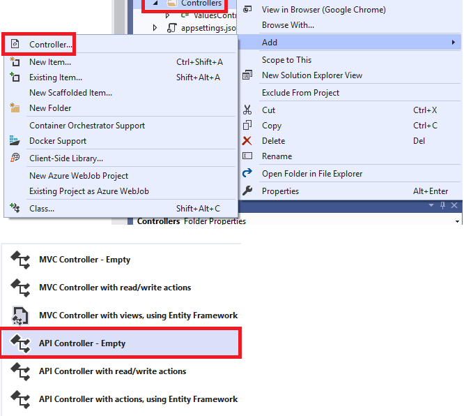

# GET Routen mit ASP.NET Core

## Anlegen eines Controllers

Nach dem Erstellen des Projektes können die Controller angelegt werden. Im Musterprojekt ist ein
Controller im Ordner *Controllers* mit dem Namen *PupilController* angelegt. Der Name ist für das
Routing wichtig, denn der Request */api/pupil* wird automatisch an den Controller mit dem Namen
*PupilController* weitergegeben.

Sollen weitere Controller angelegt werden, so kann dies in Visual Studio unter *Controllers* >
*Add* - *Controller* erledigt werden:



Alternativ kann auch im Ordner *Controllers* eine leere *.cs* Datei angelegt und die Klasse
implementiert werden. Wichtig ist, dass die Klasse von *ControllerBase* erbt.

## Der Pupil Controller und seine Funktionen

Als ersten Einstieg legen wir einen Controller *Pupil* an. Er soll Schülerdaten als JSON unter
der url */api/pupil* bereitstellen. Der Name *PupilController* besagt bereits, dass der Controller
auf die URL */api/pupil* hört (Convention over Configuration)

Wird ein leerer Controller angelegt, so werden 2 Annotations über die Klassendefinition
geschrieben:

```c#
[Route("api/[controller]")]
[ApiController]
public class PupilController : ControllerBase
{
}
```

Die Annotation *[Route("api/[controller]")]* bewirkt, dass Requests mit der URL
*/api/controllername* hier bearbeitet werden. Natürlich könnte man statt *[controller]*
auch den Namen des Controllers (also *Pupil*) schreiben, so ist es jedoch allgemeiner.

### GET Routen

Damit ein Controller auf GET Anfragen reagiert, wird eine Methode mit der Annotation *HttpGet* versehen.
Der Methodenname kann dabei beliebig gewählt werden. Es gibt 3 Arten von Methoden:

```c#
[HttpGet]                     // Darf nur 1x ohne Angabe von Parametern vorkommen!
public IEnumerable<string> GetMethod1()
{
    return new string[] { "value1", "value2" };
}

[HttpGet]                     // Darf nur 1x ohne Angabe von Parametern vorkommen!
public IActionResult GetMethod2()
{
    return Ok(new string[] { "value1", "value2" });
}

[HttpGet]                     // Darf nur 1x ohne Angabe von Parametern vorkommen!
public ActionResult<string[]> GetMethod3()
{
    return new string[] { "value1", "value2" };
}

// *************************************************************************************************

[HttpGet]                     // Darf nur 1x ohne Angabe von Parametern vorkommen!
public async Task<IEnumerable<string>> GetMethod1Async()
{
    return await Task.FromResult(new string[] { "value1", "value2" });
}

[HttpGet]                     // Darf nur 1x ohne Angabe von Parametern vorkommen!
public async Task<IActionResult> GetMethod2Async()
{
    // await something
    return CreatedAtAction(nameof(GetMethod2Async), new string[] { "value1", "value2" });
}

[HttpGet]                     // Darf nur 1x ohne Angabe von Parametern vorkommen!
public async Task<ActionResult<string[]>> GetMethod3Async()
{
    return await Task.FromResult(Ok(new string[] { "value1", "value2" }));
}
```

*GetMethod1()* liefert einfach eine Collection zurück. Es wird automatisch HTTP 200 gesetzt und
die Collection wird als JSON serialisiert ausgegeben.

*GetMethod2()* liefert ein *IActionResult* zurück. Es erlaubt uns, HTTP Statuscodes selbst zu setzen.
Die *Ok()* Funktion sieht hier vielleicht seltsam aus, ist aber eine normale Methode, die ein *object*
bekommt und ein Ergebnis mit dem HTTP Status 200 liefert.

*GetMethod3()* liefert ein Ergebnis mit der Angabe des erwarteten Datentyps. Diese Variante ist
wenn möglich vorzuziehen. Bei der Rückgabe von anonymen Typen muss natürlich Variante 1 gewählt
werden.

Die *Get...Async()* Methoden sind die Entsprechungen der beschriebenen Methoden als *async* Methoden.
Sie sind vorzuziehen, wenn Datenbankabfragen gemacht werden.

Es gibt keine "beste" Form, alle Methoden kommen - je nach den verwendeten Daten die geliefert
werden müssen - zum Einsatz.

Detaillierte Infos gibt es auf [Microsoft Docs](https://docs.microsoft.com/en-us/aspnet/core/web-api/action-return-types?view=aspnetcore-3.1)
nachzulesen.

### HTTP Statuscodes

Möchten wir einen Statuscode zurückliefern, so muss *IActionResult* oder *ActionResult* als
Rückgabewert geschrieben werden. Hier stehen uns folgende Methoden aus *ControllerBase* zur
Verfügung:

```c#
return Ok();              // HTTP 200: Alles OK
return BadRequest();      // HTTP 400: BadRequest. Die Eingabedaten konnten nicht verarbeitet werden.
return NotFound();        // HTTP 404: Die Resource wurde nicht gefunden.
return Unauthorized();    // HTTP 401: User hat sich nicht angemeldet.
return Forbid();          // HTTP 403: User hat sich angemeldet, darf die Resource aber nicht haben.
return StatusCode(500);   // HTTP 500 (oder definierter Code)
return StatusCode(StatusCodes.Status500InternalServerError);
```

Liefern wir mehrere Status Codes zurück, so sollte dies in einer Annotation über die Methode
geschrieben werden. So können Dokumentationstools wie Swagger automatisch eine Dokumentation
der API generieren. Die nachfolgenden Beispiele verwenden diese Annotations.

## Routing

### Adressen der Form /api/controller/id

Wenn nur *HttpGet* angegeben wird, so wird diese Methode bei */api/pupil* aufgerufen. Möchten wir nun
einzelne Schüler abfragen, brauchen wir eine dynamischere Definition. Wenn bei */api/pupil/1001* der
Schüler mit der ID 1001 zurückgegeben werden soll, so können wir mit folgender Annotation den
letzten Parameter in die Variable id schreiben:

```c#
[HttpGet("{id}")]
[ProducesResponseType(StatusCodes.Status200OK)]
[ProducesResponseType(StatusCodes.Status404NotFound)]
public ActionResult<Pupil> GetPupilById(int id)
{
    Pupil p = db.Pupil.SingleOrDefault(p => p.Id == id);
    if (p == null) { return NotFound(); }
    return Ok(p);
}
```

Hier sind mehrere Dinge zu beachten:

- Achte auf die Form der *HttpGet* Annotation *HttpGet("{id}")* mit den geschweiften Klammern.
- Der Parameter der Methode (*id*) muss genau so heißen wie der in *HttpGet* angegebene Parameter.
- Wir liefern einen einzelnen Schüler. Die Unterscheidung, ob eine Collection oder ein einzelnes
  Objekt geliefert wird, ist für die JSON Serialisierung wichtig. Erstere wird immer in ein Array
  verpackt, bei zweiterem wird ein Objekt geliefert. Deswegen verwenden wir auch *SingleOrDefault()*.
- Wir liefern HTTP 200, wenn der Schüler gefunden wird und HTTP 404 wenn nicht.

### Adressen der Form /api/controller/action?param=value

Die Annotation *HttpGet("byId")* wird jetzt ohne geschweifte Klammer verwendet. Das bedeutet,
dass der String *byId* in der Adresse vorkommen muss. Möchten wir nun Requests der Form
*/api/pupil/byId?id=1001* verarbeiten, so kann das Attribut *FromQuery* vor dem Parameter
der Methode *GetWithQuerystring()* verwendet werden. Es veranlasst den Server, nach dem Parameter
*id* im Querystring zu suchen und zuzuweisen.

```c#
[HttpGet("byId")]
[ProducesResponseType(StatusCodes.Status200OK)]
[ProducesResponseType(StatusCodes.Status404NotFound)]
public ActionResult<Pupil> GetWithQuerystring([FromQuery]int id)
{
    return GetPupilById(id);
}
```

### Absolute Adressen

Die Routen waren bis jetzt immer relativ, d. h. sie werden zur Route des Controllers "dazugegeben".
Möchten wir eine Route definieren, die auf */api/count* reagiert, so können wir durch einen
Schrägstich am Anfang eine absolute Route definieren:

```c#
[HttpGet("/api/count")]
[ProducesResponseType(StatusCodes.Status200OK)]
public int GetPupilCount(int id)
{
    return db.Pupil?.Count() ?? 0;
}
```

## Übung

Schreibe basierend auf diesem Musterprojekt ein Webservice, welches folgende URLs implementiert.
Hinweis: Leerstellen werden in der URL mit *%20* übertragen. So kann als Abteilungsname z. B.
*Biomedizin-%20und%20Gesundheitstechnik* in der URL übertagen werden.

Verwende wenn möglich ein *ActionResult* mit dem Datentyp der zurückgegebenen Werte. Liefere nur ein
*IActionResult*, wenn ein anonymer Typ erstellt wird. Achte auch auf die Annotations mit den HTTP
Statuscodes.

| Method | URL                               | Result |
| ------ | --------------------------------  | -------- |
| GET    | /api/class                        | Alle Klassennamen als JSON Array (["4AHIF", "4BHIF", ...]) |
| GET    | /api/class/(klassenname)          | Details zur übergebenen Klasse als JSON Objekt oder HTTP 400, wenn die Klasse nicht gefunden wurde. |
| GET    | /api/department/(abtname)         | Alle Klassen der übergebenen Abteilung als JSON Array oder HTTP 400, wenn die Abteilung nicht gefunden wurde. |
| GET    | /api/classcount?abteilung=(Name)  |  Liefert die Anzahl der Klassen der übergebenen Abteilung, z. B. 14 oder HTTP 400, wenn die Abteilung nicht gefunden wurde. |
