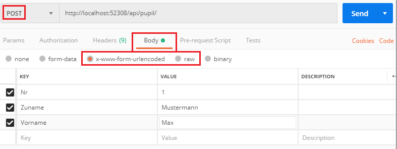

# POST, PUT und DELETE Requests

Bisher haben wir nur auf sogenannte GET Requests reagiert. GET Requests stellen im Webservice 
einfache Abfragen dar. Da über ein Webservice auch Daten eingefügt, geändert oder gelöscht werden
sollen, müssen wir die HTTP Methoden POST, PUT und DELETE betrachten.


<sup>Quelle: https://www.edureka.co/blog/what-is-rest-api/</sup>

## Arten der Datenübermittlung
### www-form-urlencoded
POST Daten werden oft von HTML Formularen aus übermittelt. Wir betrachten folgendes kleine HTML
Formular für die Übermittlung von Schülerdaten:
```html
<form action="/api/pupil" method="POST">
    <input type="text" name="Zuname" value="ABC"/>
    <input type="text" name="Vorname" value="DEF"/>
    <input type="submit" value="Submit" />
</form>
```

Beim Senden codiert der Browser diese Daten mit dem Content-Type *application/x-www-form-urlencoded*.
Das bedeutet, dass sie im Request so codiert sind, wie sie auch mit einer URL als GET Request 
übertragen werden könnten:
```
Zuname=ABC&Vorname=DEF
```

### RAW
Bei der Kommunikation zwischen 2 Programmen über eine REST Schnittstelle werden die Daten oft direkt
als JSON in den Request Body geschrieben. Bei der Schülerklasse würden folgende Daten übertragen
werden:
```javascript
{
    "Nr": 1,
    "Klasse": "5AHIF",
    "Zuname": "Mustermann",
    "Vorname": "Max",
    "Geschl": "m"
}
``` 

## Implementierung in ASP.NET Core

### POST Requests
Soll ein POST Request verarbeitet werden, dessen Daten als *application/x-www-form-urlencoded* gesendet
werden, wird dies mit der Annotation *[FromForm]* bekannt gegben. Der Formatter erstellt automatisch
ein Objekt vom Typ Schueler und schreibt die Daten in die entsprechenden Properties. Die Namen der 
Parameter müssen natürlich mit den Namen der Properties übereinstimmen, die Großschreibung wird allerdings
nicht beachtet. Durch die Annotation *[HttpPost]* reagiert die Methode auf POST Requests mit der URL 
des Controllers:
```c#
[HttpPost]
public IActionResult PostFromForm([FromForm] Schueler schueler)
{
    db.Schueler.Add(schueler);
    return Ok(schueler);
}
```

Werden die Daten direkt als JSON in den Request Body geschrieben, so erzeugt die Annotation *[FromBody]*
das Schueler Objekt aus den Daten:
```c#
[HttpPost("rawdata")]
public IActionResult PostFromBody([FromBody] Schueler schueler)
{
    db.Schueler.Add(schueler);
    return Ok(schueler);
}
```

Da POST Requests zum Anlegen von Datensätzen verwendet werden, wird in diesen Codebeispielen das Objekt
der Collection hinzugefügt.

### PUT und DELETE Requests
Der Umgang mit PUT und DELETE Requests ist ident mit POST, nur dass die Annotation *[HttpPut]* bzw.
*[HttpDelete]* verwendet wird. Der Umgang mit dem Request Body ist gleich wie bei PUT Requests.

Da PUT Requests für Aktualisierungen und DELETE Requests zum Löschen von Daten verwendet werden, führt
der Code in folgenden Beispielen die entsprechenden Operationen aus.
```c#
[HttpPut]
public IActionResult PutFromForm([FromForm] Schueler schueler)
{
    Schueler found = db.Schueler.FirstOrDefault(s => s.Nr == schueler.Nr);
    if (found != null)
    {
        db.Schueler.Remove(found);
        db.Schueler.Add(schueler);
        return Ok(schueler);
    }
    else
    {
        return Ok();
    }
}

[HttpDelete]
public IActionResult DeleteFromForm([FromForm] Schueler schueler)
{
    Schueler found = db.Schueler.FirstOrDefault(s => s.Nr == schueler.Nr);
    if (found != null)
    {
        db.Schueler.Remove(found);
        return Ok(schueler);
    }
    else
    {
        return Ok();
    }
}


```

## Senden der Requests
Zum Testen von POST, PUT und DELETE Requests reicht der Browser nicht mehr aus. Deswegen verwenden wir
das Programm [Postman](https://www.getpostman.com/). Wird das Programm zum ersten Mal gestartet, erscheint
ein Dialog zur Registrierung. Mit dem (schlecht lesbaren) Link ganz unten kann ohne Registrierung gearbeitet
werden.

Ein POST Request kann wie folgt gesendet werden:



## Ausliefern von statischen Dateien
In diesem Beispiel wird auch eine statische Datei, nämlich *index.html*, vom Webserver ausgeliefert. Diese
Datei muss im Ordner *wwwroot* liegen. Um das Ausliefern von statischen Dateien zu aktivieren, wird in der Datei
*Startup.cs* die Methode *Configure()* so abgeändert, dass *app.UseFileServer()* aufgerufen wird:
```c#
public void Configure(IApplicationBuilder app, IHostingEnvironment env)
{
    if (env.IsDevelopment())
    {
        app.UseDeveloperExceptionPage();
    }
    app.UseCors("CorsPolicy");
    app.UseFileServer(); // Liefert statische Files und legt index.html als Standarddokument fest.
    app.UseMvc();
}
```

## Übung
Erweitere das Webservice, sodass Klassen angelegt, geändert oder gelöscht werden. Erstelle dafür einen
eigenen Controller mit dem Namen *KlasseController*. Implementiere danach die folgenden Requests:

| Method                   | URL               | Response   |
| ---------------------    | ----------------- | ---------- |
| POST (www-formencoded)   | /api/klasse       | Neu angelegte Klasse als JSON oder leeres JSON, wenn die Klasse schon vorhanden ist. |
| POST (raw, JSON)         | /api/klasse/raw   | Neu angelegte Klasse als JSON oder leeres JSON, wenn die Klasse schon vorhanden ist. |
| PUT                      | /api/klasse       | Aktualisierte Klasse als JSON oder leeres JSON, wenn die Klasse nicht gefunden wurde. |
| DELETE                   | /api/klasse       | Gelöschte Klasse als JSON oder leeres JSON, wenn die Klasse nicht gefunden wurde. |

Nachdem die Routen in Postman getestet wurden, kopiere die Datei *index.html* in die Datei *klasse.html*.
Ändere das HTML Formular so, dass ein POST Request auch von diesem HTML Formular aus erfolgreich verarbeitet
werden kann.