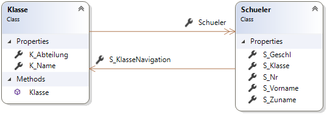
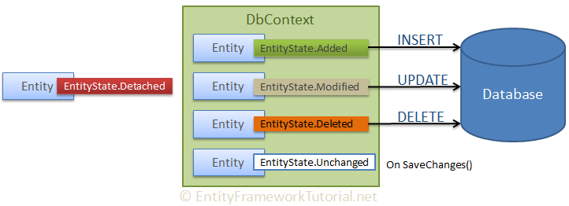

# Entity Framework Core
Damit unser Webservice in eine Datenbank schreiben kann, arbeiten wir mit dem OR Mapper für .NET Core Anwendungen
Entity Framework Core. Die Grundfunktionen wie Navigation Properties und LINQ für den Zugriff sind ident,
deswegen ist eine Einarbeitung sehr leicht wenn bereits das Entity Framework .NET verwendet wurde.

## Arbeiten mit einer SQLite Datenbank
Als Datenbanksystem für den Unterricht verwenden wir SQLite, da sie alle Daten in einer Datei speichert
und diese leicht weitergegeben kann. SQLite Datenbanken können mit der Software [SQLite Studio](https://sqlitestudio.pl/index.rvt?act=download)
verwaltet werden. Diese Software gibt es auch in einer portable Version, sodass nur die ZIP Datei entpackt
und das Programm gestartet werden muss.

Unsere Datenbank *Schule.db* kann mit *Database* - *Add a Database* in SQLite Studio geladen werden. Danach
kann über *Connect to Database* in der Symbolleiste (1. Symbol) die Verbindung aufgebaut werden. Die Datenbank
besteht aus 2 Tabellen und einer Fremdschlüsselbeziehung:



## Upgrade auf Visual Studio 16.3 und .NET Core 3
Um .NET Core zu nutzen, muss Visual Studio 2019 auf die Version 16.3 aktualisiert werden. Eine Anleitung
ist auf [Visual Studio Docs](https://docs.microsoft.com/en-us/visualstudio/install/update-visual-studio?view=vs-2019)
zu finden.

Das Ausgangsprojekt in diesem Ordner ist bereits für .NET Core 3 eingerichtet. Es ist daher nicht mehr
möglich, ein Downgrade auf .NET Core 2.1 oder 2.2 durchzuführen, da sich die Konfigurationsoptionen von
ASP.NET Core 3.0 geändert haben. Möchte man das Projekt händisch aktualisieren, so müssen die Dateien
*Program.cs* und *Startup.cs* angepasst werden. Angepasste Versionen sind in diesem Ordner zu finden.

## Installation von EntityFramework.Core
Wir benötigen 2 Pakete, um auf die SQLite Datenbank zugreifen zu können:
- Microsoft.EntityFrameworkCore.Tools 
- Microsoft.EntityFrameworkCore.Sqlite

Diese können entweder über die grafische Oberfläche von NuGet oder über die Packet Manager Console
installiert werden. Diese kann über das Menü *Tools* - *NuGet Package Manager* - *Packet Manager Console*
geöffnet werden. Für die Installation sind 2 Befehle einzugeben:
```powershell
Install-Package Microsoft.EntityFrameworkCore.Tools 
Install-Package Microsoft.EntityFrameworkCore.Sqlite
```

## Automatisches Erstellen der Modelklassen
Mit folgendem Befehl in der Packet Manager Console wird ein Verzeichnis *Model* erstellt und die 
Modelklassen werden generiert. Die Option -Force erzwingt ein Überschreiben vorhandener Dateien.
```powershell
Scaffold-DbContext "DataSource=Schule.db" Microsoft.EntityFrameworkCore.Sqlite -OutputDir Model -UseDatabaseNames -Force
```

**Achtung: Für diesen Vorgang muss das Projekt erstellt werden können. Syntaxfehler, die z. B. durch
das Löschen des Model Ordners entstehen, führen zu einem Fehler!**

Nun kann im Controller die Datenbank instanziert und wie gewohnt mit LINQ abgefragt werden:
```c#
private readonly SchuleContext db = new SchuleContext();
[HttpGet]
public IActionResult Get()
{
    return Ok(db.Schueler.Select(s => new { s.S_Vorname, s.S_Zuname }));
}
```

### Problem mit Autoincrement
Wird eine Spalte aul *AUTOINCREMENT* Wert deklariert, wird dies unter Umständen nicht korrekt erkannt.
Um das zu beheben, ist in der Conextklasse die Methode *OnModelCreating()* anzupassen. Dafür wird beim
entsprechenden Entity statt der Methode *ValueGeneratedNever()* die Methode *ValueGeneratedOnAdd()* 
verwendet:
```c#
entity.Property(e => e.U_ID)
    .IsRequired()
    .ValueGeneratedOnAdd();
```

## CRUD Operationen mit Entity Framework Core
Mit dem Entity Framework Core können natürlich auch INSERT, UPDATE und DELETE Anweisungen abgesetzt werden.
Dafür wird der sogenannte EntityState eines Objektes in der DbSet Collection gesetzt.



<sup>Quelle: https://www.entityframeworktutorial.net/basics/entity-states.aspx</sup>

Folgendes Codebeispiel generiert einen Schüler mit einer zufälligen Schülernummer und fügt ihn in die
Datenbank ein. Die Klasse wird nur über die Navigation gesetzt, der Wert für *S_Klasse* wird nach dem 
Setzen des *EntityState* auf *Added* automatisch gesucht. Das anschließende *SaveChanges()* schickt
das *INSERT* an die Datenbank.
```c#
Random rnd = new Random();
Schueler s = new Schueler
{
    S_Nr = rnd.Next(),
    S_Geschl = "m",
    S_Zuname = "Mustermann",
    S_Vorname = "Max",
    S_KlasseNavigation = db.Klasse.Find("4AHIF")
};

db.Entry(s).State = Microsoft.EntityFrameworkCore.EntityState.Added;
try
{
    db.SaveChanges();
}
catch (Microsoft.EntityFrameworkCore.DbUpdateException)
{
    return StatusCode(StatusCodes.Status500InternalServerError);
}
```

Soll nun der Schüler aktualisiert werden, so wird das gewünschte Property geändert und der *EntityState*
auf *Modified* gesetzt. Ein *SaveChanges()* schreibt die *UPDATE* Anweisung.

```c#
s.S_Zuname = "Mustermann2";
db.Entry(s).State = Microsoft.EntityFrameworkCore.EntityState.Modified;
try
{
    db.SaveChanges();
}
catch (Microsoft.EntityFrameworkCore.DbUpdateException)
{
    return StatusCode(StatusCodes.Status500InternalServerError);
}
```

Das Löschen eines Schülers wird durch das Setzen des *EntityState* auf *Deleted* gelöst:
```c#
db.Entry(s).State = Microsoft.EntityFrameworkCore.EntityState.Deleted;
try
{
    db.SaveChanges();
}
catch (Microsoft.EntityFrameworkCore.DbUpdateException)
{
    return StatusCode(StatusCodes.Status500InternalServerError);
}
```
 
## Konfigurieren der Datenbank über ConfigureServices()
Beim Kompilieren wird eine Warnung ausgegeben: *"To protect potentially sensitive information in your connection string, you should move it out of source code."* Diese entsteht dadurch, dass der
Connection String in der Methode *SchuleContext.OnConfiguring()* im Quelltext enthalten ist. Um das
zu beheben, entfernen wir die Methode *OnConfiguring()*, da wir über die Konfigurationsdatei
den Connection String einlesen wollen.

In ASP.NET gibt es mit der Methode *Startup.ConfigureServices()* eine zentrale Stelle, wo alle
Konfigurationen - also auch die verwendete Datenbank - eingestellt werden können. Als ersten Schritt
erweitern wir die Datei *appsettings.json* um einen Punkt *AppSettings*. Darin speichern wir unter 
dem Eintrag Database den Namen unserer SQLite Datenbank. Die Datei *appsettings.json* sieht danach so aus:
```js
{
  "AppSettings": {
    "Database":  "Schule.db"
  },
  "Logging": {
    "LogLevel": {
      "Default": "Warning"
    }
  },
  "AllowedHosts": "*"
}
```

In *Startup.ConfigureServices()* rufen wir nun eine noch zu schreibende Extension Methode 
*ConfigureDatabase()* auf. Über das *Configuration* Property der Klasse Startup können wir auf
die gesetzte Konfiguration in *appsettings.json* bequem über den Index zugreifen:
```c#
public void ConfigureServices(IServiceCollection services)
{
    services.ConfigureDatabase(Configuration["AppSettings:Database"]);
    services.ConfigureCors();
    services.AddControllers();
}
```

In der Klasse *HostingExtensions* ergänzen wir nun diese Methode:
```c#
public static void ConfigureDatabase(this IServiceCollection services, string database)
{
    services.AddDbContext<SchuleContext>(options =>
        options.UseSqlite($"DataSource={database}")
    );
}
```

## Übung
Öffne die Solution *PostRequestExample.sln* in diesem Ordner und verwende nun die Datenbank statt den Demodaten. Gehe dabei
so vor:
- Aktualisiere deinen Rechner auf VS 16.3 und .NET Core 3.
- Installiere Microsoft.EntityFrameworkCore.Tools und Microsoft.EntityFrameworkCore.Sqlite
- Generiere die Modelklassen in den Ordner *Model*. Dies ersetzt das "alte" Mockup Model.
- Passe die Feldnamen an, so dass der Code korrekt ist.
- Implementiere die CRUD Operationen in den einzelnen Routen des Controllers.
- Um *self referencing Loops* zu vermeiden, dürfen die Entities (Schüler, Klasse, ...) nicht direkt
  ausgegeben werden. Der Serializer würde dadurch von Schüler auf die Klasse und dann über die
  Navigation zum Schüler zurück gehen. Erstelle daher beim Zurückgeben der Daten mit *new { }* eine 
  anonyme Klasse mit den gewünschten Properties.

