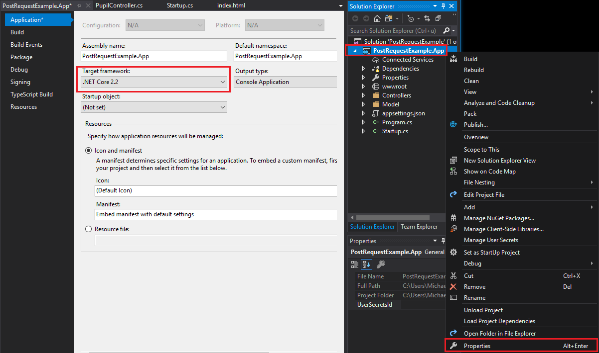

# Entity Framework Core
Damit unser Webservice in eine Datenbank schreiben kann, arbeiten wir mit dem OR Mapper für .NET Core Anwendungen
Entity Framework Core. Die Grundfunktionen wie Navigation Properties und LINQ für den Zugriff sind ident,
deswegen ist eine Einarbeitung sehr leicht wenn bereits das Entity Framework .NET verwendet wurde.

## Arbeiten mit einer SQLite Datenbank
Als Datenbanksystem für den Unterricht verwenden wir SQLite, da sie alle Daten in einer Datei speichert
und diese leicht weitergegeben kann. SQLite Datenbanken können mit der Software [SQLite Studio](https://sqlitestudio.pl/index.rvt?act=download)
verwaltet werden. Diese Software gibt es auch in einer portable Version, sodass nur die ZIP Datei entpackt
und das Programm gestartet werden muss.

Unsere Datenbank *Schule.db* kann mit *Database* - *Add a Database* in SQLite Studio geladen werden. Danach
kann über *Connect to Database* in der Symbolleiste (1. Symbol) die Verbindung aufgebaut werden. Die Datenbank
besteht aus 2 Tabellen und einer Fremdschlüsselbeziehung:


## Upgrade des Projektes auf .NET Core 2.2
Das Projekt in *02_PostPutDeleteRoutes* wurde mit .NET Core 2.1 erstellt. Wenn in diesem Projekt über NuGet
das Entity Framework Core installiert wird, gibt es einen Versionskonflikt, da die neueste Version geladen wird
und diese schon für .NET Core 2.2 geschrieben ist. Deswegen führen wir ein Upgrade auf .NET Core 2.2
durch. Lade dafür von [Download .NET](https://dotnet.microsoft.com/download) unter dem Punkt *Download .NET Core SDK*
die neueste SDK und installiere diese.

Öffne danach das Projekt *02_PostPutDeleteRoutes* in Visual Studio 2019 und stelle in den Projekteigenschaften
*.NET Core 2.2* als Zielplattform ein.



Wenn nun mit F6 ein Erstellen des Projektes durchgeführt wird, erscheint eine Fehlermeldung, dass das 
Paket Microsoft.AspNetCore.Razor.Design nicht mit der Version 2.2 kompatibel ist. Um eine neuere Version 
dieses Paketes einzutragen, klicke doppelt auf den Projektnamen (PostRequestExample.App) und ändere 
in der XML Datei das Paket auf folgenden Eintrag:
```xml
<PackageReference Include="Microsoft.AspNetCore.Razor.Design" Version="2.2.0" PrivateAssets="All" />
```

Nun muss das Projekt mit F6 erstellt werden.

## Installation von EntityFramework.Core
Wir benötigen 2 Pakete, um auf die SQLite Datenbank zugreifen zu können:
- Microsoft.EntityFrameworkCore.Tools 
- Microsoft.EntityFrameworkCore.Sqlite

Diese können entweder über die grafische Oberfläche von NuGet oder über die Packet Manager Console
installiert werden. Diese kann über das Menü *Tools* - *NuGet Package Manager* - *Packet Manager Console*
geöffnet werden. Für die Installation sind 2 Befehle einzugeben:
```powershell
Install-Package Microsoft.EntityFrameworkCore.Tools 
Install-Package Microsoft.EntityFrameworkCore.Sqlite
```

## Automatisches Erstellen der Modelklassen
Ziehe die Datei Schüler.db in den Solution Explorer über den Projektnamen. Dadurch wird die Datenbank
in das Projekt integriert. Mit folgendem Befehl in der Packet Manager Console kann ein Verzeichnis
Model2 erstellt und die Klassen generiert werden:
```powershell
Scaffold-DbContext "DataSource=Schule.db" Microsoft.EntityFrameworkCore.Sqlite -OutputDir Model2 -UseDatabaseNames
```

**Achtung: Für diesen Vorgang muss das Projekt erstellt werden können. Syntaxfehler, die z. B. durch
das Löschen des Model Ordners entstehen, führen zu einem Fehler!**

Nun kann im Controller die Datenbank instanziert und wie gewohnt mit LINQ abgefragt werden:
```c#
private readonly SchuleContext db = new SchuleContext();
[HttpGet]
public IActionResult Get()
{
    return Ok(db.Schueler.Select(s => new { s.S_Vorname, s.S_Zuname }));
}
```

## Übung
Öffne dein Projekt *02_PostPutDeleteRoutes* und verwende nun die Datenbank statt den Demodaten. Gehe dabei
so vor:
- Aktualisiere das Projekt auf .NET Core 2.2
- Installiere Microsoft.EntityFrameworkCore.Tools und Microsoft.EntityFrameworkCore.Sqlite
- Generiere die Modelklassen zuerst in den Ordner *Model2*. Danach lösche den alten Ordner *Model* und
  benenne *Model2* auf *Model* um. Vergiss nicht, auch den Namespace umzubenennen.
- Passe die Feldnamen an, so dass der Code korrekt ist.
