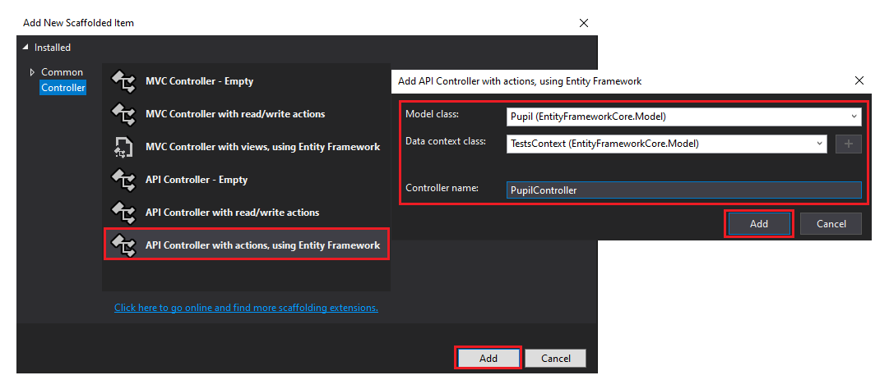

# REST mit Entity Framework Core

Damit unser Webservice in eine Datenbank schreiben kann, arbeiten wir mit dem OR Mapper für .NET Core Anwendungen
Entity Framework Core. Voraussetzung für dieses Kapitel ist daher der Umgang mit Entity Framework Core. In
[EF Core des Repositories Pos3xhif](https://github.com/schletz/Pos3xhif/tree/master/03%20EF%20Core)
gibt es Unterlagen dazu.

## Erstellen eines WebAPI Projektes mit Datenbank

Am Einfachsten ist das Erstellen von der Konsole aus. Mit *dotnet new webapi* wird eine leere
WebAPI Applikation erstellt. Danach können mit *dotnet ef dbcontext scaffold* die Modelklassen
erstellt werden. Eine Anleitung dazu ist im oben verlinkten Kapitel über [EF Core](https://github.com/schletz/Pos3xhif/tree/master/03%20EF%20Core)
zu finden.

Folgende Befehle zeigen das Erstellen einer WebAPI Anwendung mit SQLite Datenbank in der Konsole.
Die Datenbank *Tests.db* muss natürich vor dem Aufrufen des scaffold Skriptes in den Ordner kopiert
werden.

```text
md DemoApp
cd DemoApp
dotnet new webapi
dotnet add package Microsoft.EntityFrameworkCore.Tools
dotnet add package Microsoft.EntityFrameworkCore.Sqlite
dotnet ef dbcontext scaffold "DataSource=Tests.db" Microsoft.EntityFrameworkCore.Sqlite ^
    --output-dir Model --use-database-names --force --data-annotations
```

## Die SQLite Tests Datenbank

In diesem Beispiel verwenden wir die Datenbank *Tests* des Kapitels [EF Core](https://github.com/schletz/Pos3xhif/tree/master/03%20EF%20Core)
aus dem 3. Jahrgang. Sie hat folgenden Aufbau:


## Registrieren des Datenbankcontext als Service

Unsere Controller brauchen natürlich Zugriff auf die generierte Contextklasse der Datenbank. In
ASP.NET Core ist dafür die Methode *ConfigureServices()* in *Startup.cs* vorgesehen. Wir registrieren
mit *AddDbContext()* unseren erzeugten Context als Service.

```c#
public void ConfigureServices(IServiceCollection services)
{
    // ...
    services.AddDbContext<Model.TestsContext>();
}
```

Nun erhält jeder Controller (und auch andere Services) den Context über den Konstruktor.
(constructor based dependency injection). Da Instanzen in ASP.NET Core oft andere Lebenszyklen als
Controller oder Komponenten haben, wurde dieser Mechanismus eingeführt.

```c#
public class PupilController : ControllerBase
{
    private readonly TestsContext _context;

    public PupilController(TestsContext context)
    {
        _context = context;
    }
}
```

## Speichern der Verbindungsdaten in appsettings.json

Beim Kompilieren wird eine Warnung ausgegeben: *"To protect potentially sensitive information in your
connection string, you should move it out of source code."* Diese entsteht dadurch, dass der
Connection String in der Methode *OnConfiguring()* im Quelltext der Contextklasse enthalten ist.

In ASP.NET gibt es mit der Methode *ConfigureServices()* in *Startup.cs* eine zentrale Stelle, wo alle
Konfigurationen - also auch die verwendete Datenbank - eingestellt werden können. Als ersten Schritt
erweitern wir die Datei *appsettings.json* um einen Punkt *AppSettings*. Darin speichern wir unter
dem Eintrag Database den Connection String zu unserer SQLite Datenbank. Bei anderen Datenbanksystemen
(MySQL, SQL Server, ...) sieht dieser String natürlich anders aus. Er kann 1:1 von der ursprünglichen
*OnConfiguring()* Methode verwendet werden. Die Datei *appsettings.json* sieht danach so aus:

```js
{
  "AppSettings": {
    "Database":  "DataSource=Tests.db"
  },
  "Logging": {
    "LogLevel": {
      "Default": "Warning"
    }
  },
  "AllowedHosts": "*"
}
```

Nu entfernen wir die Methode *OnConfiguring()*, da wir in *ConfigureServices()* bei *AddDbContext()*
einen Parameter mitgeben. Dieser Parameter liest aus der *appsettings.json* den Key
*AppSettings* und *Database*:

```c#
public void ConfigureServices(IServiceCollection services)
{
    // ...
    services.AddDbContext<Model.TestsContext>(options =>
        options.UseSqlite(Configuration["AppSettings:Database"]));
}
```

## Automatisches Erstellen eines CRUD Controllers mit Visual Studio

Visual Studio bietet ein Template an, mit dem für eine Datenbanktabelle schon ein fertiger Controller
erstellt werden kann. Dafür klickt man im Kontextmenü des Ordners *Controllers* im Solution Explorer
auf *Add > Controller...* und wählt folgende Optionen:



## Anpassen der Modelklassen

Mit *System.Text.Json.Serialization.JsonPropertyName* und *System.Text.Json.Serialization.JsonIgnore*
kann die Ausgabe der Modelklasse als JSON beeinflusst werden. *JsonPropertyName* setzt den Namen des
Properties im JSON. Beim Einlesen wird dieser Name auch verwendet und umgesetzt.

*JsonIgnore* ist bei Navigation Properties wichtig. Sie sind (meist) null wenn die Daten serialisiert
werden. Durch diese Option werden sie gar nicht erst geschrieben.

Folgendes Beispiel zeigt die Verwendung in *Model/Pupil.cs*:

```c#
public partial class Pupil
{
    [Key]
    [System.Text.Json.Serialization.JsonPropertyName("Id")]
    public long P_ID { get; set; }
    // ...
    [ForeignKey(nameof(P_Class))]
    [InverseProperty(nameof(Schoolclass.Pupil))]
    [System.Text.Json.Serialization.JsonIgnore]
    public virtual Schoolclass P_ClassNavigation { get; set; }
}

```

## Der Code von PupilController.cs

Als Basis für den *PupilController* wurde das Template von Visual Studio verwendet und erweitert.
Da bei einer Datenbank natürlich mehr Probleme als bei reinen Speicherlisten vorkommen können,
ist das korrekte Behandeln von Fehlern sehr wichtig. Diese Fehler müssen in schlüssige HTTP
Statuscodes übersetzt werden, damit die aufrufende Applikation entsprechend reagieren kann.

Die Funktionsweise ist in den nachfolgenden Kommentaren erklärt.

```c#
using System;
using System.Collections.Generic;
using System.Linq;
using System.Threading.Tasks;
using Microsoft.AspNetCore.Http;
using Microsoft.AspNetCore.Mvc;
using Microsoft.EntityFrameworkCore;
using EntityFrameworkCore.Model;

namespace EntityFrameworkCore.Controllers
{
    [Route("api/[controller]")]
    [ApiController]
    public class PupilController : ControllerBase
    {
        private readonly TestsContext _context;

        /// <summary>
        /// Speichert den über Dependency Injection übergebenen DB Context.
        /// Dabei ist in Startup.cs in ConfigureServices() die Zeile
        ///     services.AddDbContext<Model.TestsContext>();
        /// einzufügen.
        /// </summary>
        public PupilController(TestsContext context)
        {
            _context = context;
        }

        /// <summary>
        /// Ragiert auf GET /api/pupil
        /// Liefert alle Schüler in der Pupil Tabelle als JSON.
        /// </summary>
        [HttpGet]
        [ProducesResponseType(StatusCodes.Status200OK)]
        public async Task<IActionResult> GetPupil()
        {
            // Damit wir das Entity nicht 1:1 serialisieren, wählen wir die Inhalte aus.
            var result = await (from p in _context.Pupil
                                select new
                                {
                                    Id = p.P_ID,
                                    Firstname = p.P_Firstname,
                                    Lastname = p.P_Lastname,
                                    Class = p.P_Class
                                }).ToListAsync();
            return Ok(result);
        }

        /// <summary>
        /// Reagiert auf GET /api/pupil/{id}
        /// Liefert ein Eintrag eines Schülers in der Pupil Tabelle als JSON.
        /// Dabei werden die JSON Annotations (JsonIgnore, JsonPropertyName) in der Modelklasse
        /// Pupil berücksichtigt.
        /// </summary>
        [HttpGet("{id}")]
        [ProducesResponseType(StatusCodes.Status200OK)]
        [ProducesResponseType(StatusCodes.Status404NotFound)]
        public async Task<ActionResult<Pupil>> GetPupil(long id)
        {
            // Navigationen in der Entity Klasse Pupil können über 
            // [System.Text.Json.Serialization.JsonIgnore] ausgeschlossen werden.
            Pupil pupil = await _context.Pupil.FindAsync(id);

            if (pupil == null) { return NotFound(); }
            return pupil;
        }

        /// <summary>
        /// Reagiert auf POST /api/pupil
        /// Schreibt einen neuen Schüler in die Datenbank.
        /// </summary>
        /// <param name="pupil">Schülerdaten als JSON im Request Body.</param>
        [HttpPost]
        [ProducesResponseType(StatusCodes.Status201Created)]
        [ProducesResponseType(StatusCodes.Status400BadRequest)]
        [ProducesResponseType(StatusCodes.Status409Conflict)]
        public async Task<ActionResult<Pupil>> PostPupil(Pupil pupil)
        {
            // Felder mit [Required] in der Modelklasse werden automatisch geprüft. Wurden sie
            // nicht übermittelt, so wird BadRequest() erzeugt. Darum müssen wir uns nicht
            // kümmern.
            _context.Pupil.Add(pupil);
            try
            {
                await _context.SaveChangesAsync();
            }
            catch (DbUpdateException)
            {
                // Hier landet man, wenn Contraints fehlschlagen. Möchte man diese feiner
                // abprüfen, so müssen sie im Programmcode vorab geprüft werden.
                return Conflict();
            }

            // Liefert den Inhalt des Requests GET /api/pupil/{id} und HTTP 201 (Created)
            return CreatedAtAction(nameof(GetPupil), new { id = pupil.P_ID }, pupil);
        }

        /// <summary>
        /// Reagiert auf PUT /api/pupil/{id}
        /// <param name="pupil">Schülerdaten als JSON im Request Body.</param>
        /// </summary>
        [HttpPut("{id}")]
        [ProducesResponseType(StatusCodes.Status204NoContent)]
        [ProducesResponseType(StatusCodes.Status400BadRequest)]
        [ProducesResponseType(StatusCodes.Status404NotFound)]
        [ProducesResponseType(StatusCodes.Status409Conflict)]
        public async Task<IActionResult> PutPupil(long id, Pupil pupil)
        {
            // Request weicht vom Inhalt ab?
            if (id != pupil.P_ID) { return BadRequest(); }
            _context.Entry(pupil).State = EntityState.Modified;

            try
            {
                await _context.SaveChangesAsync();
            }
            catch (DbUpdateConcurrencyException)
            {
                // Es wurde versucht, einen Schüler zu aktualisieren, den es nicht gibt.
                if (!_context.Pupil.Any(e => e.P_ID == id)) { return NotFound(); }
                else { throw; }
            }
            catch (DbUpdateException)
            {
                // Eine Kollision beim Aktualisieren (Femdschlüssel, ...) trat auf.
                return Conflict();
            }
            // Unbehandelte Fehler führen automatisch zu HTTP 500.

            return NoContent();
        }


        /// <summary>
        /// Reagiert auf DELETE /api/pupil/{id}
        /// Löscht den Schüler mit der angegebenen ID aus der Pupil Tabelle.
        /// </summary>
        [HttpDelete("{id}")]
        [ProducesResponseType(StatusCodes.Status204NoContent)]
        [ProducesResponseType(StatusCodes.Status404NotFound)]
        public async Task<ActionResult<Pupil>> DeletePupil(long id)
        {
            Pupil pupil = await _context.Pupil.FindAsync(id);
            if (pupil == null) { return NotFound(); }
            _context.Pupil.Remove(pupil);
            try
            {
                await _context.SaveChangesAsync();
            }
            catch (DbUpdateException)
            {
                // Es kann vorkommen, dass die Daten als FK verwendet werden.
                return Conflict();
            }
            return NoContent();
        }
    }
}
```

## Übung

Erstelle analog zur vorigen Übung einen *ClassController*, sodass Klassen angelegt, geändert oder 
gelöscht werden. Implementiere die folgenden Requests:

| Method                   | URL                             | Response   |
| ---------------------    | -----------------               | ---------- |
| POST (JSON Body)         | /api/class                      | Neu angelegte Klasse als JSON; HTTP 409 wenn die Klasse schon vorhanden ist; HTTP 400 wenn die Klasse nicht mit einer Ziffer beginnt. |
| PUT                      | /api/class/(klassenname)        | HTTP 204 (No Content); HTTP 400 wenn sich der Name der Klasse ändern soll; HTTP 404 wenn die Klasse nicht gefunden wurde. |
| DELETE                   | /api/class/(klassenname)        | HTTP 204 (No Content); HTTP 404 wenn die Klasse nicht gefunden wurde; HTTP 409 wenn die Klasse noch Schüler hat. |

