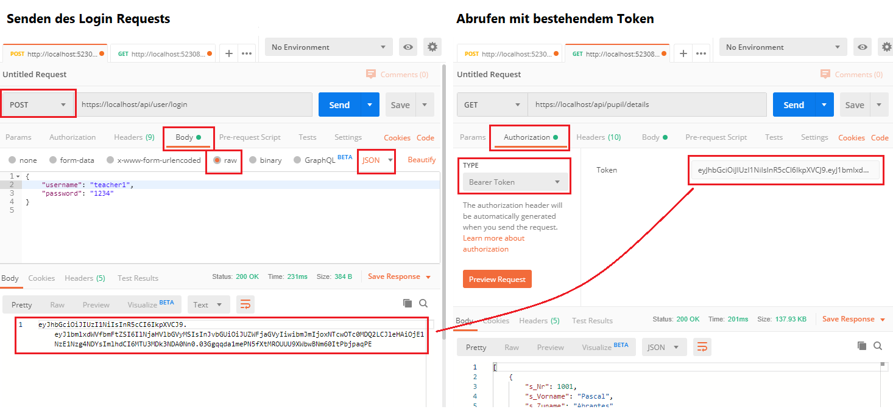

# Authentication in einer ASP.NET WebAPI Anwendung

## Erstellen eines neuen WebAPI Projektes

Diese Anleitung beschreibt das Integrieren der JWT und Cookie Authentication in ein ASP.NET Code
WebAPI Projekt. Es kann mit folgenden Befehlen in der Konsole angelegt werden.

```text
md AuthDemo
cd AuthDemo
dotnet webapi new
```

## Schritt 1: Installation der NuGet Pakete

Für die JWT Autentifizierung muss das Paket *Microsoft.AspNetCore.Authentication.JwtBearer*
installiert werden. Es kann über die Packet Manager Console oder in der Windows Konsole mit dem
Befehl

```text
dotnet add package Microsoft.AspNetCore.Authentication.JwtBearer
```

installiert werden.

## Schritt 2: Übernehmen der Klassen in *Extensions*, *Services* und *Controller*

Lege in deinem Projekt in Visual Studio 2 neue Ordner an: *Extensions* und *Services*. Danach kopiere
die folgenden Dateien in in die entsprechenden Ordner deines Projektes:

- *Extensions/IServiceCollectionExtensions.cs*
- *Services/AuthService.cs*
- *Services/UserCredentials.cs*
- *Controllers/UserController.cs*
- *Controllers/PupilController.cs*

Danach passe den Namespace dieser Klassen an, sodass dein Projektname verwendet wird.
Am Schnellsten geht dies in Visual Studio mit *CTRL + .*, wenn der Cursor im Namespace steht.

## Schritt 3: Aktivieren der Authentifizierung in ASP.NET

Die Methode *ConfigureServices()* in *Startup.cs* muss nun angepasst werden, um die Authentifizierung
zu konfigurieren. Dafür stehen in der Klasse *IServiceCollectionExtensions* 2 Extension Methoden
bereit: *AddJwtAuthentication()* und *AddCookieAuthentication()*.

### Fall 1: Reines WebAPI Projekt ohne Blazor

Stellt der ASP.NET Server nur Routen bereit und keine Views, so muss nur die JWT Authentifizierung
aktiviert werden:

```c#
public void ConfigureServices(IServiceCollection services)
{
    ...
    // BEGIN AUTHENTICATION ************************************************************************
    string jwtSecret = Configuration["AppSettings:Secret"] ?? AuthService.GenerateRandom(1024);
    services.AddJwtAuthentication(jwtSecret, setDefault: true);
    services.AddScoped<AuthService>(services =>
        new AuthService(jwtSecret));
    // END AUTHENTICATION **************************************************************************
    ...
}
```

### Fall 2: Blazor oder MVC Projekt und WebAPI

Sollen Views und Controller gemischt in einem Projekt angeboten werden, so werden beide Methoden
aktiviert. Das Setzen der default Methode bei der Cookie Authentifizierung bedeutet, dass - wenn
keine Methode bei der Annotation *Authorize* angegeben wird - das Cookie berücksichtigt wird.

```c#
public void ConfigureServices(IServiceCollection services)
{
    ...
    // BEGIN AUTHENTICATION ************************************************************************
    string jwtSecret = Configuration["AppSettings:Secret"] ?? AuthService.GenerateRandom(1024);
    services.AddJwtAuthentication(jwtSecret, setDefault: false);
    services.AddCookieAuthentication(setDefault: true);
    services.AddScoped<AuthService>(services =>
        new AuthService(jwtSecret));
    // END AUTHENTICATION **************************************************************************
    ...
}
```

## Anpassen der Methode *Configure()*

In der Methode *Configure()* der Datei *Startup.cs* muss die Authentifizierung noch aktiviert werden:

```c#
public void Configure(IApplicationBuilder app, IWebHostEnvironment env)
{
    ...
    // BEGIN AUTHENTICATION ************************************************************************
    // Muss NACH UseRouting() und VOR UseEndpoints() stehen.
    app.UseAuthentication();
    app.UseAuthorization();
    // END AUTHENTICATION **************************************************************************
    ...
}
```

## Schritt 4: Testen der Route mit Postman

Stelle sicher, dass in *File > Settings...* die Punkte *SSL certificate verification* und
*Automatically follow redirects* in Postman deaktiviert sind.

Zum Testen der Applikation starte diese mit *dotnet run*. Es können 2 gültige Benutzer gesendet
werden:

- *{ "username": "pupil1", "password": "1234" }*
- *{ "username": "teacher1", "password": "1234" }*.

Diese Daten werden als POST Request an *https://localhost/api/user/login* gesendet. Der
zurückgegebene String wird dann bei einem GET Request auf *https://localhost/api/pupil/me* oder
*https://localhost/api/pupil/details* als Bearer Token im Authentication Header gesendet.



## Schritt 5: Generieren des Secrets

Wenn kein Secret konfiguriert wurde, wird mit jedem Neustart des Servers ein solches generiert.
Dadurch werden aber alle Token ungültig und jeder muss sich neu authentifizieren. Daher kann
das Secret auch in der Datei *appsettings.json* gespeichert werden.

Auf der Seite https://generate.plus/en/base64 kann ein zufälliger Base64 codierter String erzeugt
werden. Ihn brauchen wir für das Speichern des Secrets bei der JWT Authentifizierung. Es wird zur
Prüfung der Signatur des Tokens verwendet. Für ein 1024bit langes Secret verwenden wir eine 128 Byte
lange Zufallszahl.

Nun kopieren wir das Secret in die Datei *appsettings.json*, damit unser Programm später darauf
zugreifen kann.

> **Achtung:** Die Datei *appsettings.json* sollte dann nicht öffentlich hochgeladen werden, denn
> jeder kann mit diesem Secret gültige Token für unsere Applikation erzeugen.

```javascript
{
  "AppSettings": {
    "Secret": "Hier ist das Secret zu setzen."
  },
  "Logging": {
    "LogLevel": {
      "Default": "Information",
      "Microsoft": "Warning",
      "Microsoft.Hosting.Lifetime": "Information"
    }
  }
}
```

## Eigene Anpassungen

Natürlich muss die Logik noch an die eigenen Erfordernisse angepasst werden.

### Anpassung des Authentication Services

In der Klasse *Services/AuthServices()* gibt es die Methode *CheckUserAndGetRole()*. Sie liefert
im Moment noch statisch die oben genannten Benutzer als richtig zurück. Das muss natürlich geändert
werden.

Soll in dieser Methode auf die Datenbank zugegriffen werden, so kann der Datenbankcontext mit
AddDbContext in *ConfigureServices()* registriert werden. Dadurch wird dem Service der Datenabnkcontext
im Konstruktor übergeben und kann gespeichert werden. Details sind im Kapitel
[03_EntityFrameworkCore][../03_EntityFrameworkCore] zu finden.

Wenn erforderlich kann noch die Methode *GetUserDetails()* implementiert werden, die genauere
Informationen zum übergebenen Usernamen aus der Datenbank herausliest.

### Erstellen eigener Controller

Auf welche Route mit welcher Autorisierung zugegriffen werden darf, bestimmen im Controller die
Annotations. Folgendes Beispiel zeigt dessen Einsatz im Pupil Controller:

```c#
// Diese Annotation aktiviert die Autorisierung für die Routen des Controllers
[Authorize(AuthenticationSchemes = JwtBearerDefaults.AuthenticationScheme)]
public class PupilController : ControllerBase
{
    // SZENARIO 1: Anonymer Zugriff erlaubt
    [AllowAnonymous]
    [HttpGet("demo1")]
    public string GetAnonymous() => "Anonymous";

    // SZENARIO 2: Nur ein Token mit der eingetragenen Rolle Teacher ist erlaubt
    [Authorize(Roles = "Teacher")]
    [HttpGet("demo2")]
    public string GetTeacher() => "Teacher";

    // SZENARIO 3: Keine Annotation: Es wird ein beliebiger gültiger JWT akzeptiert
    [HttpGet("demo3")]
    public ActionResult<string> GetMyData()
    {
        string username = User.Claims.FirstOrDefault(c => c.Type == ClaimTypes.Name)?.Value ?? "";
        string role = User.Claims.FirstOrDefault(c => c.Type == ClaimTypes.Role)?.Value;
        return Ok($"{username}:{role}");
    }
```

## Konfiguration der Ports und des Loggings

In diesem Beispiel wurde in der Methode *CreateHostBuilder()* in der Datei *Program.cs* das Logging
für die Konsole aktiviert. Außerdem wurden die Ports auf 80 und 443 festgelegt:

```c#
public static IHostBuilder CreateHostBuilder(string[] args)
{
    return Host.CreateDefaultBuilder(args)
        .ConfigureLogging(logging =>
        {
            logging
                .ClearProviders()
                .AddConsole();
        })
        .ConfigureWebHostDefaults(webBuilder =>
        {
            webBuilder
                .UseUrls("http://*:80;https://*.443")
                .UseStartup<Startup>();
        });
}
```

Durch den Logger kann nun in jeder Klasse der Logger über Dependency Injection geholt und benutzt
werden.

```c#
public class MyController : ControllerBase
{
    ...
    private readonly ILogger<UserController> _logger;
    public UserController(ILogger<UserController> logger)
    {
        ...
        _logger = logger;
    }

    public string MyMethod()
    {
        _logger.LogInformation("Info");
        _logger.LogWarning("Warning");
        _logger.LogError("Error");
    }
```
