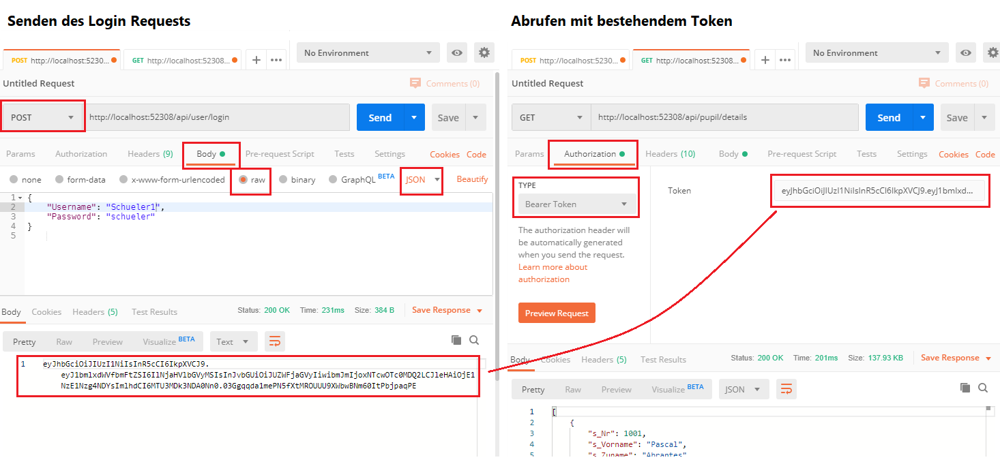

# Praktische Umsetzung: Authorization in ASP.NET Core

Siehe Kommentare im Projekt *AuthExample.sln*. Du kannst due Authentifizierung mit Postman testen:

## Weitere Informationen
- Setting up ApiKey-based Authentication: https://www.youtube.com/watch?v=Zo3T_See7iI
- Nick Chapsas: ASP.NET Core 3 & 2.2: https://www.youtube.com/playlist?list=PLUOequmGnXxOgmSDWU7Tl6iQTsOtyjtwU