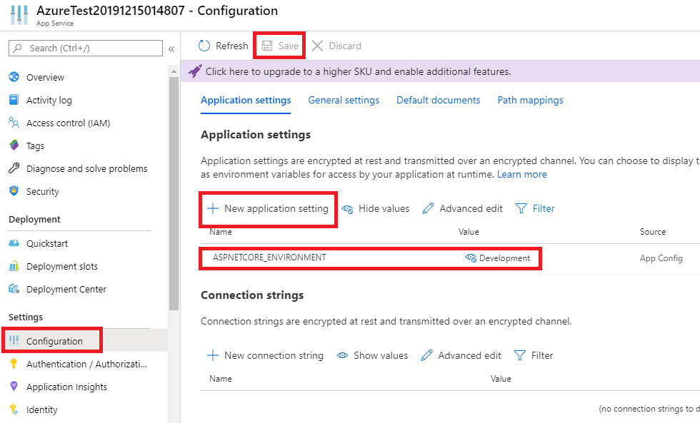

# Deployment von ASP.NET Applikationen

Soll der Server für ein Projekt in den Produktivbetrieb gehen, sind folgende Schritte zu erledigen:

- Anpassung der Datei *launchSettings.json*.
- Erstellen des Release Builds.
- Ausführen am Zielrechner.

## Anpassen der Konfiguration

Die von Visual Studio erstelle Konfiguration startet den IIS Express Webserver. Um den Kestrel Server
direkt zu starten, werden die IIS Profile in der Datei *Properties/launchSettings.json* entfernt. Weiters
kann der verwendete Port (hier 5000) angepasst werden. Die Datei sieht nach der Entfernung des IIS
Profiles so aus:

```js
{
  "$schema": "http://json.schemastore.org/launchsettings.json",
  "profiles": {
    "PostRequestExample.App": {
      "commandName": "Project",
      "applicationUrl": "http://localhost:5000",
      "environmentVariables": {
        "ASPNETCORE_ENVIRONMENT": "Development"
      }
    }
  }
}
```

Die gesetzte Information unter *ASPNETCORE_ENVIRONMENT* kann in der ASP.NET Core Applikation über
Dependency Injection mit dem IHostingEnvironment Interface abgefragt werden. Eine Beschreibung ist auf der
[MSDN](https://docs.microsoft.com/en-us/aspnet/core/fundamentals/environments?view=aspnetcore-3.0)
verfügbar.

## SSL verwenden

Gerade bei der Übertragung von Passwörtern muss unser Server die Daten über das https Protokoll
verschlüsseln. Dabei gibt es 2 Möglichkeiten:

- Verwenden eines vertrauenswürdigen SSL Zertifikates.
- Generieren eines selbst signierten SSL Zertifikates.

Die Verschlüsselungsalgorithmen und somit die Sicherheit der Verschlüsselung selbst sind bei beiden 
Varianten gleich, bei selbst signierten Zertifikaten erscheint im Browser jedoch eine Warnmeldung und 
ist somit nur für Testzwecke geeignet.

### Anpassen der Datei *launchSettings.json*

Wir ergänzen bei *applicationUrl* in der Datei *Properties/launchSettings.json* einfach eine HTTPS Adresse,
die auf den Standardport für HTTPS (443) hört. Außerdem schreiben wir statt localhost das Interface
0.0.0.0, da sonst Verbindungen über das Netzwerk nicht angenommen werden.

```js
{
  "$schema": "http://json.schemastore.org/launchsettings.json",
  "profiles": {
    "PostRequestExample.App": {
      "commandName": "Project",
      "applicationUrl": "http://0.0.0.0:80;https://0.0.0.0:443",
      "environmentVariables": {
        "ASPNETCORE_ENVIRONMENT": "Development"
      }
    }
  }
}
```

Falls ein Benutzer die http Adresse ohne SSL aufrufen möchte, können wir ihn über die Methode
*UseHttpsRedirection()* in der Datei *Startup.cs* auf die https Seite umleiten. Diese Methode muss
gleich am Anfang aufgerufen werden:

```c#
public void Configure(IApplicationBuilder app, IWebHostEnvironment env)
{
    app.UseHttpsRedirection();
    // Other Code...
}
```

> **Achtung**: Dieses Zertifikat ist - wie oben erwähnt - selbst signiert und daher nicht vertrauenswürdig.
> Für Produktionsanwendungen muss ein vertrauenswürdiges Zertifikat vom Hoster oder einem unabhängigen
> Anbieter erworben werden.

## Veröffentlichen in Azure App Services

> **Hinweis:** Eine App in Azure ist öffentlich (das ist ja auch der Sinn der Veröffentlichung).
> Falls noch kein Login verwendet wird, kann jeder die
> Daten abrufen. Verwende zumindest als Name für die App eine GUID (https://www.guidgenerator.com/),
> damit zumindest der Name nicht einfach zu erraten ist.

Um die Applikation in Azure veröffentlichen zu können, prüfe folgende Schritte:

- Ist auf https://sic.spengergasse.at die Zustimmung für die Übertragung des Accounts an Microsoft aktiviert (Punkt Office 365)?
- Funktioniert der Schul Login auf https://portal.azure.com?
- Wenn eine SQLite Datenbank verwendet wird: Ist im Solution Explorer bei dieser Datei die Option "Copy always" gesetzt?

Starte nun mit *dotnet run* in der Konsole den Server und prüfe, ob die Seite unter http://localhost 
und https://localhost unter dem Standardport (80 und 443) erreichbar ist.

Nun klicke mit der rechten Maustaste auf das Projekt im Visual Studio Solution Explorer und wähle
*Publish*. Mit *Create New* kann eine neue Applikation in Azure erstellt werden. Die weiteren
Dialoge sind selbsterklärend und das Veröffentlichen ist mit wenigen Klicks erledigt. Nun ist die
App unter https://(name).azurewebsites.net abrufbar.

### Aktivieren des Development Profiles

Falls Fehler auftreten, werden keine Beschreibungen dazu in Azure angezeigt. Das liegt daran, dass diese
nur im Profil *Development* sichtbar sind. Um das zu aktivieren, klicke in https://portal.azure.com
unter *App Services* auf deine App. Unter den Einstellungen kann nun die Umgebungsvariable
*ASPNETCORE_ENVIRONMENT* auf *Development* gesetzt werden.



### Aktivieren von MySQL in App

In Azure kann - ebenfalls unter *Settings* des App Serivce - der Punkt *MySQL in App* aktiviert
werden. Dabei wird ein Connectionstring angeboten, der in der Datei *Startup.cs* der ASP.NET
Core Applikation verwendet werden kann:

```c#
string connectionString = Environment.GetEnvironmentVariable("MYSQLCONNSTR_localdb")
    ?.Replace("Data Source", "Server")
    ?.Replace("User Id", "User") ?? "";
services.AddDbContext<ApplicationDbContext>(options =>  
    options.UseMySql(connectionString)
);
```

In Windows kann diese Variable *MYSQLCONNSTR_localdb* zum Testen angelegt werden (*Start* -
*Environment Variables*). Diese muss einen Connectionstring liefern, wie ihn auch Azure liefern würde.
Die einzelnen Werte können natürlich an das lokale System angepasst werden.

```text
Database=localdb;Data Source=127.0.0.1:50513;User Id=azure;Password=xxxxxx
```

## Erstellen des Release Builds

Der folgende Befehl erzeugt einen Releasebuild mit folgenden Optionen:

- publish: Fügt alle Abhängigkeiten hinzu.
- -c Release: Erzeugt einen Release Build.
- -o (Dir): Speichert die Dateien im angegebenen Verzeichnis.
- --self-contained: Fügt die .NET Runtimebibliotheken hinzu.
- -r winx64 Gibt die Zielplattform an. Eine Auflistung ist im [RID Catalog](https://docs.microsoft.com/en-us/dotnet/core/rid-catalog)
  zu finden.

```text
...\AuthExample.App>dotnet publish -c Release -o ../Production --self-contained -r win-x64
```

## Ausführen der Datei

Der oben erzeugte Ordner Production wird auf das Zielsystem kopiert. Dort kann mit folgendem Befehl
der Server gestartet werden:

```text
.../Production>dotnet AuthExample.App.dll
```

Soll der Port nachträglich geändert werden, so kann in der Datei *appsettings.json* durch Hinzufügen
der folgenden Optionen der Port geändert werden:

```js
  "Kestrel": {
    "EndPoints": {
      "Http": {
        "Url": "http://0.0.0.0:80;https://0.0.0.0:443"
      }
    }
  }
```

Eine Auflistung aller Konfigurationsmöglichkeiten ist in der [MSDN](https://docs.microsoft.com/en-us/aspnet/core/fundamentals/servers/kestrel?view=aspnetcore-3.0) verfügbar.

Natürlich müssen die verwendeten Datenbanken und externe Ressourcen auch am Zielrechner zur Verfügung
stehen. Dafür ist ggf. die Datei *appsettings.json* an die veränderten Connection Strings, etc. anzupassen.
