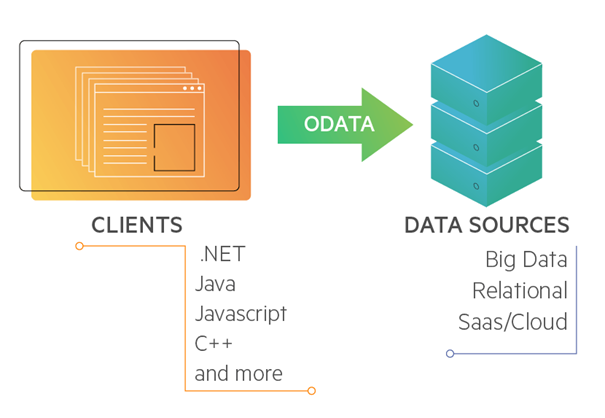
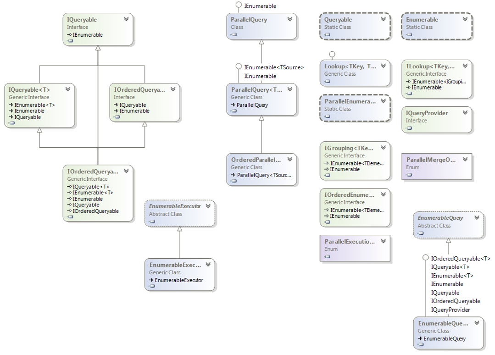
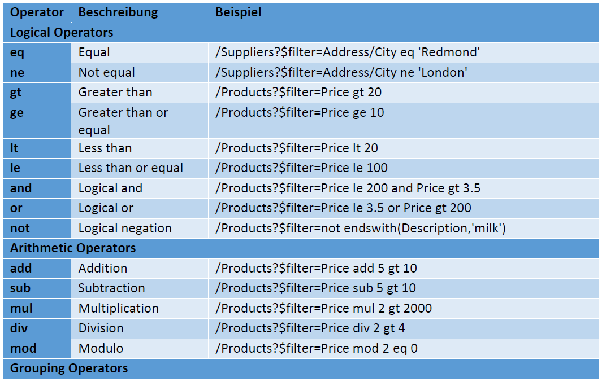

# OData (Open Data)

Das Open Data Protocol (OData) ist ein unter dem Open Specification Promise von Microsoft veröffentlichtes HTTP-basiertes Protokoll für den Datenzugriff zwischen kompatiblen Softwaresystemen, um in diesen CRUD-Operationen zu ermöglichen.



Es ermöglicht eine flexible Datenübertragung zwischen Server und Client oder Server und Server. Unterschiedliche Implementierungen dieses Protokolls erleichtern die Entwicklung von REST-Apis erheblich. Wir beschäftigen uns in dieser Stunde mit der Implementierung von Microsoft.

## Eine klassische Get-Route

Als erstes benötigen wir wie immer einen Api-Controller. Darin erstellen wir eine bereits bekannte Get-Methode und geben Informationen aus der Datenbank an den Aufrufer zurück. Das ist ja nichts neues.

Nicht vergessen! Wir müssen den DBContext mittels Dependency-Injection in den Controller bringen.

Der Controller wird anschließend mit der Methode befüllt:

```C#
[HttpGet()]
public IEnumerable<SchoolClasses> Get()
{
    return _dbContext.SchoolClasses;
}
```

## Logging für EF-Core aktivieren

In dieser Solution wurde die Ausgabe der SQL Statements aktiviert. Möchte man in anderen Projekten diese Statements ausgeben, so muss das Paket `Microsoft.Extensions.Logging.Console` installiert werden:

Dafür muss folgendes NuGet-Package installiert werden:

```PowerShell
Microsoft.Extensions.Logging.Console
```

Danach wird in der Klasse AirQualityContext eine statische Membervariable (kein Property!) `MyLoggerFactory` angelegt. Static ist wichtig, da sonst bei jeder Abfrage eine neue Instanz erzeugt wird.

```C#
public static readonly ILoggerFactory MyLoggerFactory
    = LoggerFactory.Create(builder => { builder.AddConsole(); });
```

Zum Schluss wird in der Methode OnConfiguring() der Logger registriert

```C#
public static void ConfigureMsSql(this IServiceCollection services, string connectionString)
{
    services.AddDbContext<SchoolContext>(optionsBuilder =>
    {
        if (!optionsBuilder.IsConfigured)
        {
            optionsBuilder
                .UseLoggerFactory(MyLoggerFactory)
                .UseSqlite(connectionString);
        }
    });
}
```

Wir können die Api nun mit folgender URL aufrufen:

```URL
https://localhost:5001/api/schoolclasses
```

Der entstandene Query:

```SQL
SELECT "s"."Id", "s"."Department", "s"."Name"
FROM "SchoolClasses" AS "s"
```

Im Grunde ein einfacher Query nach dem Grundmuster `select * from`

Möchten wir nun nach unterschiedlichen Feldern filtern, sortieren, gruppieren, abzählen, oder nur einzelne Felder an den Client zurückgeben, wird die Programmlogik dieser, bis jetzt noch sehr simplen Methode, schnell komplex werden. Oder der Controller implementiert mehrere Methoden, jede speziell für eine bestimmt Einschränkung. Auch das wird bei umfangreichen Anforderungen an den Controller kompliziert werden. Es geht einfacher.

## OData aktivieren

### Installation der notwendigen NuGet-Packages

Wie bereits aus dot-Net Core bekannt müssen wir folgende NuGet-Packages installieren `Microsoft.AspNetCore.OData`:

```PowerShell
Install-Package Microsoft.AspNetCore.OData
```

Entweder direkt über die Packet Manager Console, oder etwas komfortabler über den NuGet Packet Manager.

### Routing anpassen (Startup.cs)

Zurück zur `Startup.cs`, unserer Middleware-Configuration. Wir fügen die OData-Middleware hinzu:

```C#
public void ConfigureServices(IServiceCollection services)
{
    services.AddControllers();

    services.ConfigureMsSql(Configuration["sqlConnection:connectionString"]);

    services.AddOData();
}
```

Anschließend müssen wir das klassische Endpoint-Routing deaktivieren, da OData nicht Endpoint-Routing verwendet, sondern MVC-Routing. OData unterstützt aktuell noch kein Endpoint Routing. Es wird in der Methode `AddControllers` folgende Option festgelegt:

```C#
public void ConfigureServices(IServiceCollection services)
{
    services.AddControllers(options => options.EnableEndpointRouting = false);

    services.ConfigureMsSql(Configuration["sqlConnection:connectionString"]);

    services.AddOData();
}
```

Das Routing muss nun in der Configure-Methode konfiguriert werden. Also Endpoint-Routing löschen (hier auskommentiert) und MVC-Routing hinzufügen, mit den entsprechenden Optionen:

```C#
public void Configure(IApplicationBuilder app, IWebHostEnvironment env)
{
    if (env.IsDevelopment())
    {
        app.UseDeveloperExceptionPage();
    }

    app.UseHttpsRedirection();
    app.UseRouting();
    app.UseAuthorization();

    //app.UseEndpoints(endpoints =>
    //{
    //    endpoints.MapControllers();
    //});

    app.UseMvc(routeBuilder => 
    { 
        routeBuilder.EnableDependencyInjection();
        routeBuilder.Filter().OrderBy().Count().MaxTop(100).Expand();
    });
}
```

Schauen wir uns das kurz an:

Die Methode `UseEndpoints` ist ausgeblendet. OData unterstützt in der aktuellen Version kein Endpoint Routing. Das ist das einzige Manko zur Zeit, allerdings wird das vermutlich zeitnahe behoben sein. Letztlich ist die aktuelle Version immer noch Beta.

Wir verwenden also klassisches MVC-Routing. Dafür aktivieren wir Dependency-Injection für das Routing mit der Methode `EnableDependencyInjection()`. Diese Methode aktiviert Dependency-Injection für http-Routen. Das ist für das MVC-Routing notwendig.

Ein weiterer Schritt ist noch notwendig. Wir müssen der OData-Middleware noch bekannt geben, welche Methoden die API unterstützen soll. Soll sie Sortieren könne, Filtern können, Zählen können, usw. (Expand, OrderBy, Filter, Count, MaxTop, …)

## Der Controller

Ändern wir nun den Controller. Zur Erinnerung, so sieht zur Zeit die Get-Methode im Controller aus:

```C#
[HttpGet()]
public IEnumerable<SchoolClasses> Get()
{
    return _dbContext.SchoolClasses;
}
```

Sie lädt lediglich alle SchoolClasses und inkludieren die Messwerte, damit sie der OR-Mapper ebenfalls verwalten kann. Die Methode kann also nicht besonders viel. Es gibt keinerlei Möglichkeiten der Filterung, Sortierung oder ähnliches.

Diese Features können wir durch folgende Data-Annotation aktivieren:

```C#
[HttpGet()]
[EnableQuery()]
public IEnumerable<SchoolClasses> Get()
{
    return _dbContext.SchoolClasses;
}
```

`EnableQuery()` teilt der Methode mit, dass ich darin alle OData-Features nutzen möchte. Jetzt kann unsere Get-Methode in die wir keinerlei Logik programmiert haben, plötzlich sortieren, filtern, usw. Wir können jetzt die URL zu unserer Get-Methode um z.B. eine Filtermöglichkeit erweitern:

```URL
https://localhost:5001/api/schoolclasses?$filter=name%20eq%20'4AHIF'
```

Wir erhalten tatsächlich ein eingeschränktes Ergebnis

```PowerShell
[{"id":"1712DAF8-BF01-4F88-905B-74EC9498D077","name":"4AHIF","department":"Höhere Informatik","pupils":[]}]
```

Sehen wir uns den Query im Console-Log an:

```SQL
SELECT "s"."Id", "s"."Department", "s"."Name"
FROM "SchoolClasses" AS "s"
WHERE "s"."Name" = @__TypedProperty_0
```

OData erstellt also eine SQL-Query, der die Daten schon gefiltert aus der Datenbank holt. Achtung! Würde man im LinQ-Statement die Methode `ToList()` verwenden, würden alle Daten geholt und erst am Client gefiltert werden.

Die `ToList()`-Methode also nicht verwenden, sondern `AsQueryable()`. Wie wir aus LinQ bereits wissen, werden 2 Interfaces implementiert, `IEnumerable` und `IQueryable`.



Der OR-Mapper benutzt IQueryable, deshalb kann die EnableQuery-Annotation das LinQ-Statement das wir in der Get-Methode erstellt haben, erweitern. Das funktioniert weil LinQ, IQueryable implementiert und der OR-Mapper ebenfalls. Daher kann man dazwischen Klassen und Methoden schreiben, die das eine auf das andere mappen.

## OData-Queries

Die Api ist jetzt plötzlich in der Lage dem Client flexibel Daten zur Verfügung zu stellen. Dazu müssen wir weder SQL noch LinQ schreiben. Die folgende Syntaxbeispiele repräsentieren die wesentlichen Query Options.

### OrderBy

Wird verwendet, um Datensätze zu sortieren.

Syntax:

```URL
$orderby=[PropertyName] asc/desc
```

Bsp:

```URL
https://localhost:5001/api/station?$orderby=name desc
```

### Top

Liefert die angegeben Anzahl an Datensätzen.

Syntax:

```URL
$top=[Anzahl]
```

Bsp:

```URL
https://localhost:5001/api/station?$top=5
```

### Skip

Liefert die Datensätze ab dem angegebenen Wert

Syntax:

```URL
$skip=[Wert]
```

Bsp:

```URL
https://localhost:5001/api/station?$skip=2
```

Die Options skip und top sollten sinnvollerweise immer gemeinsam verwendet werden. Die Option skip gibt an ab welchem Datensatz Ergebnisse geliefert werden sollen und top gibt die Anzahl der zu liefernden Datensätze an. Diese beiden Options eignet sich hervorragend für Paging.

### Filter

Die Filtering-Option reduziert das Ergebnis entsprechend der angegebenen Bedingung

Folgende Tabelle veranschaulicht dabei die zur Verfügung stehenden Operatoren:



Syntax:

```URL
?$filter=[PropertyName] [Operator] '[Wert]'
```

Bsp:

```URL
Bsp: https://localhost:5001/api/station?$filter=shortname eq 'z'
```

## Zusammengesetzte Queries

Mehrere Options lassen sich in einem Query natürlich auch zusammensetzen. Dabei geht man wie bei einer klassischen URL vor. Der erste Parameter wird mit dem Fragezeichen gekennzeichnet, alle weitern Parameter werden mit dem kaufmännischen UND (&) getrennt

Syntax:

```URL
?$option1=[Wert1]&$option2=[Wert2]&$...
```

Bsp:

```URL
https://localhost:5001/api/station?$top=10&$skip=10&$orderby=name asc
```

## Erweiterung EDM (DTO)

Eine kleine Erweiterung wäre noch zu erwähnen. Wir haben ja gelernt, über die Service-Fassade hinaus mit DTO's zu arbeiten. Das sollte mit OData natürlich nicht anders sein. Allerdings ist es nicht notwendig DTO's zu erstellen, OData macht das für uns. Es wird ein sog. EDM (Entity Data Model) erstellt. D.h. Ergebnisse die unsere Controller-Methode produziert, werden auf das EDM gemappt. Deshalb funktioniert auch die `Select`-Methode. Erinnern wir uns an anonyme Typen und die Select-Methode von LinQ. Allerdings müssen wir dafür natürlich ein EDM definieren:

Zuerst die Methode:

```C#
private IEdmModel GetEdmModel()
{
    ODataConventionModelBuilder builder = new ODataConventionModelBuilder();
    var schoolClasses = builder.EntitySet<SchoolClasses>("SchoolClasses");
    schoolClasses.EntityType.Count().Filter().OrderBy().Expand().Select();

    return builder.GetEdmModel();
}
```

Wir benötigen eine Instanz vom OData Model Builder (oder eine abgeleitete Klasse) die dann konfiguriert wird. `EntitySet` gibt das Entity an, von dem weg gemappt wird. Danach, wie bereits gehabt, die Methoden die OData umsetzten soll. (Count, Filter, OrderBy, ...) angeben.

Aufgerufen wird die Methhode natürlich unter `Configure`:

```C#
app.UseMvc(routeBuilder =>
{
    routeBuilder.MapODataServiceRoute("odata", "odata", GetEdmModel());
});
```

!!Achtung!! kleines Manko: die Route darf nun nicht mehr `../api..` lauten, sondern `../odata/..`.

Der Code-Abschnitt von oben muss natürlich entfernt werden: (Ich habe ihn hier auskommentiert dargestellt, damit man sieht was weg muss)

```C#
//app.UseMvc(routeBuilder =>
//{
//    //routeBuilder.EnableDependencyInjection();
//    routeBuilder.Expand().Select().OrderBy().Filter().Count().MaxTop(100);
//    routeBuilder.MapODataServiceRoute("ODataRoute", "api", builder.GetEdmModel());
//});
```

---

## Übung

Lade die vorbereitete Solution herunter und implementiere folgende Funktionen:

+ Installiere alle notwendigen NuGet-Packages
+ Logging der vom OR-Mapper erzeugten SQL-Queries.
+ Deaktiviere End Point Routing und aktiviere stattdessen MVC Routing in der `Startup.cs`. Erstelle ein aber eigenes EDM mit dem OData Model Builder und verwende nicht Dependency Injection.
+ Aktiviere OData in der `Startup.cs` .
+ Füge OData zu den Services hinzu.
+ Ändere im `MeasurementsController` die Get-Methode so, dass sie OData-Queries akzeptiert und korrekt verarbeiten kann.

Gutes Gelingen!
