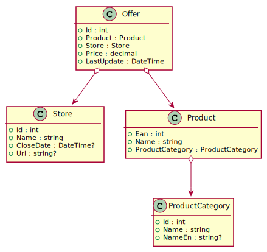

# Razor Pages 1 - Intro

## Inhalt

- Anlegen einer Solution mit Application, Test und Webapp Projekt
- Erstellen und Seeden eines EF Core Models
- Erstellen der ersten Razor Page

Das Video ist auf https://youtu.be/OzDa0B9BonI verfügbar (63min). Der Programmcode ist im
Ordner [StoreManager](StoreManager) zu finden.

Voraussetzung ist der sichere Umgang mit EF Core und dem Code First Ansatz. Dieser wird auf
https://github.com/schletz/Pos3xhif/tree/master/03%20EF%20Core
beschrieben.

## Anlegen des Projektes

```
rd /S /Q StoreManager
md StoreManager
cd StoreManager
md StoreManager.Application
cd StoreManager.Application
dotnet new classlib
dotnet add package Microsoft.EntityFrameworkCore --version 6.*
dotnet add package Microsoft.EntityFrameworkCore.Sqlite --version 6.*
dotnet add package Microsoft.EntityFrameworkCore.Proxies --version 6.*
dotnet add package Bogus --version 34.*
cd ..
md StoreManager.Test
cd StoreManager.Test
dotnet new xunit
dotnet add reference ..\StoreManager.Application
cd ..
md StoreManager.Webapp
cd StoreManager.Webapp
dotnet new webapp
dotnet add reference ..\StoreManager.Application
cd ..
dotnet new sln
dotnet sln add StoreManager.Webapp
dotnet sln add StoreManager.Application
dotnet sln add StoreManager.Test
start StoreManager.sln

```

## Klassenmodell



<sup>
https://www.plantuml.com/plantuml/uml/ZP3FQeSm3CVlVOhUn-y5F4p1UHYCRR3v0A6DMkWVQUD1njvzBR5Z4s7pelaaVFADNIA8j3ah5gDHebjfbmvf2Je9PI4b-KOXelmGCZztZresqdZYwXaSvZfHD7vcrDkGy06eyF9wDmvRRetHVW-tubCS_fTfmdZjVur1Rueougy3SwA6azL9emhIg8m3o_094esh_XscBEQLuNQxPyTFK3TnkbhsG3Y7kF_pFp0Q_CMzrLXD0_W_LES8pJbKTX-4JpYtE_HwS_OB
</sup>
