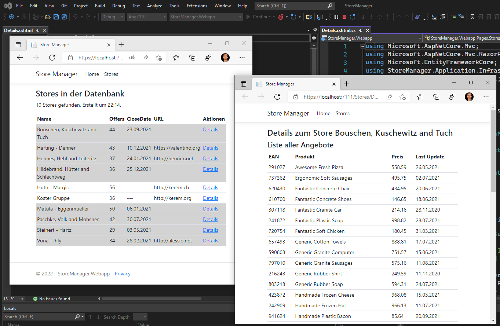

# Razor Pages 2 - Details Page

## Inhalt

- Sections für CSS Deklarationen
- Der asp-page Tag Helper, Erstellen von Links auf andere Razor Pages
- Routingparameter und GUID Werte
- Include() in EF Core
- Abfrageoptimierung mit eigenen Klassen für Summenwerte

Das Video ist auf https://youtu.be/dlNkI7X80FI verfügbar (56min). Der Programmcode ist im
Ordner [StoreManager](StoreManager) zu finden.

Voraussetzung ist der Inhalt des vorigen Kapitels [01 Intro](../01%20Intro/README.md).

