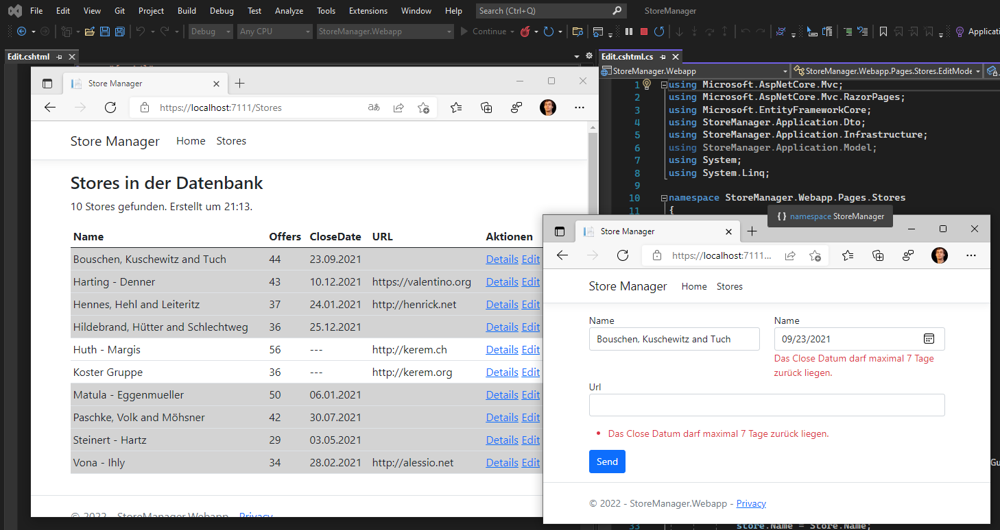

# Razor Pages 3 - Edit

## Inhalt

- Formulare mit dem asp-for Tag Helper
- Model Binding
- Redirect after POST
- DTO Klassen
- AutoMapper

Das Video ist auf https://youtu.be/0BfpNBLNNog verfügbar (55min). Der Programmcode ist im
Ordner [StoreManager](StoreManager) zu finden.

Voraussetzung ist der Inhalt des vorigen Kapitels [02 Details](../02%20Details%20Page/README.md)

