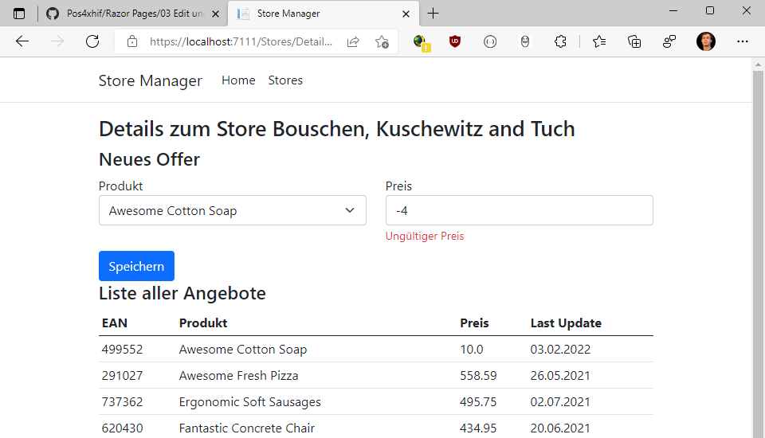

# Razor Pages 4 - Add

## Inhalt

- Einfügen eines neuen Datensatzes
- Select Lists für Fremdschlüssel
- Automapper: Mapping Profile konfigurieren
- Page Filter

Das Video ist auf https://youtu.be/Q4uz7y9IMzU verfügbar (43min). Der Programmcode ist im
Ordner [StoreManager](StoreManager) zu finden.

Voraussetzung ist der Inhalt des vorigen Kapitels [03 Edit](../03%20Edit%20und%20DTO/README.md)

