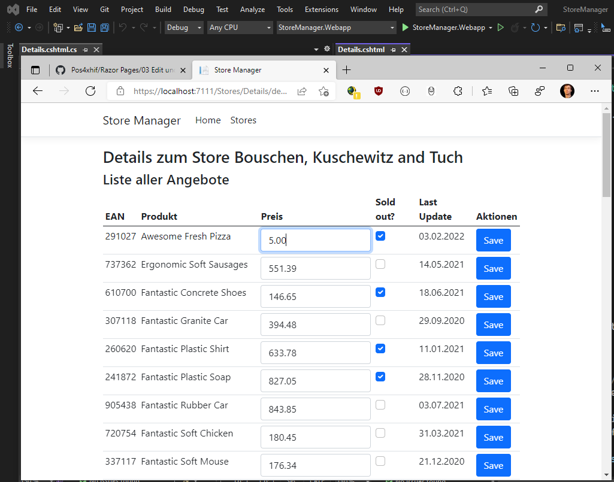

# Razor Pages 4 - Bulk Edit

## Inhalt

- Formulare für mehrere Datensätze
- DTO Klassen und Vererbung
- Dictionaries und Formulare
- Page Filter

Das Video ist auf https://youtu.be/kEW1X2Q8wt0 verfügbar (49min). Der Programmcode ist im
Ordner [StoreManager](StoreManager) zu finden.

Voraussetzung ist der Inhalt des vorigen Kapitels [03 Edit](../03%20Edit%20und%20DTO/README.md)

