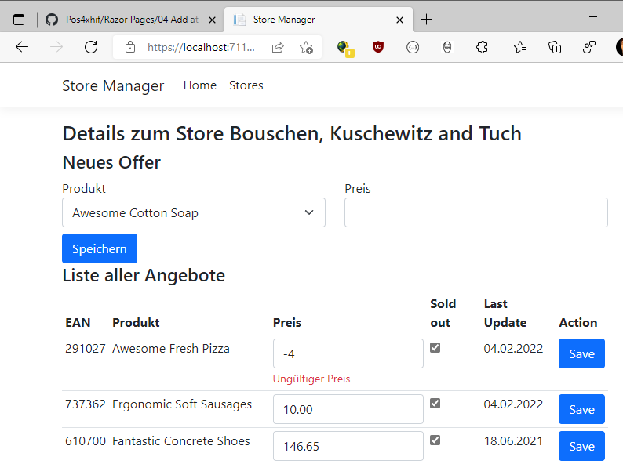

# Razor Pages 5 - Bulk Edit

## Inhalt

- Dictionaries für Formularelemente
- Formulardaten als Parameter der Handlerfunktionen
- Automapper: ProjectTo und Map(src, dst)

Das Video ist auf https://youtu.be/97z3i5sVEBs verfügbar (40min). Der Programmcode ist im
Ordner [StoreManager](StoreManager) zu finden.

Voraussetzung ist der Inhalt des vorigen Kapitels [04 Add](../04%20Add/README.md)

