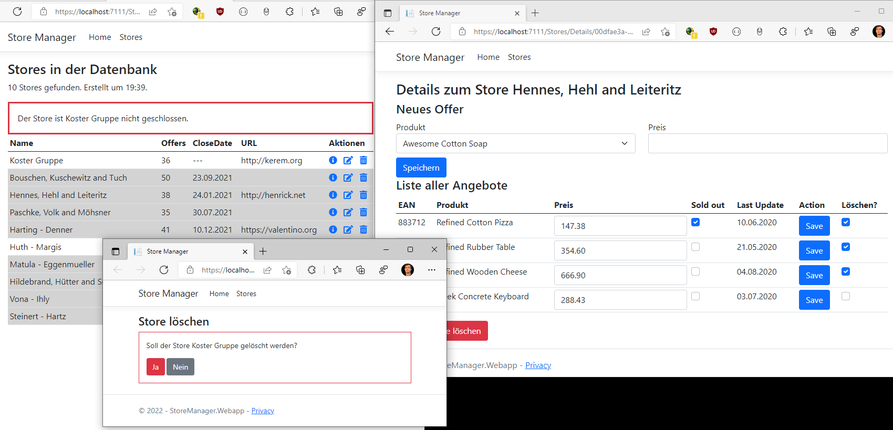

# Razor Pages 7 - Delete Pages

## Inhalt

- Confirmation Page
- Temp Data: Austauschen von Meldungen beim Redirect
- Bulk Delete mit Checkboxen

Das Video ist auf https://youtu.be/c23DNZO5CVA verfügbar (30min). Der Programmcode ist im
Ordner [StoreManager](StoreManager) zu finden.

Voraussetzung ist der Inhalt des vorigen Kapitels [06 Repository](../06%20Repositories/README.md).

