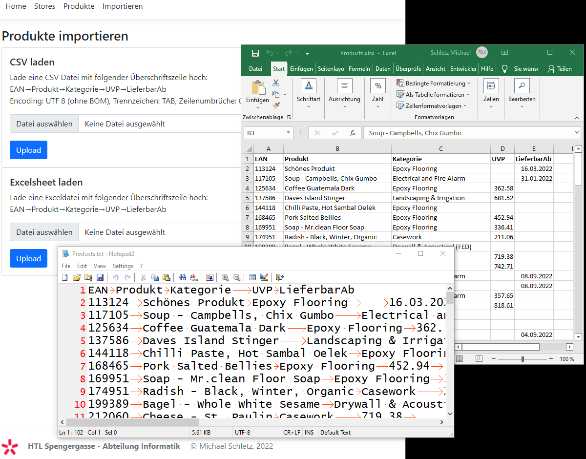

# Razor Pages 8 - Import von Text- und Exceldateien

## Inhalt

- File Uploads in ASP.NET Core
- Ein Service erstellen, registrieren und nutzen
- Das Paket CSVHelper und die Verwendung
- Das Paket ExcelDataReader und die Verwendung
- Importlogik für die Datenbank

Das Video ist auf https://youtu.be/klD60c9LjZM verfügbar (67min). Der Programmcode ist im
Ordner [StoreManager](StoreManager) zu finden.

