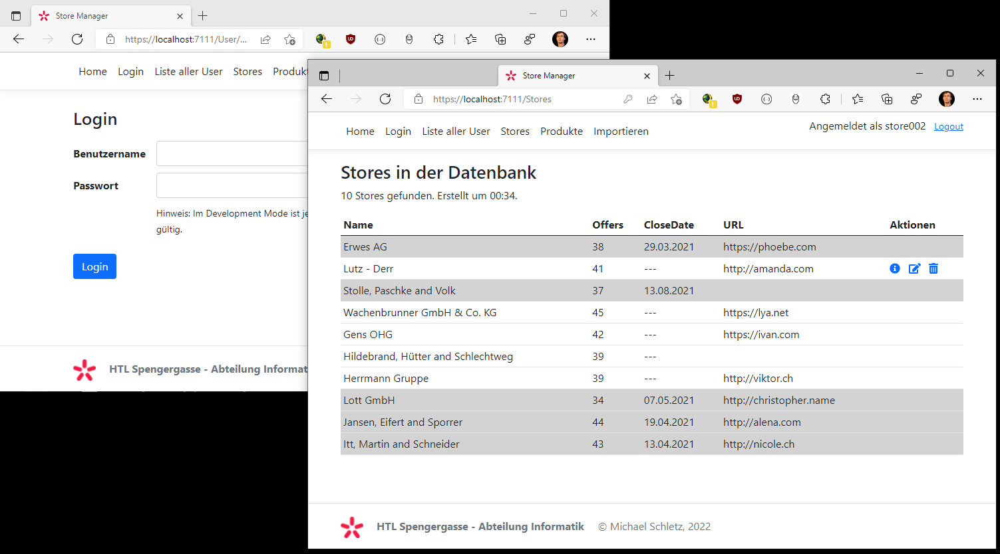

# Razor Pages 9 - Login: Authentication und Authorization

## Inhalt

- Speichern von Passwörtern als HMACSHA512 Hashes
- Erstellen eines Authentication Cookies, Cookie based authentication
- Konfiguration von ASP.NET Core für Authentication
- Der HttpContextAccessor
- @inject in Razor Views
- Annotations für Pages zur Zugriffsbeschränkung
- Anzeigen userspezifischer Inhalte
- Development und Production Mode, launchSettings.json und die Umgebungsvariable ASPNETCORE_ENVIRONMENT

Das Video ist auf https://youtu.be/KaLJ8N2vVsE verfügbar (78min). Der Programmcode ist im
Ordner [StoreManager](StoreManager) zu finden.

