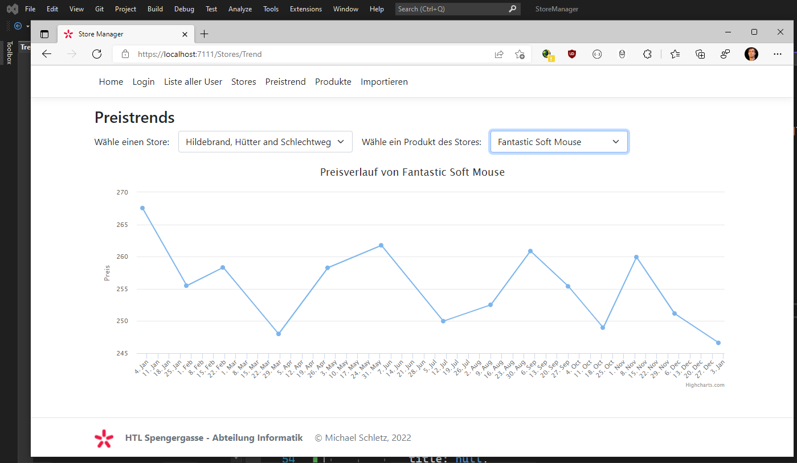

# Razor Pages 10 - Einbinden von Highcharts

## Inhalt

- Senden von JSON Daten mit einem Pagehandler
- Aufrufen der Daten über fetch in JavaScript
- Dynamisches Befüllen von Select Lists
- Viewmodels und Eventhandler in JavaScript
- Export der Daten für die Darstellung als Highchart series
- Extension Methoden für DateTime

Das Video ist auf https://youtu.be/Zgm-rMzxbSM verfügbar (61min). Der Programmcode ist im
Ordner [StoreManager](StoreManager) zu finden.

