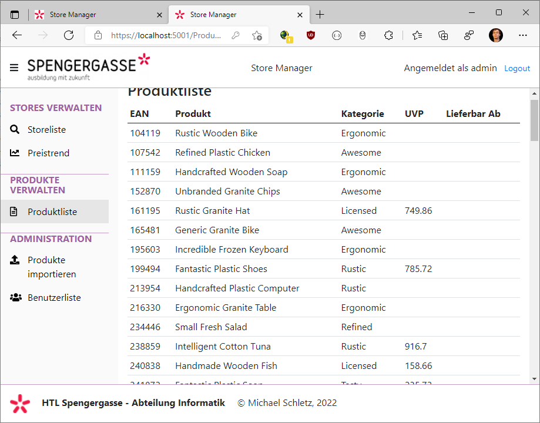
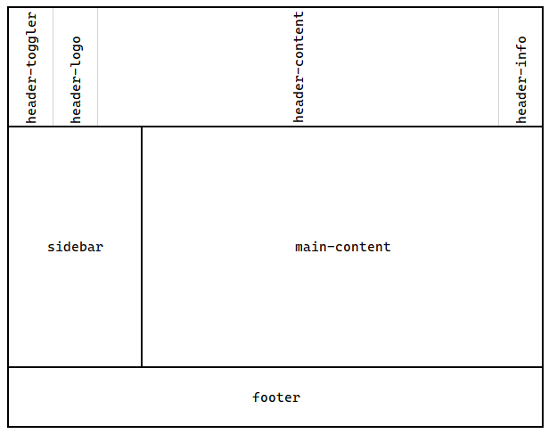
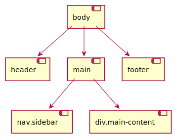

# Razor Pages 12 - Navigation



## Flex Container als Grundlayout

Das neue Layout wurde mit CSS von Grund auf definiert. Mit den heutigen Möglichkeiten von CSS
muss es nicht immer gleich ein komplexes Template, das mehrere MB an Fonts und Libraries lädt,
sein. Unser Layout teilen wir mit folgenden CSS Klassen auf:




## Definieren des Layouts

In [Pages/Shared/_Layout.html](StoreManager/StoreManager.Webapp/Pages/Shared/_Layout.cshtml)
wird die HTML Struktur definiert. Wichtig ist die Anweisung
*@RenderBody()*. Fehlt diese Anweisung, kann das Layout nicht verwendet werden da kein
Platzhalter für die Applikation definiert wurde.

Bei der Namensgebung der CSS Klassen wird darauf geachtet, dass sie die Hierarchie wiedergeben.
*header-content* ist also eine Klasse in Header, *sidebar-item-container* ist in *sidebar-item*.

Die reine Struktur ohne konkrete Inhalte sieht so aus:



```html
<!DOCTYPE html>
<html lang="en">
<head>
<!-- -->
</head>
<body>
    <header>
        <div class="header-toggler" onclick="toggleSidebar()">
            <i class="fas fa-bars"></i>
        </div>
        <div class="header-logo">
            <a href="/">
                
            </a>
        </div>
        <div class="header-content">
            Store Manager
        </div>
        <div class="header-info">
        </div>
    </header>
    <main>
        <nav class="sidebar">
            <ul data-nav-group="Stores verwalten">
                <li class="sidebar-item">
                    <a asp-page="/Stores/Index">
                        <div class="sidebar-item-container">
                            <div class="sidebar-item-icon"><i class="fas fa-search"></i></div>
                            <div class="sidebar-item-text">Storeliste</div>
                        </div>
                    </a>
                </li>
        </nav>
        <div class="main-content">
            @RenderBody()
        </div>
    </main>
    <footer>
    </footer>
    @await RenderSectionAsync("Scripts", required: false)
</body>
</html>
```

## Den CSS Code schreiben

Die Datei [site.css](StoreManager/StoreManager.Webapp/wwwroot/css/site.css) wurde mit folgenden
Überlegungen erstellt:

### Flex Container

Das Layout wird auf Basis von Flex Containern erstellt. Auf https://yoksel.github.io/flex-cheatsheet/
und unzähligen anderen Seiten gibt es eine Einführung in das Thema. Die wichtigsten Attribute sind

#### Bei der Definition eines Containers

- display: flex
- flex-direction: (column|row)
- align-items: (stretch|center|...)

#### Im Flexelement selbst

- flex-grow
- flex-shrink
- flex-base

### Variablen in :root

Farbwerte, ... kommen mehrfach im Stylesheet vor. Damit sie als Variable definiert werden, können wir
sie im root Selector definieren. Für Farbwerte wird *hsl()* verwendet, damit wir Variationen des
gleichen Farbtons (erster Parameter) erzeugen können. Wir können auch Bootstrap Variablen
(https://getbootstrap.com/docs/5.0/customize/css-variables/) überschreiben, um z. b. eine andere
Schrift zu verwenden.

```css
:root {
    --sidebar-background-color: hsl(0, 0%, 98%);
    --sidebar-separator-color: hsl(300, 25%, 70%);
    --sidebar-groupheader-color: hsl(300, 25%, 50%);
    --sidebar-item-color: hsl(0, 0%, 0%);
    --sidebar-item-background-color: hsl(0, 0%, 90%);
    --bs-font-sans-serif: "Segoe UI", sans-serif;
}
```

### Gruppenüberschrift als HTML Attribut

Im Template ist in der UL die Überschrift dieser Gruppe als Attribut mit dem selbst gewählten
Namen *data-nav-group* definiert.

```html
<ul data-nav-group="Stores verwalten">
<!-- ... -->
</ul>
```

Damit daraus ein Element wird, welches der Browser darstellen kann, wird mit dem Pseudoselektor
*::before* gearbeitet. Die Eigenschaft *content* kann den Text aus dem Attribut lesen und so ein
Element erzeugen. *ul[data-nav-group]* bedeutet, dass jedes ul Element mit definiertem Attribut
*data-nav-group* gewählt wird.

```css
ul[data-nav-group]::before {
    content: attr(data-nav-group);
    /* ... */
}
```

### Scrollen

Damit wir nur im Container *main-content* scrollen, definieren wir die *overflow-y* Eigenschaft.
Im Element *main* wird *overflow-y: hidden* gesetzt, sodass keine Vergrößerung des Elementes
durchgeführt wird, wenn mehr Text angezeigt wird. Ohne diesen Wert würde die Scrollbar am Rand
des Dokumentes erstellt werden und wir würden unseren Header "wegscrollen". Danach erlauben wir
die Scrollbar in *main-content*.

```css
main {
    display: flex;
    flex-grow: 1;
    align-items: stretch;
    overflow-y: hidden;
}

.main-content {
    padding-left: 1rem;
    padding-right: 1rem;
    padding-top: 1rem;
    flex-grow: 1;
}
```

### Media Queries

#### Einblenden von Sidebar und Footer

Die Fußzeile und die Sidebar wird nur eingeblendet, wenn die Bildschirmbreite mindestens 576px
beträgt. Der folgende Selektor erledigt dies über die *display* Eigenschaft.

```css
@media (min-width: 576px) {
    footer {
        display: block;
    }

    .sidebar {
        display: block;
    }
}

```

### Drucklayout

Damit beim Ausdrucken die Sidebar und andere Elemente nicht mitgedruckt werden, werden sie auf
*display: none* gesetzt.

```css
@media print {
    .main-content {
        overflow-y: inherit;
    }

    header {
        display: none !important;
    }

    footer {
        display: none !important;
    }

    .sidebar {
        display: none !important;
    }
}
```

### Animation für die Meldung "Nicht angemeldet"

Mit CSS können auch Animationen definiert werden. Die Animation der Meldung "Nicht angemeldet" setzt
alle Sekunden die Deckkraft (*opacity*) auf 0 und wieder zurück.

```css
@keyframes changeopacity {
    from {
        opacity: 0%;
    }

    to {
        opacity: 100%;
    }
}

.not-authenticated {
    animation-duration: 1s;
    animation-name: changeopacity;
    animation-iteration-count: infinite;
    animation-direction: alternate;
}

```
## Ein bisschen Javascript

Am Ende der Layoutdatei wird auf die Daten [site.js](StoreManager/StoreManager.Webapp/wwwroot/js/site.js)
verwiesen. In ihr befindet sich die Methode *toggleSidebar()*. Es ist der Eventhandler für das
Toggle Icon im Layout.

Das Lesen der aktuell gesetzten CSS Eigenschaft *display* muss mit *window.getComputedStyle()*
erfolgen, da die *styles* Collection nur inline Styles umfasst.


```javascript
function toggleSidebar() {
    const navbar = document.querySelector(".sidebar");
    navbar.style.display = window.getComputedStyle(navbar).display != "block" ? "block" : "none";
}
```

Damit in der Sidebar die aktuelle Seite farblich hervorgehoben wird, werden alle Elemente mit der
Klasse *sidebar-item* gelesen. Dann wird geprüft ob der Link, der in diesem Element
definiert wurde, ein Substring der aktuellen Adresse ist.

```javascript
const items = Array.from(document.querySelectorAll(".sidebar-item"));
const active = items.find(i => window.location.href.includes(i.querySelector("a").href));
if (active) {
    active.classList.add("sidebar-active-item");
}
