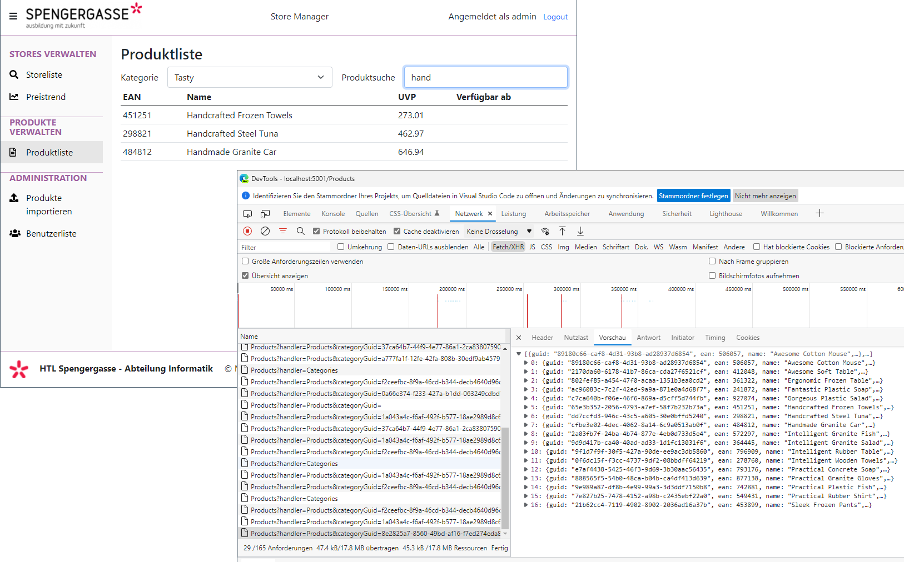

# Razor Pages 13 - Vue.js Template Engine im Browser nutzen

## Inhalt

- Einbinden von Vue.js
- Partial Views zur Einbindung der Scripts.
- JSON Daten mit Pagehandlern generieren.
- JSON Daten mit Vue.js lesen.
- Daten mit der Templatesyntax von Vue.js darstellen.
- State Management.

Das Video ist auf https://youtu.be/Xow96bDWIGc verfügbar (68min). Der Programmcode ist im
Ordner [StoreManager](StoreManager) zu finden.



## Starten der Applikation

Führen Sie die Datei *startServer.cmd* (Windows) bzw. *bash startServer.sh* (Linux) aus. Im
Skript wird die Umgebungsvariable *STORE_ADMIN* für das Adminkennwort gesetzt. Ohne diese
Umgebungsvariable kann der Server nicht starten.

## Zur Verfügung gestellte Dateien

Vue.js 3 muss in den Ordner *wwwroot/lib/vuejs3* kopiert werden.

- [vue.global.js](https://unpkg.com/vue@3) im Browser öffnen und mit STRG+S an die richtige
  Stelle speichern.
- *vue.global.prod.js*: Bei obigem Link *vue.global.js* durch *vue.global.prod.js* ersetzen und
  speichern.


**Pages/Shares/_VuejsPartial.cshtml**

```c#
@using Microsoft.Extensions.Hosting
@inject IHostEnvironment Environment

@if (Environment.IsDevelopment())
{
    <script src="~/lib/vuejs3/vue.global.js"></script>
}
else
{
    <script src="~/lib/vuejs3/vue.global.prod.js"></script>
}
<script src="~/js/vue_extensions.js"></script>

```

**wwwroot/js/vue_extensions.js**

```c#
Vue.$mount = function (viewmodel, container) {
    if (!document.getElementById(container)) {
        throw `Der Container mit der id ${container} wurde nicht gefunden. Fehlt ein div mit dieser id?`;
    }
    Vue.createApp(viewmodel).mount(`#${container}`);
}
/**
 * Ermittelt die URL eines Razor Page Handlers
 * 
 * Vue.$getHandlerUrl("AllStores", {guid = "3c316e59-1f84-42c9-8f86-70747cfb837e"}) 
 *   liefert /Stores/Index?handler=AllStores&guid=3c316e59-1f84-42c9-8f86-70747cfb837e wenn die Funktion
 *   von /Stores/Index aus aufgerufen wurde.
 */
Vue.$getHandlerUrl = function (handler, params) {
    params = params || {};
    const path = window.location.href;
    let url = path.indexOf("?") != -1
        ? path + "&handler=" + handler
        : path + "?handler=" + handler
    url = Object.keys(params).reduce((prev, param) =>
        prev + "&" + param + "=" + params[param]
        , url);
    return url;
};


/**
 * Sendet einen POST/PUT/DELETE Request an die Razor Page
 * Wichtig: In der Serverkonfiguration muss mit 
 *     builder.Services.AddAntiforgery(o => o.HeaderName = "xsrf-token");
 * das Übermitteln des Anti Forgery Tokens im Header aktiviert werden.
 * 
 * data: Ein JSON Object mit dem Payload. Er wird als Formulardaten übertragen
 * method: POST/PUT/DELETE als String.
 * asJson: Wenn der Payload als JSON statt als Formular gesendet werden soll. 
 *         Erfordert [FromBody] in der RazorPage.
 */
Vue.$sendRequest = function (url, data = {}, method = "POST", asJson = false) {
    // Die Formulardaten zum Senden aufbereiten, damit sie wie aus einem HTML Formular gesendet aussehen.
    const formData = asJson === true ? JSON.stringify(data) : Object.keys(data).reduce((formData, key) => {
        formData.append(key, data[key]);
        return formData;
    }, new FormData());

    // Den RequestVerificationToken lesen. Er muss auf der RazorPage mit
    // @Html.AntiForgeryToken()
    // eingefügt werden.
    if (!document.getElementsByName('__RequestVerificationToken') ||
        !document.getElementsByName('__RequestVerificationToken')[0] ||
        !document.getElementsByName('__RequestVerificationToken')[0].value) {
        throw "RequestVerificationToken nicht gefunden. Wurde er mit @Html.AntiForgeryToken() eingefügt?";
    }
    const token = document.getElementsByName('__RequestVerificationToken')[0].value;

    const fetchParams = { method: method };
    fetchParams.headers = { 'XSRF-TOKEN': token };
    if (asJson === true) fetchParams.headers['content-type'] = 'application/json';
    if (method != 'GET') { fetchParams.body = formData; }

    return new Promise((resolve, reject) => {
        fetch(url, fetchParams)
            .then(response => {
                if (response.ok) {
                    response.json()
                        .then(data => resolve(data))
                        .catch(() => resolve({}));    // HTTP 201 no content
                    return;
                }
                if (response.status == 400) {
                    response.text()
                        .then(data => {
                            try {
                                // Server returns JSON? Return error property as validation.
                                const dataJson = JSON.parse(data);
                                // server returns an error property with validation messages?
                                if (!dataJson.errors) {
                                    reject({ status: 400, validation: {}, message: "" });
                                    return;
                                }
                                // convert keys to lowercase
                                const validation = Object.keys(data.errors).reduce((prev, current) => {
                                    prev[current.toLowerCase()] = data.errors[current];
                                    return prev;
                                }, {});
                                reject({
                                    status: response.status,
                                    validation: validation,
                                    message: ""
                                });
                            }
                            // Server returns plaintext? Return as message.
                            catch {
                                reject({ status: 400, validation: {}, message: data });
                            }
                        })
                        .catch(() => reject({ status: 400, validation: {}, message: "Der Server akzeptierte die Anfrage nicht (Bad request)." }));
                    return;
                }
                reject({ status: response.status, validation: {}, message: `Der Server antwortete mit dem Fehlercode ${response.status}.` });
            })
            .catch(() => reject({ status: 0, validation: {}, message: "Der Server ist nicht erreichbar." }));             // Server nicht erreichbar
    });
};

/**
 * Sendet einen GET Request an die Razor Page und liefert das JSON Ergebnis
 * zurück. Tritt ein Fehler auf, wird eine Exception mit den Feldern status und message
 * geworfen.
 * Wichtig: Die Antwort muss mit return new JsonResult im JSON Format
 *          zurückgegeben werden.
 * 
 */
Vue.$get = function (handler, data) {
    return new Promise((resolve, reject) => {
        fetch(Vue.$getHandlerUrl(handler, data))
            .then(response => {
                response.text()
                    .then(data => {
                        try {
                            const dataJson = JSON.parse(data);
                            resolve(dataJson);
                        }
                        catch {
                            // Server lieferte Text (z. B. HTML) statt einem JSON.
                            reject({ status: response.status, message: "Der Server lieferte kein JSON Ergebnis." });
                        }
                    })
                    // Server lieferte einen Fehlercode.
                    .catch(() => reject({ status: response.status, message: `Der Server antwortete mit dem Fehlercode ${response.status}.` }));
            })
            // Server ist nicht errichbar.
            .catch(() => reject({ status: 0, message: "Der Server ist nicht erreichbar." }));
    });
};

Vue.$post = function (handler, data, asJson = false) {
    return Vue.$sendRequest(Vue.$getHandlerUrl(handler), data, 'POST', asJson);
};

Vue.$put = function (handler, data, asJson = false) {
    return Vue.$sendRequest(Vue.$getHandlerUrl(handler), data, 'PUT', asJson);
};

Vue.$delete = function (handler, data, asJson = false) {
    return Vue.$sendRequest(Vue.$getHandlerUrl(handler), data, 'DELETE', asJson);
};

```
