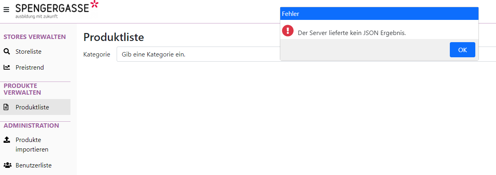

# Razor Pages 14 - Vue.js Components

## Inhalt

- Konfiguration von ESLint in Visual Studio
- Erstellen einer Komponente am Beispiel eines modalen Dialoges
- Parameter und *emit()*
- Slots

Das Video ist auf https://youtu.be/XXXVnmqP0ZM verfügbar (50min). Der Programmcode ist im
Ordner [StoreManager](StoreManager) zu finden.

> **Hinweis:** Um in Visual Studio vernünftig mit JavaScript zu arbeiten, muss der Workload
> *Node.js development* und ESLint installiert werden. Die Anleitung hierzu befindet sich auf
> der [Startseite des Kurses](../../README.md#installation-der-ide-visual-studio-2022)



## Starten der Applikation

Führen Sie die Datei *startServer.cmd* (Windows) bzw. *bash startServer.sh* (Linux) aus. Im
Skript wird die Umgebungsvariable *STORE_ADMIN* für das Adminkennwort gesetzt. Ohne diese
Umgebungsvariable kann der Server nicht starten.

## Zur Verfügung gestellte Dateien

**[wwwroot/js/components/modal.js](StoreManager/StoreManager.Webapp/wwwroot/js/components/modal.js)**

```javascript
const modal = {
    // See https://vuejs.org/guide/components/props.html
    props: {
        title: { required: true },
        ok: {},
        yes: {},
        no: {},
        icon: { default: 'info' },
        timeout: { default: 0 }
    },
    mounted() {
        if (this.timeout && this.ok) {
            setTimeout(() => {
                if (this.ok) {
                    this.$emit('ok');
                }
            }, this.timeout);
        }
    },
    template: `
        <div class="modal d-block" tabindex="-1">
            <div class="modal-dialog">
                <div class="modal-content">
                    <div class="d-flex flex-column">
                        <div class="p-1" style="color: white; background-color:var(--bs-primary)">{{ title }}</div>
                        <div class="d-flex align-items-end p-1" style="flex: 1 0 3em">
                            <div style="flex: 0 0 40px">
                                <i v-if="icon == 'info'" class="fas fa-info-circle" style="font-size:30px; color:var(--bs-info)"></i>
                                <i v-if="icon == 'question'" class="fas fa-question-circle" style="font-size:30px; color:var(--bs-info)"></i>
                                <i v-if="icon == 'warning'" class="fas fa-exclamation-triangle" style="font-size:30px; color:var(--bs-warning)"></i>
                                <i v-if="icon == 'error'" class="fas fa-exclamation-circle" style="font-size:30px; color:var(--bs-danger)"></i>
                            </div>
                            <div>
                                <slot></slot>
                            </div>
                        </div>
                        <div class="d-flex p-2 justify-content-end" style="background-color:#f0f0f0; gap: 1em">
                            <button v-if="ok"  v-on:click="$emit('ok')"  class="btn btn-primary"   style="flex: 0 0 4em">OK</button>
                            <button v-if="yes" v-on:click="$emit('yes')" class="btn btn-primary"   style="flex: 0 0 4em">Ja</button>
                            <button v-if="no"  v-on:click="$emit('no')"  class="btn btn-secondary" style="flex: 0 0 4em">Nein</button>
                        </div>
                    </div>
                </div>
            </div>
        </div>
`
}
```

** Verwenden der Komponente **

```html
@section Scripts {
<partial name="_VuejsPartial" />
<!-- Includes our modal component -->
<script src="~/js/components/modal.js"></script>
<script src="~/js/products/index.js"></script>
}

<div id="app">
    <!-- !! Register this component in your app viewmodel !! -->
    <modal v-if="errorMessage" v-on:ok="errorMessage = ''"
           timeout="4000" ok="true" title="Fehler" icon="error">
        Eine Fehlermeldung.
    </modal>
</div>
```