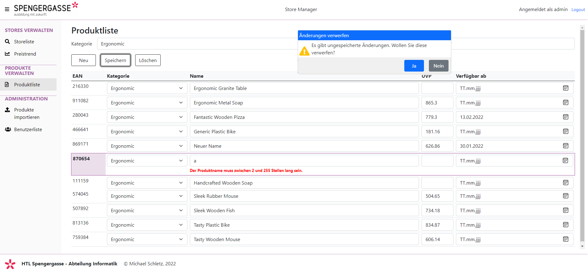

# Razor Pages 15 - Vue.js Data Grid (für die POS MeisterInnen)

## Inhalt

- POST/PUT/DELETE Requests
- Umgang mit lokalen Zahlenformaten
- CRUD Operationen in einem Grid abbilden
- Spinner und Umgang mit Netzwerkfehlern
- Komplexes State Management

Das Video ist auf https://youtu.be/hZZfDYiU7YU verfügbar (82min). Der Programmcode ist im
Ordner [StoreManager](StoreManager) zu finden.

> **Hinweis:** Um in Visual Studio vernünftig mit JavaScript zu arbeiten, muss der Workload
> *Node.js development* und ESLint installiert werden. Die Anleitung hierzu befindet sich auf
> der [Startseite des Kurses](../../README.md#installation-der-ide-visual-studio-2022)



## Starten der Applikation

Führen Sie die Datei *startServer.cmd* (Windows) bzw. *bash startServer.sh* (Linux) aus. Im
Skript wird die Umgebungsvariable *STORE_ADMIN* für das Adminkennwort gesetzt. Ohne diese
Umgebungsvariable kann der Server nicht starten.

## Wichtiger Code

#### Konfiguration von ASP.NET Core ([Program.cs](StoreManager/StoreManager.Webapp/Program.cs))

Damit der RequestVerificationToken auch im Header gesendet werden kann (das macht die Methode
*Vue.$post()*, *Vue.$put()* und *Vue.$delete()* aus der Datei
[StoreManager/StoreManager.Webapp/wwwroot/js/vue_extensions.js](StoreManager/StoreManager.Webapp/wwwroot/js/vue_extensions.js))
muss bei den Services folgende Konfiguration eingefügt werden:

```c#
builder.Services.AddAntiforgery(o => o.HeaderName = "xsrf-token"); 
```

Damit der Server auch auf einer deutschen Windows Installation in der *InvariantCulture* läuft,
muss im app Bereich folgende Middleware konfiguriert werden. Da Zahlen im JSON Format immer mit
Punkt gesendet werden, führt das bei einer deutschen Einstellung (, als Komma) zu einem
Fehler.

```c#
app.UseRequestLocalization(System.Globalization.CultureInfo.InvariantCulture.Name);
```

#### Automatisches Generieren von GUID Werten mit EF Core ([StoreContext.cs](StoreManager/StoreManager.Application/Infrastructure/StoreContext.cs))

Wir konfigurieren in *OnModelCreating* alle Properties mit dem Namen *Guid* so, dass beim Einfügen
ein neuer GUID Wert automatisch generiert wird. Somit müssen wir uns nicht händisch darum kümmern.

```c#
protected override void OnModelCreating(ModelBuilder modelBuilder)
{
    /* ... */
    foreach (var entity in modelBuilder.Model.GetEntityTypes())
    {
        var type = entity.ClrType;
        if (type.GetProperty("Guid") is not null)
        {
            modelBuilder.Entity(type).HasAlternateKey("Guid");
            modelBuilder.Entity(type).Property("Guid").ValueGeneratedOnAdd();
        }
    }
}
```

#### Aktualisierte Dialogkomponente in [modal.js](StoreManager/StoreManager.Webapp/wwwroot/js/components/modal.js)

Dialoge können damit aus JavaScript heraus geöffnet und die Antwort abgewartet werden. Einbetten in das
Template (*cshtml* Datei):

```html
@section Scripts {
    <partial name="_VuejsPartial" />
    <!-- Includes our modal component -->
    <script src="~/js/components/modal.js"></script>
    <script src="~/js/products/index.js"></script>
}
<modal ref="deleteConfirmDialog" yes="true" no="true" title="Produkt löschen?" icon="warning"></modal>
<!-- ... -->
```

Nutzen im Viewmodel:

```javascript
this.$refs.deleteConfirmDialog.show(`Möchten Sie das Produkt löschen?`);
if ((await this.$refs.deleteConfirmDialog.buttonClicked) != "yes") {
    return;
}
```

#### Spinner

Quelle: https://elliotstarks.com/loading-animation-with-typewriter-effect

Folgende Definition muss im Haupt Stylesheet
([site.css](StoreManager/StoreManager.Webapp/wwwroot/css/site.css)) eingefügt werden:

```css
.spinner {
    border: 16px solid silver;
    border-top: 16px solid #337AB7;
    border-radius: 50%;
    width: 80px;
    height: 80px;
    animation: spin 700ms linear infinite;
    top: 50%;
    left: 50%;
    margin-top: -40px;
    margin-left: -40px;
    position: absolute;
}

@keyframes spin {
    0% {
        transform: rotate(0deg)
    }

    100% {
        transform: rotate(360deg)
    }
}

```

Danach kann der Spinner einfach als *div* mit der Klasse *spinner* und einem *v-if*
ein- und ausgeblendet werden:

```html
<div class="spinner" v-if="loading"></div>
```

