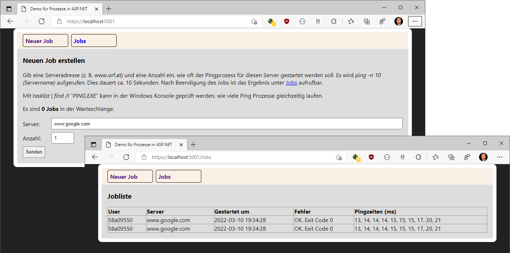

# Starten von Prozessen in ASP.NET Core



Es soll über den Windows Ping Befehl herausgefunden werden, wie viele ms das Pingpaket zu einem
Server benötigt. Dafür wird mit der Klasse *Process* der Prozess *ping.exe* mit den
entsprechenden Argumenten gestartet. Die Ausgabe in der Konsole sieht so aus (englische
Windows Version):

```
C:\Users\Michael>ping -n 10 www.google.com

Pinging www.google.com [142.251.36.196] with 32 bytes of data:
Reply from 142.251.36.196: bytes=32 time=18ms TTL=118
Reply from 142.251.36.196: bytes=32 time=17ms TTL=118
Reply from 142.251.36.196: bytes=32 time=13ms TTL=118
Reply from 142.251.36.196: bytes=32 time=13ms TTL=118
Reply from 142.251.36.196: bytes=32 time=13ms TTL=118
Reply from 142.251.36.196: bytes=32 time=13ms TTL=118
Reply from 142.251.36.196: bytes=32 time=12ms TTL=118
Reply from 142.251.36.196: bytes=32 time=13ms TTL=118
Reply from 142.251.36.196: bytes=32 time=13ms TTL=118
Reply from 142.251.36.196: bytes=32 time=13ms TTL=118

Ping statistics for 142.251.36.196:
    Packets: Sent = 10, Received = 10, Lost = 0 (0% loss),
Approximate round trip times in milli-seconds:
    Minimum = 12ms, Maximum = 18ms, Average = 13ms
```


## Starten von Prozessen: Eine gefährliche Angelegenheit

In .NET gibt es die Klasse *Process*, die es erlaubt, aus einem .NET Programm heraus einen
beliebigen Prozess (wie ping.exe) zu starten. Dabei gibt es allerdings Probleme, die oft nicht
bedacht werden:

- Ein Prozess kann u. U. lange laufen. Wird dieser direkt im Controller oder der Razor Page
  mit *WaitForExit()* (also mit blockierendem Warten) gestartet, blockiert er einen Thread von ASP.NET Core.
- Auf eine Webapplikation greifen viele User zu. Kann jeder sofort einen Prozess starten, werden
  nach kurzer Zeit keine Threads mehr für die Beantwortung neuer Anfragen zur Verfügung stehen.
- Selbst wenn mit *await WaitForExitAsync()* nicht blockierend gewartet wird, hat die (virtuelle)
  Maschine des Servers kaum die Ressourcen hunderte von Prozessen starten zu können.
- Prozesse laufen mit den Rechten, unter denen auch der Webserver läuft. Wird bei der Übergabe
  von Parametern nicht sehr genau auf die Datenprüfung geachtet, kann z. B. *rm -rf /* ausgeführt
  werden.

## Lösung: Die Queue

Anstatt die Prozesse direkt zu starten, schreiben wir ein Singleton Service *QueuedWorker*. Es
bietet die Methode *TryAddJob()* an. Der Aufrufer kann Jobinformationen als Parameter übergeben.
Danach wird der Job nicht direkt ausgeführt, sondern in der Methode *EnqueueJob* in einen
"Wartebereich" gegeben.

Da sin Singleton Service thread safe sein muss, müssen wir schreibende Zugriffe auf den gemeinsamen
Speicher wie das Erhöhen von *queueLength* immer mit entsprechenden Locking Mechanismen versehen.

Wir rufen *EnqueueJob()* nicht mit *await* auf, sondern arbeiten mit der Technik *fire and forget*.
Das bedeutet, dass die aufrufende Funktion *TryAddJob()* sofort fortsetzt. Das erfordert allerdings
einiges an Planung:

- Exceptions in *EnqueueJob()* können nicht dem User rückgemeldet werden.
- Daher muss eine sehr sorgfältige Fehlerbehandlung mit einem Logger oder einer Logtabelle in der
  Datenbank durchgeführt werden.

```c#
public (bool success, string message) TryAddJob(Jobinfo jobinfo)
{
    Interlocked.Increment(ref _queueLength);
    if (_queueLength > _maxQueueLength)
    {
        Interlocked.Decrement(ref _queueLength);
        return (false, "Queue is full");
    }
    _ = EnqueueJob(jobinfo)
        .ContinueWith(task => Interlocked.Decrement(ref _queueLength));
    return (true, string.Empty);
}
```

Der "Wartebereich" in der Methode *EnqueueJob()* ist die *SemaphoreSlim* Klasse in .NET. Sie
wird mit

```c#
var semaphore = new SemaphoreSlim(_maxProcesses, _maxProcesses);
```

instanziert. Die Parameter zeigen an, wie viele Plätze noch frei sind (1. Argument) und wie viele
"Routinen" gleichzeitig aktiv sein dürfen (2. Argument).


```c#
private async Task EnqueueJob(Jobinfo jobinfo)
{
    await _semaphore.WaitAsync();
    try
    {
        await StartJob(jobinfo);
    }
    catch (Exception e)
    {
        WriteJobFailedInfo(jobinfo, DateTime.UtcNow, null, e.InnerException?.Message ?? e.Message);
    }
    finally
    {
        _semaphore.Release();
    }
}
```

Wichtig sind dabei folgende Aspekte:

- Es muss sichergestellt werden, dass auch im Fehlerfall *Release()* ausgeführt wird. Daher wird
  *finally* verwendet. Sonst bleibt der Platz bei einer Exception für immer belegt.
- *StartJob()* wird mit *await* aufgerufen, da wir die Semaphore erst am Ende der Jobbearbeitung
  freigeben dürfen.
- Im Fehlerfall wird eine Info in die Datenbank geschrieben, da wir nicht dem User direkt eine
  Rückmeldung geben können.

## Registrieren von QueuedWorker

Das Service *QueuedWorker* in der Datei Program.cs registriert:

```c#
builder.Services.AddSingleton<QueuedWorker>(provider=>
    new QueuedWorker(
        provider.GetRequiredService<IServiceScopeFactory>(),
        provider.GetRequiredService<ILogger<QueuedWorker>>(),
        maxQueueLength: 10,
        maxProcesses: 2,
        timeout: 30000
));
```

Es kann durch 3 Parameter konfiguriert werden:

- **maxQueueLength:** Bestimmt, wie viele Jobs in der Warteschlange sein dürfen. Werden es
  mehr, so wird ein neuer Job abgelehnt und der User sieht eine Fehlermeldung.
- **maxProcesses:** Es werden, um schneller die Jobs abarbeiten zu können, mehrere PING
  Prozesse gestartet. Dieser Parameter bestimmt die gleichzeitig laufenden Prozesse. Bedenke, dass
  die Applikation im Internet vielleicht 100 User gleichzeitig bedienen. Daher ist eine
  Limitierung sehr wichtig.
- **timeout:** Nach diesem Zeitraum wird dem Prozess ein Kill Signal gesendet.

## Starten des Programmes

Führe *dotnet watch run* im Projektverzeichnis aus. Öffne danach den Browser an der angezeigten
URL. Es wird .NET 6 zur Ausführung benötigt.

In der [Index Page](Pages/Index.cshtml.cs) wird ein Job mittels *TryAddJob()* hinzugefügt.
