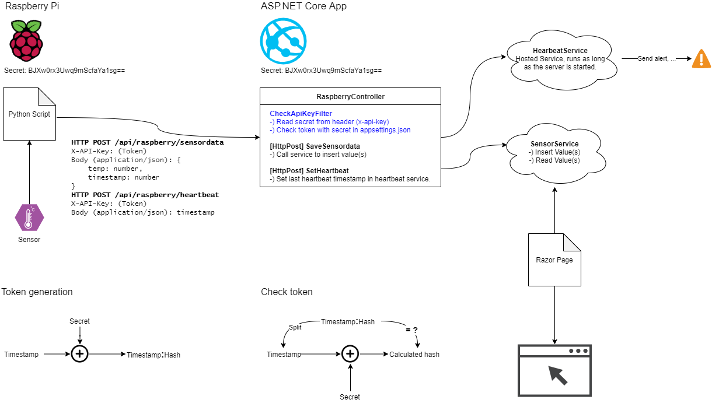

# Raspberry PI und ASP.NET Core API Demonstration

## Starten des Python Clients und des Webservers

Zur Demonstration muss auf einem PC Python 3 und .NET Core 5 installiert werden. Client und Server
werden mit folgenden Befehlen gestartet:

```text
cd SensorDemo.Raspberry
start python main.py
cd ..\SensorDemo.Webapp
dotnet run
```

## Schema der Applikation



## Sicherheit

Es wird im HTTP Header *X-API-Key* der Zeitstempel samt Hash gesendet. Dies sieht z. B. so aus:
*1022324234:dsf349fjsdfkg*. Der Hash wird mit dem konfigurierten Secret erzeugt. Dadurch kann
der Token von keinem unberechtigten erzeugt oder verändert werden, da der Hash dann nicht stimmen
würde. Der Token hat eine definierte Gültigkeit, die in
[der Klasse CheckApiKeyFilterAttribute](SensorDemo.Webapp/Controllers/RaspberryController.cs)
in der Rest API eingestellt wird. Achtung: Laufen die Uhren von Raspberry 
und Server über dieses Zeitmaß auseinander, wird kein Request mehr funktionieren.

Der *Heartbeat* wird im Background Service
[HearbeatService](SensorDemo.Webapp/Services/HearbeatService.cs)
geprüft. Es wird mit dem Server gestartet. Der Controller setzt im Service den letzten
empfangenen Zeitstempel. Ist dieser zu alt, kann das Service entsprechende Aktionen
auslösen.
