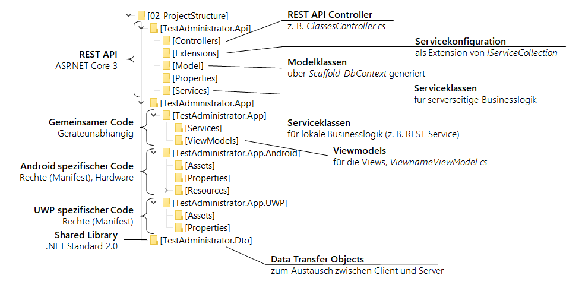

# Erstellen einer Solution für eine App mit REST API
Am Anfang jedes Projektes steht der Aufbau der Visual Studio Solution. Anhand eines Beispiels, der
App *TestAdministrator*, soll das Erstellen der Solution von Grund auf gezeigt werden.



## 1. Erstellen des neuen ASP.NET Core Projektes
Wir beginnen in Visual Studio mit einem neuen Projekt vom Typ *ASP.NET Core Web Application*. 
Der Solutionname kann frei gewählt werden (z. B. *TestAdministrator*), darf sich später jedoch nicht 
mit einzelnen Klassen überschneiden. Der Name des Projektes bekommt *.Api* angehängt (z. B. 
*TestAdministrator.Api*). Der Haken bei *Place solution and project in the same directory* muss 
deaktiviert werden, da wir noch weitere Projekte hinzufügen werden.

> **Hinweis**: Solution- und Projektnamen können später nicht mehr geändert werden, da sie 
> auch als String in XAML oder anderen Konfigurationsdateien verwendet werden. Der Name gilt daher
> für die gesamte Lebensdauer des Projektes.

In den Einstellungen zur ASP.NET Applikation wählen wir *API*. Der Haken bei *Configure for HTTPS* kann
belassen werden, damit Daten verschlüsselt übertagen werden.

### Hinzufügen der Modelklassen
Im Folgenden wird als Beispiel eine SQLite Datenbank verwendet. Sie liegt im selben Ordner wie die
Solution, daher ist sie aus dem Projekt mit *../MyDb.db* anzusprechen. In der Packet Manager Console
von Visual Studio werden folgende Befehle eingegeben:
```powershell
Install-Package Microsoft.EntityFrameworkCore.Tools   # EF Tools installieren
Install-Package Microsoft.EntityFrameworkCore.Sqlite  # SQLite Treiber installieren
# Modelklassen aus der Datenbank MyDb, die im selben Verzeichnis wie die Solution liegt, 
# in den Ordner Model generieren. Dabei werden bestehende Dateien überschrieben.
Scaffold-DbContext "DataSource=../MyDb.db" Microsoft.EntityFrameworkCore.Sqlite -OutputDir Model -UseDatabaseNames -Force -DataAnnotations
```

### Anpassen der Modelklassen bei SQLite
Die mit *Scaffold-DbContext* erstellten Modelklassen müssen bei der Verwendung von SQLite noch 
nachbearbeitet werden.

Wird eine Spalte als *AUTOINCREMENT* Wert deklariert, wird dies nicht korrekt erkannt. 
Um das zu beheben, ist in der Contextklasse die Methode *OnModelCreating()* anzupassen. Dafür wird beim 
entsprechenden Entity statt der Methode *ValueGeneratedNever()* die Methode *ValueGeneratedOnAdd()* verwendet:
```c#
entity.Property(e => e.U_ID)
    .IsRequired()
    .ValueGeneratedOnAdd();
```

Außerdem werden Datumswerte in den einzelnen Modelklassen als Bytearray generiert. Hier muss *byte[]* 
durch *DateTime* ersetzt werden.

### Anpassen von *appsettings.json*: Datenbankpfad und JWT Secret
In der Contextklasse im Model entfernen wir die Methode *OnConfiguring()*. Danach öffnen wir *appsettings.json*
und fügen ein Property AppSettings hinzu. Unter *Database* geben wir den Namen der Datenbank an. Bei der
Gelegenheit generieren wir gleich einen Base64 String als Secret für den JSON Web Token, welches mit 
dem Demoprogramm im Kapitel 
[04a_AuthenticationPrinciples](https://github.com/schletz/Pos4xhif/tree/master/REST/04a_AuthenticationPrinciples)
generiert werden kann.
```js
{
  "AppSettings": {
    "Database": "../MyDb.db",
    "Secret": "Ein z. B. über das Crypt Testprogramm erstellter 1024bit Base64 String."
  },
  "Logging": {
    "LogLevel": {
      "Default": "Information",
      "Microsoft": "Warning",
      "Microsoft.Hosting.Lifetime": "Information"
    }
  },
  "AllowedHosts": "*"
}
```

> **Hinweis:** Diese Datei sollte in *.gitignore* vom Hochladen in ein Repository ausgeschlossen werden,
> da sie rechnerspezifische oder geheime Informationen (Pfade, Secrets, ...) enthält.

Damit das Property *Database* ausgelesen wird, schreiben wir zu Beginn in die Methode 
*Startup.ConfigureServices()* die folgende Zeilen (*MyDbContext* wird durch die echte
Contextklasse ersetzt):
```c#
services.AddDbContext<MyDbContext>(options =>
    options.UseSqlite($"DataSource={Configuration["AppSettings:Database"]}")
);
```

Nun kann in jedem Controller und jedem Service ein Konstruktor geschrieben werden, der *MyDbContext*
als Argument enthält. Dieses Argument wird automatisch über Dependency Injection befüllt.

### Anpassen der Serverkonfiguration
In der Standardeinstellung bindet sich der Server nur an das Loopback Interface (127.0.0.1). Für
den Zugriff von außen (Android Smartphone über WLAN) muss der Server auf allen Interfaces hören.
Außerdem benötigen wir das IIS Profil nicht, da wir die Applikation serverless von der Kommandozeile
starten wollen. Die Datei *Properties/launchSettings.json* kann wie folgt angepasst werden. Sie
hört nur auf https Verbindungen auf Port 8080 und startet den Browser mit der *launchUrl*:
```js
{
  "$schema": "http://json.schemastore.org/launchsettings.json",
  "profiles": {
    "TestAdministrator.Api": {
      "commandName": "Project",
      "launchBrowser": true,
      "launchUrl": "https://localhost:8080/api/classes",
      "applicationUrl": "https://0.0.0.0:8080",
      "environmentVariables": {
        "ASPNETCORE_ENVIRONMENT": "Development"
      }
    }
  }
}
```

> **Hinweis:** Die Firewall des Rechners muss natürlich Verbindungen von außen an diesem Port akzeptieren.
> Dies kann in der Windows Firewall (Ausführen - *wf.msc*) unter eingehende Regeln eingestellt werden.
> Das Schul WLAN blockiert Zugriffe auf andere Rechner im WLAN, deswegen muss in der Schule mit USB
> Tethering gearbeitet werden, wenn die App am Smartphone auf den Server am Laptop zugreifen soll.

### Implementierung der JWT Authentifizierung
Die Klassen *Extensions.HostingExtensions*, *Services.UserService* und *Controllers.UserController* 
können von diesem Musterprojekt übernommen werden. Natürlich ist der Namespace und die 
Kontextklasse der Datenbank an das eigene Projekt anzupassen. Davor müssen noch über NuGet 2 Pakete 
installiert werden:
```powershell
Install-Package Microsoft.AspNetCore.Authentication.JwtBearer
Install-Package System.IdentityModel.Tokens.Jwt
```

Die Methoden *Startup.Configure()* und *Startup.ConfigureServices()* müssen natürlich für die 
Authentifizierung angepasst werden. In den Methoden des Musterprojektes wurde dies gemacht. Der 
Server sollte nun starten und die in *launchUrl* eingestellte Adresse zeigen.

## 2. Hinzufügen einer Library für DTO Objekte
### Was sind DTO (Data Transfer Object) Klassen?
Die DTO Klassen werden als JSON aus der REST API ausgeliefert und in der Xamarin App geladen. 
Betrachten wir die Modelklasse für Schulklassen:
```c#
public partial class Schoolclass
{
    public Schoolclass()
    {
        Lesson = new HashSet<Lesson>();
        Pupil = new HashSet<Pupil>();
        Test = new HashSet<Test>();
    }

    public string C_ID { get; set; }
    public string C_Department { get; set; }
    public string C_ClassTeacher { get; set; }
    public DateTime C_Created {get; set;}

    public virtual Teacher C_ClassTeacherNavigation { get; set; }
    public virtual ICollection<Lesson> Lesson { get; set; }
    public virtual ICollection<Pupil> Pupil { get; set; }
    public virtual ICollection<Test> Test { get; set; }
}
```

Diese Klasse weist Properties auf, die wir nicht in einer DTO Klasse brauchen:
- Die Navigationen brauchen wir nicht, da wir alles über einen HTTP Request laden müssen.
- Die Propertynamen kommen aus der Datenbank (Prefixnotation), diese sollen für das JSON anders
  gestaltet werden.
- Eventuell vorhandene interne Informationen (Timestamps, ...) sollen nicht nach außen gelangen.

Andererseits möchten wir auch Daten übermitteln, die erst in der Businesslogik des Servers ermittelt
werden und die für die Anzeige am Client hilfreich sind. In diesem Beispiel ist dies die Schüleranzahl.
Das bedeutet, dass DTO Klassen nicht 1:1 Abbildungen von Datenbanktabellen sind, sondern sich an den
Bedürfnissen des Clients orientieren.

Unsere DTO Klasse ist eine reine Datenhaltende Klasse ohne Logik, deswegen kann sie schlank gehalten
werden.
```c#
public class SchoolclassDto
{
    public string Id { get; set; }
    public string Department { get; set; }
    public string ClassTeacher { get; set; }
    public int StudentCount {get; set; }
}
```

Im Controller wird sie z. B. mittels Projektion (*select* in LINQ) als JSON gesendet:
```c#
var allClasses =    from c in _context.Schoolclass
                    select new SchoolclassDto
                    {
                        Id = c.C_ID,
                        Department = c.C_Department,
                        ClassTeacher = c.C_ClassTeacher,
                        StudentCount = c.Pupil.Count()
                    };
return Ok(allClasses);
```

### Umsetzung in Visual Studio
Da die DTO Klassen in beiden Projekten - REST API und Xamarin App - verwendet werden, fügen wir 
mittels Rechtsklick auf die Solution und *Add* - *New Project* ein Projekt vom Typ *Class Library (.NET Standard)*
hinzu. Achte darauf, dass du nicht die Vorlage für .NET Core oder .NET Framework wählst, diese Bibliotheken
können nämlich in Xamarin nicht verwendet werden. Wir benennen die Library mit *TestAdministrator.Dto*.

Am Besten kopiere die Modelklassen in das DTO Projekt als Basis. Passe danach den Namespace an (er soll 
*Solutionname.Dto* lauten) und ändere die Klassen ab. 

Danach muss im Api Projekt durch Rechtsklick auf *Dependencies* im Solution Explorer ein Verweis auf
das erstellte DTO Projekt hinzugefügt werden.


## 3. Hinzufügen des Xamarin.Forms Projektes
Nun fügen wir mittels Rechtsklick auf die Solution und *Add* - *New Project* ein Projekt vom Typ 
*Mobile App (Xamarin.Forms)* hinzu. Achte darauf, nicht die anderen Xamarinprojekte (Android App, ...)
zu wählen. Das Projekt erhält den Namen *Solutionname.App*.

In den Projekteigenschaften wählen wir *Blank* als Template. Bei Platform wird *Android* und *Windows (UWP)*
gewählt. 

> **Hinweis für iOS Apps:** iOS Apps können nur vernünftig unter macOS entwickelt werden. Wird Visual 
> Studio für macOS verwendet, muss ein Apple Developer Program account verwendet werden. Free provisioning 
> kann nur mit Xcode verwendet werden. Falls jemand im Team unter macOS entwickelt ist der Beste Weg 
> das Anlegen eines eigenen Projektes mit XCode in einem eigenen Ordner im Repository. Die ASP.NET 
> Core Applikation kann zum Testen natürlich auch unter macOS ausgeführt werden.
> Der gemeinsame Code im Ordner *Solutionname.App/Solutionname.App* und in *Solutionname.Dto* kann 
> im entsprechenden Ordner mit *dotnet publish -c Release* unter macOS als dll erzeugt und in das 
> iOS Projekt eingebunden werden.

### Erstellen der appsettings.json
Damit Konfigurationen in einer eigenen JSON Datei ausgelagert werden, erstellen wir im Solutionname.App
Projekt eine neue Datei mit dem Namen appsettings.json. Diese beinhaltet die Adresse der REST API:
```js
{
  "ServiceUrl": "https://(IP Adresse):8080/api"
}
```

> **Wichtig:** Damit diese Datei auch auf das Gerät übertragen wird, muss sie als *EmbeddedResource* definiert werden.
> Das kann in Visual Studio in den Properties der Datei (*Build Action: Embedded resource*) oder in der
> *.csproj* Datei durch Doppelklick auf den Projektnamen und durch den Eintrag folgender Information geschehen:
```xml
<ItemGroup>
    <None Remove="appsettings.json" />
</ItemGroup>

<ItemGroup>
    <EmbeddedResource Include="appsettings.json" />
</ItemGroup>

```

### Übernahme der Serviceklassen
Die in diesem Musterprojekt vorhandenen Serviceklassen *Services.AppSettingsService*, 
*Services.RestService* und *Services.ServiceException* können nach der Anpassung des Namespaces im eigenen
Projekt verwendet werden.

### Views und Viewmodels
In diesem Musterprojekt ist eine View (*MainPage*) und ein Viewmodel (*Viewmodels.MainViewModel*) zur
Demonstration definiert. Im eigenen Projekt entstehen natürlich eigene Views und Viewmodels, sodass 
eine Übernahme dieses Codes wenig sinnvoll ist.

### Verweis auf die DTO Klassen
Wie in der REST API muss im App Projekt durch Rechtsklick auf *Dependencies* im Solution Explorer ein 
Verweis auf das erstellte DTO Projekt hinzugefügt werden.

## 4. Starten und entwickeln

### Ausführen von Server und App
Damit Server und UWP App starten, können die Starteigenschaften der Solution angepasst werden. 
Natürlich können alle Bereiche (App und API) mit dem Debugger untersucht werden.


Diese Einstellungen werden im versteckten *.vs* Ordner gespeichert, der normalerweise nicht ins 
Repository übertragen wird. 

### Batdateien in diesem Projekt
In diesem Projekt befinden sich 2 hilfreiche BAT-Dateien:
- *cleanSolution.cmd*: Löscht alle bin und obj Ordner. Bei Buildproblemen kann sie nach dem Schließen
  aller Anwendungen gestartet werden.
- *Api/run.cmd*: Startet die REST API von der Kommandozeile aus, wenn z. B. die App auf das Smartphone
  übertragen und getestet werden soll.

## Übung
Falls du in PRE ein eigenes Projekt hast, wo eine App benötigt wird, kannst du diese Struktur passend
für dein Projekt erstellen. Verwende zum Testen eine SQLite Datenbank.

Falls dein Projekt keine App beinhaltet, kannst du dir eine kleines Thema für eine neue App überlegen. 
Die Datenbank muss eine Usertabelle und Daten, die an spezifische Rechte gebunden sind, beinhalten (z. B. Termine,
die einen Eigentümer haben, etc.). Die Datenbank muss nicht groß sein, eine abgebildete 1:n Beziehung
ist ausreichend. Es müssen folgende Punkte vorhanden sein:
- Implementierte Usertabelle in der Datenbank mit Salt, Hash und Rolle.
- Authentifizierung und Autorisierung mit ASP.NET
- Routen, die je nach Benutzerrolle zugänglich sind oder nicht.
- Routen, die je nach Benutzer zugänglich sind oder nicht.
- Eine Loginseite in der App.
- Eine MasterDetailPage in der App für den angemeldeten Benutzer.
- Mindestens 2 Detailseiten, wobei eine auch weitere Detailseiten aufruft 
  (z. B. Druck auf den Termin führt zu Termindetails).
- Eine Eingabemaske für neue Elemente.
- Fehlerbehandlung, falls der Server nicht erreichbar ist.

Falls keine eigene Aufgabenstellung gewollt wird oder der Fortschritt bem eigenen Projekt nicht ausreichend ist, 
können auch die Übungen in den zukünftigen Themen abgearbeitet werden. Die Grundstruktur wird immer 
in der Angabe mitgegeben, es handelt sich dann um Erweiterungen dieser Struktur. Ein "Sehr gut" oder 
"Gut" ist allerdings nur mit den ersten beiden Punkten erreichbar, da die Selbstständigkeit 
nicht ausreichend gegeben ist.
