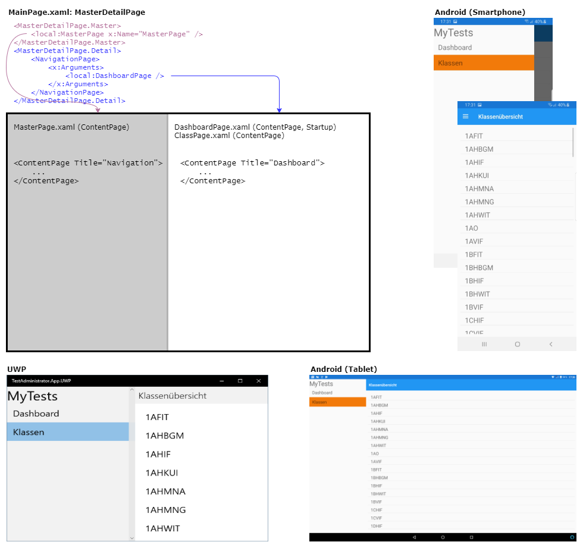

# Master Detail View
Eine Xamarin App besteht aus mehreren Elementen:
| Element | Bedeutung   |
| ------- | ----------- |
| Page    | Am Gerät angezeigte Seite. Entspricht dem Fenster in WPF bzw. der Activity in Android. Sie beinhaltet ein Layout, welches vie Viewelemente anordnet. |
| Layout  | Die Elemente können auf der Seite angeordnet werden. Es gibt *StackLayout*, *Grid*, *AbsoluteLayout* und *RelativeLayout*. |
| View    | Entspricht den UI Controls wie *Labels*, *Buttons*, *ListViews*, ... Der Name verwirrt etwas, da man oft denkt dass es sich um die Seite (Page) handelt. |

## Pages und Navigation
Da durch die Größe eines Smartphones oft zwischen Seiten gewechselt werden muss, kommt der Navigation
eine besondere Bedeutung zu. Oft ist die MasterDetail Page der Einstieg für die App. Sie besteht aus
2 ContentPages, wobei die MasterPage immer über das Navigationsicon aufgerufen werden kann. Die
"variable" Seite ist eine NavigationPage, also eine ContentPage mit Navigationsstack.

Quelle: https://docs.microsoft.com/de-de/xamarin/xamarin-forms/app-fundamentals/navigation/

## Umsetzung der App
### Die MasterDetailPage
