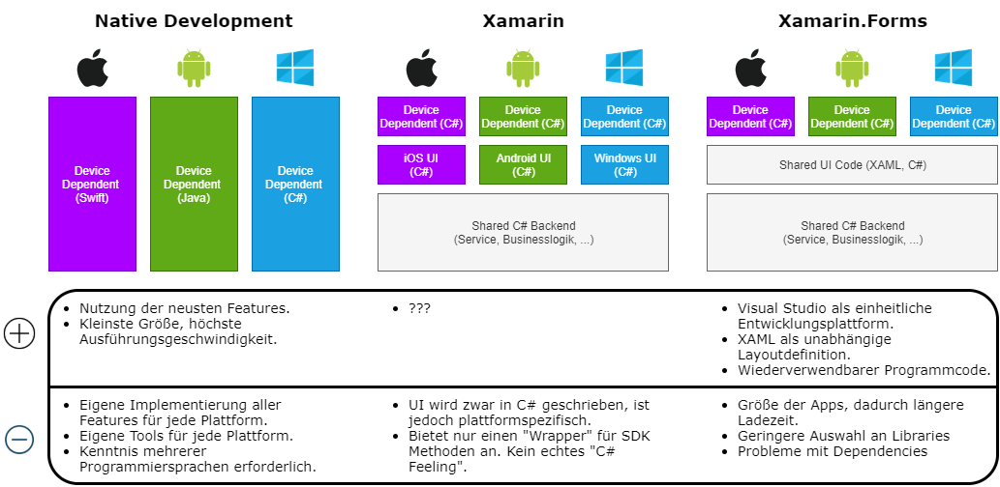

# App Entwicklung mit Xamarin.Forms
Bei der App Entwicklung denken viele sofort an Android Studio. Wird eine App nur für Android ausgerollt,
und möchte man alle Android SDK Features nutzen, ist dies sicher auch die beste Wahl. Allerdings lässt
sich der produzierte Java oder Kotlin Programmcode nicht auf andere Plattformen übertragen.

Im Jahr 2016 übernahm Microsoft die Firma Xamarin, die eine plattformübergreifende Laufzeitumgebung
für .NET anbot (Mono). Durch die Übernahme wurden die Entwicklungswerkzeuge in Visual Studio integriert und 
so für Entwickler leichter nutzbar gemacht.

Heute haben App Entwickler mehrere Möglichkeiten, ihre Apps für verschiedene Plattformen zu entwickeln:

## Wie ist ein Codesharing möglich?
Wird in Visual Studio eine neue Xamarin.Forms App angelegt, entsteht ein gemeinsames (shared) Projekt und -
je nach ausgewählten Plattformen - plattformspezifische Projekte. Die folgende Grafik zeigt ein klassisches
Xamarin (und nicht Xamarin.Forms) Projekt, wo der UI Code plattformspezifisch implementiert wird:

Quelle: https://docs.microsoft.com/de-de/xamarin/cross-platform/app-fundamentals/code-sharing

Der gemeinsame Code wird vom Compiler als DLL in CIL Code (Common Intermediate Language) übersetzt, 
der dann in die plattformspezifischen Projekte als Bibliothek eingebunden wird. Die CLR 
(Common Language Runtime) der jeweiligen Plattform führt diesen Code aus.

Daraus ist allerdings schon der Nachteil erkennbar: Die CLR muss auch mit der APK ausgeliefert werden.
Dadurch entstehen auch für kleinere Xamarin Apps Android APK Dateien mit mehreren MB. Details zur
Ausführung von Xamarin Apps in Android werden [in diesem Beitrag](https://www.sharpmobilecode.com/nuts-bolts-of-xamarin-android/)
erklärt. 

## Zugriff auf Hardware
Mit den Libraries aus [Xamarin.Essentials](https://docs.microsoft.com/en-us/xamarin/essentials/) können 
auch hardwarebezogene Funktionen plattformunabhängig verwendet werden. 
Der [Feature Support](https://docs.microsoft.com/en-us/xamarin/essentials/platform-feature-support?context=xamarin/xamarin-forms#feature-support)
reicht von Location Services über Phone Dialer bis Text-to-Speech. Es wird also immer weniger notwendig,
eigene Implementierungen für einzelne Plattformen umzusetzen. 

## Was soll verwendet werden: Android Studio oder Xamarin.Forms?
Für schnelles Prototyping - und auch Diplomarbeiten sind meist ein Prototyp - ist Xamarin.Forms
der schnellste Weg zum Ziel. Aber wie bei allem gilt: was man mit Freude macht, macht man auch gut.
Daher sollte jeder das Setting wählen wo er wich wohler fühlt.
